# C++泛型编程和STL


* 本阶段主要针对C++==泛型编程==和==STL==技术做详细讲解，探讨C++更深层的使用


## 1 模板

### 1.1 模板的概念


模板就是建立**通用的模具**，大大**提高复用性**


例如生活中的模板


一寸照片模板：


PPT模板：


模板的特点：

* 模板不可以直接使用，它只是一个框架
* 模板的通用并不是万能的


### 1.2 函数模板


* C++另一种编程思想称为 ==泛型编程== ，**主要利用的技术就是模板**


* C++提供两种模板机制:**函数模板**和**类模板** 


#### 1.2.1 函数模板语法

函数模板作用：

建立一个通用函数，其函数返回值类型和形参类型可以不具体制定，用一个**虚拟的类型**来代表。


**语法：** 

```C++
template<typename T>
函数声明或定义
```

**解释：**

template  ---  声明创建模板

typename  --- 表面其后面的==符号是一种数据类型==，可以用class代替

T    ---   通用的数据类型，名称可以替换，通常为==大写字母==


**示例：**

```C++
#include <iostream>
using namespace std;

template<typename T>//说明，我紧接着要写一个函数模板啦,下面的T编译器你不要给我报错.
void mySwap(T& a, T& b)
{
	T temp = a;
	a = b;
	b = temp;
}


void swapInt(int& a, int& b)
{
	int temp = a;
	a = b;
	b = temp;
}

void swapDouble(double& a, double& b)
{
	double temp = a;
	a = b;
	b = temp;
}

int main()
{
	int a = 10;
	int b = 20;
	swapInt(a, b);
	cout << "a=" << a << endl;
	cout << "b=" << b << endl;


	double c = 10.5;
	double d = 20.5;
	swapDouble(c, d);
	cout << "c=" << c << endl;
	cout << "d=" << d << endl;

	cout << "-------------模板的使用(2)-------------------" << endl;

	//1.显示使用
	cout << "-------------模板的使用_显示使用-------------------" << endl;
	mySwap<int>(a, b);
	cout << "a=" << a << endl;
	cout << "b=" << b << endl;
	mySwap(c, d);
	cout << "c=" << c << endl;
	cout << "d=" << d << endl;
	cout << "-------------模板的使用_编译器自动推导使用-------------------" << endl;
	mySwap(a, b);
	cout << "a=" << a << endl;
	cout << "b=" << b << endl;
	mySwap(c, d);
	cout << "c=" << c << endl;
	cout << "d=" << d << endl;
	return 0;
}
```

总结：

* 函数模板利用关键字 template
* 使用函数模板有两种方式：==自动类型推导==、==显示指定类型==
* 模板的目的是为了提高复用性，将类型参数化


天才提示:有区别,当T为包含子类的类时,用class编译器会误认为对象声明


---

#### 1.2.2 函数模板==注意事项==

注意事项：

> * **自动类型推导**，必须推导出一致的数据类型T,才可以使用
>
>
> * 模板必须要**确定出T的数据类型**，才可以使用

**示例：**

```C++
#include <iostream>
using namespace std;

template<typename T>//说明，我紧接着要写一个函数模板啦,下面的T编译器你不要给我报错.
void mySwap(T& a, T& b)
{
	T temp = a;
	a = b;
	b = temp;
}


template<typename T>
void Say() {

	cout << "我没用到T，我还让编译器自动推导传入的T是何种数据类型" << endl;
}


int main()
{
	cout << "	//模板要推出一致的数据类型" << endl;
	int a = 10;
	int b = 20;
	char c = 'a';
	mySwap(a, b);//正确

	//mySwap(a,c)//错误,编译器自动推导出一个int和char，不一致。
	cout << "	//模板要确定T的数据类型" << endl;

	//Say();//执行不了一点，编译器汗流浃背了
	Say<int>();
    Say<>();//函数模板的空参列表！
	 //Say(void)();//也不行，void用于函数的返回类型啊..


	return 0;
}
```

总结：

* ==使用模板时必须**确定出通用数据类型T**，并且能够推**导出一致的类型**==


#### 1.2.3 函数模板案例

案例描述：

* 利用函数模板封装一个==排序的函数==，可以对**不同数据类型数组**进行排序
* 排序规则从大到小，排序算法为**选择排序**
* 分别利用**char数组**和**int数组**进行测试


示例：

```C++
#include <iostream>
#include <string>
using namespace std;

//void sort(int a[])
template <typename T>//排序模板
//void mySort(T a[],int line)
//{
//	T temp;
//	for (int i = 0; i < line-1; i++)
//	{
//		for (int j = 0; j < line - i - 1; j++)
//		{
//			//降序
//			if (a[j] < a[j + 1])
//			{
//				temp = a[j];
//				a[j] = a[j + 1];
//				a[j + 1] = temp;
//			}
//		}
//		
//	}
//
//}
//选择排序
void mySort(T a[], int line)
{
	T temp;
	for (int i = 0; i < line - 1; i++)
	{
		int minindex = i;
		for (int j = i+1; j < line; j++)
		{
			if (a[j] > a[minindex])
			{
				minindex = j;
			}
		}
		temp = a[i];
		a[i] = a[minindex];
		a[minindex] = temp;

	}

}


template <typename T>//打印模板
void myPrint(T a[],int line)
{

	for (int i = 0; i < line; i++)
	{
		if(i!=line-1)
		cout << a[i] << " ";
		else
		cout << a[i] <<endl;
	}

}

//--------------------------------进阶排序,可选择升降排序
template <typename T>//排序模板
void mySort(T a[], int line,bool flag)
{
	T temp;
	for (int i = 0; i < line -1; i++)
	{
		for (int j = 0; j < line - i - 1; j++)
		{
			if (flag)
			{
				//升序
				if (a[j] > a[j + 1])
				{
					temp = a[j];
					a[j] = a[j + 1];
					a[j + 1] = temp;
				}
			}
			else
			{
				//降序
				if (a[j] < a[j + 1])
				{
					temp = a[j];
					a[j] = a[j + 1];
					a[j + 1] = temp;
				}
			}
		}

	}

}

int main()
{

	int arrayInt[5] = { 1,6,8,4,2 };
	int line = sizeof(arrayInt) / sizeof(arrayInt[0]);
	cout << "----------------测试int数组------------------" << endl;
	cout << "这是int数组原来的状态" << endl;
	myPrint(arrayInt,line);
	cout << "这是int数组降序排序后状态" << endl;
	mySort(arrayInt, line);
	myPrint(arrayInt, line);

	
	cout << "这是int数组升序后状态" << endl;
	mySort(arrayInt, line, true);
	myPrint(arrayInt, line);


	cout << "----------------测试char数组----------------" << endl;
	char str[9] = "abcdefg";//1 7 6 8 2 3 4
	//cin.getline(str,10);
	cout << "这是char数组原来的状态" << endl;
	int charline = sizeof(str) / sizeof(str[0]);
	myPrint(str, charline);
	
	cout << "这是char数组降序后的状态" << endl;
	mySort(str, charline);
	myPrint(str, charline);

	cout << "这是char数组升序后状态" << endl;
	mySort(str, charline, true);
	myPrint(str, charline);

	return 0;
}
```


总结：模板可以提高代码复用，需要熟练掌握


---------


#### 1.2.4 普通函数与函数模板的区别


**普通函数与函数模板区别：**

* 普通函数调用时可以发生自动类型转换（隐式类型转换）
* 函数模板调用时，如果利用自动类型推导，不会发生隐式类型转换
* 如果利用显示指定类型的方式，可以发生隐式类型转换


**示例：**

```C++
#include <iostream>
#include <string>
using namespace std;


//1. 普通函数可以自动类型转换隐式
//2. 函数模板自动类型转换的时候不可以发生类型抓换，显示的时候可以

int test(int a, int b)
{
	return a + b;
}
template<typename T>
T newtest(T a, T b)
{
	return a + b;
}

int main()
{

	int a = 20, b = 10;
	cout << test(a, b) << endl;//30

	char c = 'a';
	cout << test(a, c) << endl;//117,10+97=117


	cout << "//测试模板的两种调用方法" << endl;
	cout << newtest(a, b) << endl;            
	 
	//cout << newtest(a, c) << endl;//自动类型推导是不能自动类型转换的  

	cout << newtest<int>(a, c);//117,显式的使用模板会自动类型转换！


	return 0;
}      
```

总结：建议使用显示==指定类型的方式，调用函数模板，因为可以自己确定通用类型T==


显示的指定！


#### 1.2.5 普通函数与函数模板的调用规则


调用规则如下：

> 1. 如果函数模板和普通函数都可以实现，==优先调用普通函数==
> 2. 可以通过空模板参数列表来强制调用函数模板
> 3. **函数模板也可以发生重载**
> 4. 如果函数模板可以产生更好的匹配,优先调用函数模板


**示例：**

```C++
#include <iostream>
#include <string>
using namespace std;


//1. 如果函数模板和普通函数都可以实现， == 优先调用普通函数 ==
//2. 可以通过空模板参数列表来强制调用函数模板
//3. * *函数模板也可以发生重载 * *
//4. 如果函数模板可以产生更好的匹配, 优先调用函数模板

void test(int a, int b)
{
	cout << "普通函数的调用" << endl;

}

template<typename T>
void test(T a,T b)
{
	cout << "函数模板的调用" << endl;

}


//模板的重载
template<typename T>
void test(T a, T b,T c )
{
	cout << "函数重载模板的调用" << endl;

}


int main()
{
	//如果二者都可以调用且实现，会优先调用函数！函数学的提前。。。
	int a = 1, b = 2;
	test(a, b);

	//强制想使用模板的版本呢？
    //使用模板空参列表
	test<>(a,b);


	//模板的重载//
	test<>(a, b, 10);


	//如果函数模板可以产生更好的匹配, 优先调用函数模板
	char c = 'c';
	char d = 'd';
	test(c, d);
	//编译器会执行与他更好匹配的结果！-=-=函数模板的调用==

	//因为用函数的话需要先转换再使用，会麻烦
	return 0;
}
```

总结：==**既然提供了函数模板，最好就不要提供普通函数，否则容易出现二义性**==


#### 1.2.6 模板的局限性

**局限性：**

* 模板的通用性并不是万能的


**例如：**

```C++
	template<class T>
	void f(T a, T b)
	{ 
    	a = b;
    }
```

在上述代码中提供的赋值操作，如果传入的a和b是一个数组，就无法实现了


再例如：

```C++
	template<class T>
	void f(T a, T b)
	{ 
    	if(a > b) { ... }
    }
```

在上述代码中，如果T的数据类型传入的是像Person这样的自定义数据类型，也无法正常运行


因此C++为了解决这种问题，提供==模板的重载，可以为这些**特定的类型**提供**具体化的模板**==

**示例：**

```C++
#include <iostream>
#include <string>
using namespace std;


class Person
{
	friend bool operator==(Person& p1, Person& p2);
public:

	Person(string name, int age) :name(name), age(age) {}

	string name;
	int age;

};

//模板的通用性并不是万能的
template<typename T>//内置数据类型可以直接使用通用的函数模板
bool mycompare(T& a, T& b)
{

	if (a == b)
	{
		return true;
	}
	else
		return false;
}
//对模板功能呢的具体化,有具体传入参数的时候会走这条路template<>+模板函数的具体重载
	//自定义数据类型，不会调用普通的函数模板
	//可以创建具体化的Person数据类型的模板，用于特殊处理这个类型
//template<> bool mycompare(Person& a, Person& b) {
//	if (a.age == b.age && a.name == b.name)
//	{
//		return true;
//	}
//	else
//		return false;
//}

//全局运算符==的重载
bool operator==(Person& p1, Person& p2)
{
	if (p1.name == p2.name && p1.age == p2.age)
		return true;
	else
		return false;
}
int main()
{
	int a = 10, b = 20;
	int ret = mycompare(a, b);
	if (ret)
	{
		cout << "a==b" << endl;
	}
	else
		cout << "a!=b" << endl;

	Person p1("tom", 11);
	Person p2("tom", 11);

	//在没有扩充模板的具体化的时候//编译器蒙蔽了，到a==b的时候汗流浃背了，不知道对象的==如何玩
	int ret1 = mycompare(p1, p2);

	if (ret1)
	{
		cout << "p1==p2" << endl;
	}
	else
		cout << "p1!=p2" << endl;


	return 0;
}
```

总结：
	//自定义数据类型，不会调用普通的函数模板
	//可以创建具体化的Person数据类型的模板，用于特殊处理这个类型

* 利用==具体化的模板，可以解决自定义类型的通用化==
* 学习模板并不是为了写模板，而是在STL能够运用系统提供的模板

friend+ 函数声明

友元

==大众类型用模板，特定类型再写特定函数==


### 1.3 类模板

#### 1.3.1 类模板语法

类模板作用：

* 建立一个==通用类==，==类中的成员 数据类型可以不具体制定==，用一个**虚拟的类型**来代表。


**语法：** 

```c++
template<typename T>
类\


template<typename nametype,typename agetype>要有多个数据类型，用逗号隔开
```

**解释：**

template  ---  声明创建模板

typename  --- 表面其后面的符号是一种数据类型，可以用class代替

T    ---   通用的数据类型，名称可以替换，通常为大写字母


**示例：**

```C++
#include <iostream>
#include <string>
using namespace std;

//class Person
//{
//public:
//
//	Person(string name, int age) :name(name), age(age) {}
//
//	string name;
//	int age;
//};

//模板类
template<typename nametype,typename agetype>
class Person {

public:

	Person(nametype name, agetype age) :name(name), age(age) {  };

	nametype name;
	agetype age;
	

};
int main()
{

	Person<string, int> person("熏悟空", 989);

	cout << person.name << endl;
	cout << person.age << endl;

	Person<string,double> p("王八蛋", 19.5);
	cout << p.name << endl;
	cout << p.age << endl;

	return 0;
}
```

总结：类模板和函数模板语法相似，在==声明模板template后面加类，此类称为类模板==


#### 1.3.2 类模板与函数模板区别


类模板与函数模板区别主要有两点：

1. ==**类模板没有自动类型推导的使用方式**==

2. 类模板在模板参数列表中==**可以有默认参数**==

3. ==函数模板也有默认参数==

4. ```c++
   #include <iostream>
   #include <string>
   using namespace std;
   
   
   //模板类
   template<typename T,typename Y=int>
   void mySay(T a,T b)
   {
   	cout << "a==" << a << endl;
   	cout << "b==" << b << endl;
   }
   
   int main()
   {
   	//不能自动推导，默认参数
   	mySay<int ,double>(2,5.0);
   //从“double”转换到“T”，可能丢失数据
   	
   	mySay(2, 3);
   
   	return 0;
   }
   ```

   


**示例：**

```C++
#include <iostream>
#include <string>
using namespace std;


//模板类
template<typename nametype,typename agetype=char>
class Person {

public:

	Person(nametype name, agetype age) :name(name), age(age) {  };

	nametype name;
	agetype age;
	

};
//1可以有默认参数
//2没有自动类型推导

int main()
{
	//Person p2("dasdas", 22);//错误，类模板，没有自动类型推导
	Person<string, int> person("熏悟空", 989);

	cout << person.name << endl;
	cout << person.age << endl;

	Person<string, double> p("王八蛋", 19.5);
	cout << p.name << endl;
	cout << p.age << endl;

	Person<string> p2("牛马",'s');
	//默认参数，你不传入就用我的默认int类型，你传入了就用你的类型

	cout << p2.name << endl;
	cout << p2.age << endl;

	return 0;
}
```

总结：

* ==**类模板使用只能用显示指定类型方式**==
* 类模板中的模板参数列表==可以有默认参数==


#### 1.3.3 类模板中成员函数创建时机


类模板中成员函数和普通类中成员函数创建时机是有区别的：

* ==普通类中的成员函数一开始就可以创建==
* 类模板中的成员函数在调用时才创建


**示例：**

```C++
class Person1
{
public:
	void showPerson1()
	{
		cout << "Person1 show" << endl;
	}
};

class Person2
{
public:
	void showPerson2()
	{
		cout << "Person2 show" << endl;
	}
};

template<class T>
class MyClass
{
public:
	T obj;

	//类模板中的成员函数，并不是一开始就创建的，而是在模板调用时再生成

	void fun1() { obj.showPerson1(); }
	void fun2() { obj.showPerson2(); }

};

void test01()
{
	MyClass<Person1> m;
	
	m.fun1();

	//m.fun2();//编译会出错，说明函数调用才会去创建成员函数
}

int main() {

	test01();

	system("pause");

	return 0;
}
```

总结：==类模板中的成员函数并不是一开始就创建的，在调用时才去创建==


#### 1.3.4 ==类模板对象做函数参数==

学习目标：

* 类模板实例化出的对象，向函数传参的方式


一共有三种传入方式：

1. 指定传入的类型   --- 直接显示对象的数据类型
2. 参数模板化           --- 将对象中的参数变为模板进行传递
3. 整个类模板化       --- 将这个对象类型 模板化进行传递


**示例：**

```C++
#include <iostream>
#include <string>
using namespace std;


template<class Name,class Age>
class Person
{
public:
	Person(Name name, Age age) :name(name), age(age) {};
	Name name;
	Age age;

	void showPerson()
	{
		cout << name << "-==-" << age << endl;
	}

};
//用我们类模板实例化的对象如何传入参数呢？
//一共有三种传入方式：
//1. 指定传入的类型-- - 直接显示对象的数据类型
void Print1(Person<string, int> p) {
	p.showPerson();
}
void test01()
{
	Person<string, int>p("1牛马", 111);
	Print1(p);
}
//2. 参数模板化-- - 将对象中的参数变为模板进行传递
template<class T, class Y>
void Print2(Person<T, Y>p) {
	p.showPerson();
}
void test02() {
	Person<string, int>p("2牛马", 222);
	Print2(p);
}
//3. 整个类模板化-- - 将这个对象类型 模板化进行传递
template<class T>
void Print3(T p) {
	p.showPerson();

}
void test03()
{
	Person<string, int>p("3牛马", 333);
	Print3(p);
}

int main() {

	test01();

	cout<<"----------------------------" << endl;

	test02();
	cout << "----------------------------" << endl;

	test03();
	system("pause");

	return 0;
}
```

总结：

* 通过类模板创建的对象，可以有三种方式向函数中进行传参
* 使用比较广泛是第一种：指定传入的类型

1. 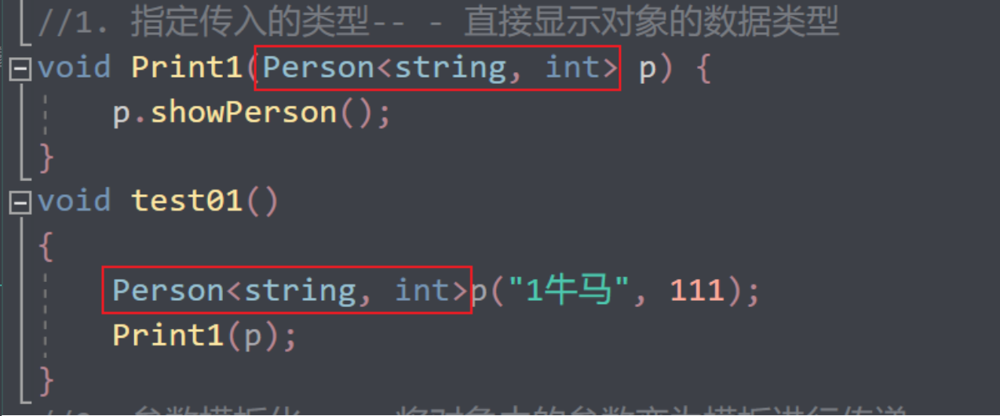 
2. 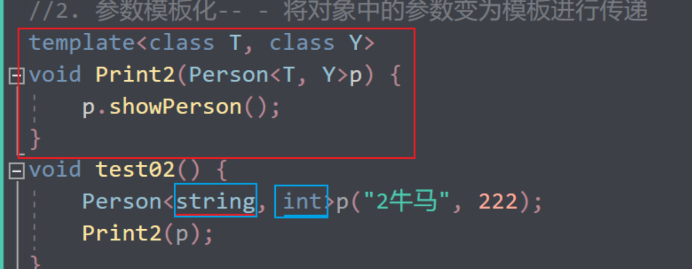 
3. 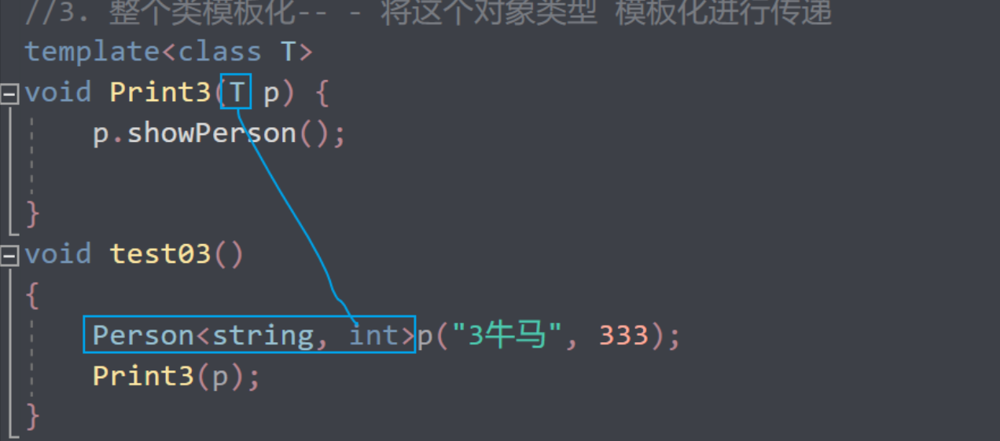 


#### 1.3.5 类模板与继承


当类模板碰到继承时，需要注意一下几点：

* 当子类继承的父类是一个类模板时，子类在声明的时候，要指定出父类中T的类型
* 如果不指定，编译器无法给子类分配内存
* 如果想灵活指定出父类中T的类型，子类也需变为类模板


**示例：**

```C++
template<class T>
class Base
{
	T m;
};

//class Son:public Base  //错误，c++编译需要给子类分配内存，必须知道父类中T的类型才可以向下继承
class Son :public Base<int> //必须指定一个类型
{
};
void test01()
{
	Son c;
}

//类模板继承类模板 ,可以用T2指定父类中的T类型
template<class T1, class T2>
class Son2 :public Base<T2>
{
public:
	Son2()
	{
		cout << typeid(T1).name() << endl;
		cout << typeid(T2).name() << endl;
	}
};

void test02()
{
	Son2<int, char> child1;
}


int main() {

	test01();

	test02();

	system("pause");

	return 0;
}
```

总结：

==如果父类是类模板，子类需要指定出父类中T的数据类型==


#### 1.3.6==类模板成员函数类外实现==


学习目标：能够掌握类模板中的成员函数类外实现


**示例：**

```C++
#include <iostream>
#include <string>
using namespace std;

//*当子类继承的父类是一个类模板时，子类在声明的时候，要指定出父类中T的类型
//* 如果不指定，编译器无法给子类分配内存
//* 如果想灵活指定出父类中T的类型，子类也需变为类模板
template<class T,class Y>
class Person {
public:
	Person(T a, Y b);
	//Person(T a,Y b):a(a),b(b){}

	void showPerson();
	//void showPerson()
	//{
	//	cout << "姓名" << a << endl;
	//	cout << "年龄" << b << endl;
	//}
	T a;
	Y b;
};

template <class T,class Y>
 Person<T, Y>::Person(T a, Y b)
{
	 this->a = a;
	 this->b = b;
};

 template <class T, class Y>
 void Person<T,Y>::showPerson() {
	 cout << "姓名" << a << endl;
 	cout << "年龄" << b << endl;
 }

int main() {
	Person<string, int> p("dsa", 2323);
	p.showPerson();
	return 0;
}
```

总结：类模板中成员函数类外实现时，需要加上==模板参数列表==


template <class T，class Y>

Person<T,Y>::----------------Person（T a,T b）

void 										 showPerson()	


#### 1.3.7 类模板分文件编写

学习目标：

* 掌握类模板成员函数分文件编写产生的问题以及解决方式

> ==因为编译器是在调用的时候才创建的==
>
> 传统的
>
> .h写类的定义
>
> .cpp写类的实现
>
> 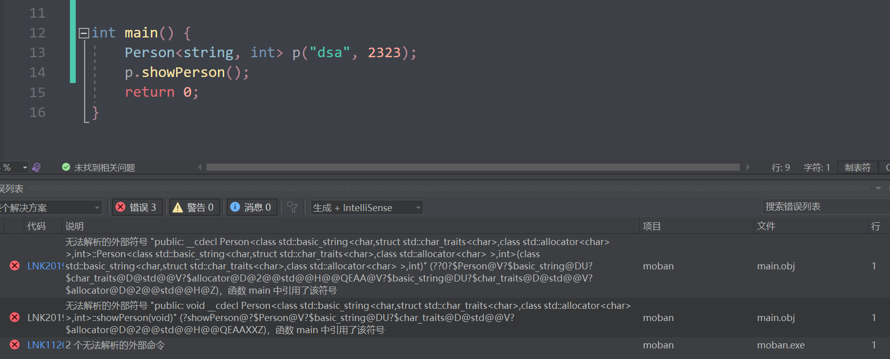 
>
> 解决办法1：
>
> 用的时候直接include "x.cpp"
>
> 解决办法2:
>
> 直接.cpp合在.h里面并且修改后缀为.hpp
>
> ==这样大家都约定好的.hpp是模板类的声明和实现==

问题：

* 类模板中成员函数创建时机是在调用阶段，导致分文件编写时链接不到


解决：

> * 解决方式1：直接包含.cpp源文件
> * 解决方式2：将声明和实现写到同一个文件中，并更改后缀名为.hpp，hpp是约定的名称，并不是强制


**示例：**

person.hpp中代码：

```C++
#pragma once
#include <iostream>
using namespace std;
#include <string>

template<class T1, class T2>
class Person {
public:
	Person(T1 name, T2 age);
	void showPerson();
public:
	T1 m_Name;
	T2 m_Age;
};

//构造函数 类外实现
template<class T1, class T2>
Person<T1, T2>::Person(T1 name, T2 age) {
	this->m_Name = name;
	this->m_Age = age;
}

//成员函数 类外实现
template<class T1, class T2>
void Person<T1, T2>::showPerson() {
	cout << "姓名: " << this->m_Name << " 年龄:" << this->m_Age << endl;
}
```


类模板分文件编写.cpp中代码

```C++
#include<iostream>
using namespace std;

//#include "person.h"
#include "person.cpp" //解决方式1，包含cpp源文件

//解决方式2，将声明和实现写到一起，文件后缀名改为.hpp
#include "person.hpp"
void test01()
{
	Person<string, int> p("Tom", 10);
	p.showPerson();
}

int main() {

	test01();

	system("pause");

	return 0;
}
```

总结：主流的解决方式是第二种，将类模板成员函数写到一起，并将后缀名改为.hpp


#### 1.3.8 类模板与友元


学习目标：

* 掌握类模板配合友元函数的类内和类外实现


！！全局函数==类内实现==- 直接在类内声明友元即可

全局函数==类外实现==- 需要提前让编译器知道全局函数的存在


**示例：**

```C++
#include <string>

//2、全局函数配合友元  类外实现 - 先做函数模板声明，下方在做函数模板定义，在做友元
template<class T1, class T2> class Person;

//如果声明了函数模板，可以将实现写到后面，否则需要将实现体写到类的前面让编译器提前看到
//template<class T1, class T2> void printPerson2(Person<T1, T2> & p); 

template<class T1, class T2>
void printPerson2(Person<T1, T2> & p)
{
	cout << "类外实现 ---- 姓名： " << p.m_Name << " 年龄：" << p.m_Age << endl;
}

template<class T1, class T2>
class Person
{
	//1、全局函数配合友元   类内实现
	friend void printPerson(Person<T1, T2> & p)
	{
		cout << "姓名： " << p.m_Name << " 年龄：" << p.m_Age << endl;
	}


	//全局函数配合友元  类外实现
	friend void printPerson2<>(Person<T1, T2> & p);

public:

	Person(T1 name, T2 age)
	{
		this->m_Name = name;
		this->m_Age = age;
	}


private:
	T1 m_Name;
	T2 m_Age;

};

//1、全局函数在类内实现
void test01()
{
	Person <string, int >p("Tom", 20);
	printPerson(p);
}


//2、全局函数在类外实现
void test02()
{
	Person <string, int >p("Jerry", 30);
	printPerson2(p);
}

int main() {

	//test01();

	test02();

	system("pause");

	return 0;
}
```


总结：==**建议全局函数做类内实现，用法简单，而且编译器可以直接识别**==

`friend void 函数名(模板类参数)`

{

直接实现！}


#### 1.3.9 ==类模板案例==

案例描述:  实现一个通用的数组类，要求如下：


* 可以对内置数据类型以及自定义数据类型的数据进行存储
* 将数组中的数据存储到堆区
* 构造函数中可以传入数组的容量
* 提供对应的拷贝构造函数以及operator=防止浅拷贝问题
* 提供尾插法和尾删法对数组中的数据进行增加和删除
* 可以通过下标的方式访问数组中的元素
* 可以获取数组中当前元素个数和数组的容量


**示例：**

myArray.hpp中代码

```C++
#pragma once
#include <iostream>
#include <string>
using namespace std;

template<class T>
class Myarray {

public:
	//尾插
	void push_back(const T &p) {
		if (this->capacity == this->m_size)
		{
			return;
		}
		else
		{
			this->point[this->m_size] = p;
			//在数组插入我们的数据
			//更新
			this->m_size++;
		}

	}
	//尾删
	void pop_back()
	{
		if (this->m_size == 0)
		{
			return;
		}
		else
		{//逻辑的尾删
			//this->point[size - 1] = NULL;
			this->m_size--;
		}
	}

	//通过下标访问
	//T的时候是简单的返回，返回引用的时候就可以链式编程了
	T& operator[] (int index)
	{
		return this->point[index];
	}

	//返回容量
	int get_capacity()
	{
		return this->capacity;
	}

	//返回当前的大小
	int get_size()
	{
		return this->m_size;
	}
	Myarray(int capacity)
	{
		cout << "这是Myarrray的有参构造" << endl;
		this->capacity = capacity;
		this->m_size = 0;
		this->point = new T[capacity];
	}
	//拷贝构造
	Myarray(const Myarray &p) {
		cout << "这是Myarrray的拷贝构造" << endl;
		this->capacity = p.capacity;
		this->m_size = p.m_size;
		//深拷贝
		if (this->point != NULL)
		{
			delete this->point;
			this->point = NULL;
		}
		this->point = new T[p.capacity];
		for (int i = 0; i < p.m_size; i++)
		{
			this->point[i] = p.point[i];
		}
	}
	//防止浅拷贝的问题
	Myarray& operator= (const Myarray& p)
	{
		cout << "这是我的赋值=的构造函数！" << endl;
		if (this->point != NULL)
		{
			delete this->point;
			this->point = NULL;
		}
		this->capacity = p.capacity;
		this->m_size = p.m_size;

		this->point = new T(p.capacity);
		for (int i = 0; i < p.m_size; i++)
		{
			this->point[i] = p.point[i];
		}
		return *this;
	}

	~Myarray()
	{
		cout << "这是Myarrray的析构函数" << endl;
		if (this->point != NULL)
		{
			delete[] this->point;
			this->point = NULL;
		}
	}
	//遍历函数
	void Print();

private:
	int capacity;
	int m_size;
	T* point;
};


template <class T>
void Myarray<T>::Print()
{
	for (int i = 0; i < this->get_size(); i++)
	{
		cout << this->point[i] << " ";
	}
	cout << endl;
}
```


类模板案例—数组类封装.cpp中

```C++
#include <string>
#include <iostream>
#include "myarray.hpp"
using namespace std;


class Person {
public:
	Person() {};
	//需要默认构造是因为，创造数组的时候，数组中的每个默认元素都是用默认构造创造出来的，所以不能少默认构造
	Person(string name, int age) :name(name), age(age) {};


	string name;
	int age;

};


void PersonPrint(Myarray<Person>& p)
{
	for (int i = 0; i < p.get_size(); i++)
	{
		cout << "姓名为" << p[i].name << "年龄为" << p[i].age << endl;
	}
}
void MyPrint(Myarray<int> &p)
{//注意对象作为形参传入的时候会调用拷贝构造函数，要严格对应自己的拷贝函数的对应关系，&来接受
	for (int i = 0; i < p.get_size(); i++)
	{
		cout << p[i] << " ";
	}
	cout << endl;
}
int main() {

	//测试有参构造
	//Myarray<int> array(5);
	//测试成功
	cout << "--------------------" << endl;

	//测试拷贝构造
	Myarray<int> array1(10);
	//Myarray<int> array2(array1);

	//测试=的浅拷贝问题
	Myarray <int> array3(100);
	array3 = array1;

	//和
	//Myarray<int> arr3 = array1;是有区别的
	//Myarray<int> arr3(array1)


	cout << "测试我们的vector青春版" << endl;

	Myarray<int> test(10);

	for (int i = 0; i < 10; i++)
	{
		test.push_back(i);
	}
	//写一个成员函数遍历
	test.Print();
	//用全局函数遍历
	MyPrint(test);
	test.pop_back();
	MyPrint(test);


	cout << "测试我们的自定义数据" << endl;


	Person p1("赵云", 11);
	Person p2("安其拉", 22);
	Person p3("马超", 33);

	Person p4("牛马", 51);

	Myarray<Person> PersonArray(10);
	PersonArray.push_back(p1);
	PersonArray.push_back(p2);
	PersonArray.push_back(p3);
	PersonArray.push_back(p4);

	PersonPrint(PersonArray);


	return 0;
}
```

总结：

能够利用所学知识点实现通用的数组


## 2 STL初识

### 2.1 STL的诞生


* 长久以来，软件界一直希望建立一种可重复利用的东西

* C++的**面向对象**和**泛型编程**思想，目的就是==**复用性的提升**==

* 大多情况下，数据结构和算法都未能有一套标准,导致被迫从事大量重复工作

* 为了==建立数据结构和算法的一套标准,诞生了**STL**==

  


### 2.2 STL基本概念


* STL(Standard Template Library,**==标准模板库==**)
* STL 从广义上分为: **容器(container) 算法(algorithm) 迭代器(iterator)**
* **容器**和**算法**之间通过**迭代器**进行无缝连接。
* STL 几乎所有的代码都采用了模板类或者模板函数


### 2.3 STL六大组件

STL大体分为六大组件，分别是:==**容器、算法、迭代器、仿函数、适配器（配接器）、空间配置器**==


1. 容器：各种数据结构，如vector、list、deque、set、map等,用来存放数据。
2. 算法：各种常用的算法，如sort、find、copy、for_each等
3. 迭代器：扮演了容器与算法之间的胶合剂。
4. 仿函数：行为类似函数，可作为算法的某种策略。
5. 适配器：一种用来修饰容器或者仿函数或迭代器接口的东西。
6. 空间配置器：负责空间的配置与管理。


### 2.4  STL中容器、算法、迭代器


**容器：**置物之所也

STL**容器**就是将运用**最广泛的一些数据结构**实现出来

常用的数据结构：数组, 链表,树, 栈, 队列, 集合, 映射表 等

这些容器分为**序列式容器**和**关联式容器**两种:

==**序列式容器**:强调值的排序，序列式容器中的每个元素均有固定的位置。==
==**关联式容器**:二叉树结构，各元素之间没有严格的物理上的顺序关系==


**算法：**问题之解法也

有限的步骤，解决逻辑或数学上的问题，这一门学科我们叫做算法(Algorithms)

算法分为:**质变算法**和**非质变算法**。

==质变算法：是指运算过程中会更改区间内的元素的内容。例如拷贝，替换，删除等等==

==非质变算法：是指运算过程中不会更改区间内的元素内容，例如查找、计数、遍历、寻找极值等等==


**迭代器：**容器和算法之间粘合剂

==提供一种方法，使之能够依序寻访某个容器所含的各个元素，而又**无需暴露该容器的内部表示方式。**==

> ==每个容器都有自己专属的迭代器==

---

迭代器使用非常类似于==指针==，初学阶段我们可以先理解迭代器为指针


迭代器种类：

| 种类               | 功能                                                     | 支持运算                                |
| ------------------ | -------------------------------------------------------- | --------------------------------------- |
| 输入迭代器         | 对数据的只读访问                                         | 只读，支持++、==、！=                   |
| 输出迭代器         | 对数据的只写访问                                         | 只写，支持++                            |
| 前向迭代器         | 读写操作，并能向前推进迭代器                             | 读写，支持++、==、！=                   |
| ==双向迭代器==     | 读写操作，并能向前和向后操作                             | 读写，支持++、--，                      |
| ==随机访问迭代器== | 读写操作，可以以跳跃的方式访问任意数据，功能最强的迭代器 | 读写，支持++、--、[n]、-n、<、<=、>、>= |

常用的容器中迭代器种类为==双向迭代器，和随机访问迭代器==


### 2.5 容器算法迭代器初识


了解STL中容器、算法、迭代器概念之后，我们利用代码感受STL的魅力

STL中==最常用的容器为Vector==，可以理解为==数组==，下面我们将学习如何向这个容器中插入数据、并遍历这个容器


#### 2.5.1 vector存放内置数据类型


容器：     `vector`

算法：     `for_each`

迭代器： `vector<int>::iterator`


**示例：**

```C++
#include <iostream>

//包含头文件
#include <vector>
#include <algorithm>
//for_each需要用
using namespace std;

void myprint(int v)
{
	cout << v << " ";
}


//每一个容器都有自己的迭代器，迭代器是用来遍历容器中的元素
//v.begin()返回迭代器，这个迭代器指向容器中第一个数据
//v.end()返回迭代器，这个迭代器指向容器元素的最后一个元素的下一个位置
//vector<int>::iterator 拿到vector<int>这种容器的迭代器类型
int main()
{
	vector<int> v;

	for (int i = 0; i < 10; i++)
	{
		v.push_back(i);
	}

	vector<int>::iterator start = v.begin();
	vector<int>::iterator end = v.end();

	cout << "第一种遍历的方式传统的for循环" << endl;
	//重载了[]符号
	for (int i = 0; i < v.size(); i++)
	{
		cout << v[i]<<" ";
	}
	cout << endl;

	for (start; start < end; start++)
	{
		cout << *start << " ";
	}
	cout << endl;
	
	//cout << "第二种遍历的方式" << endl;
	//while (start!=end)
	//{
	//	cout << *start<<" ";
	//	start++;
	//}
	cout << "第三种遍历的方式" << endl;

	for_each(v.begin(),v.end(), myprint);

	for_each(start, end, myprint);


	return 0;
}
```


#### 2.5.2 Vector存放自定义数据类型


学习目标：vector中存放自定义数据类型，并打印输出


**示例：**

```c++
#include <iostream>

//包含头文件
#include <vector>
#include <string>
#include <algorithm>
using namespace std;


class Person {

public:
	Person(string n, int a) :name(n), age(a) {};
	string name;
	int age;
};
void myprint(const Person& p)
{
	cout << "name是" << p.name << "年龄是" << p.age<<endl;
}
//每一个容器都有自己的迭代器，迭代器是用来遍历容器中的元素
//v.begin()返回迭代器，这个迭代器指向容器中第一个数据
//v.end()返回迭代器，这个迭代器指向容器元素的最后一个元素的下一个位置
//vector<int>::iterator 拿到vector<int>这种容器的迭代器类型
int main()
{
	vector<Person> v;
	Person p1("牛马4", 22);
	Person p2("牛马3", 12);
	Person p3("牛马2", 3);
	Person p4("牛马1", 3);
	Person p5("牛马5", 23);
	
	v.push_back(p1);
	v.push_back(p2);
	v.push_back(p3);
	v.push_back(p4);
	v.push_back(p5);


	for_each(v.begin(), v.end(), myprint);

	//现在vector里面放对象的指针！

	vector<Person*> v1;
	Person p11("牛马4", 22);
	Person p22("牛马3", 12);
	Person p33("牛马2", 3);
	Person p44("牛马1", 3);
	Person p55("牛马5", 23);

	v1.push_back(&p11);
	v1.push_back(&p22);
	v1.push_back(&p33);
	v1.push_back(&p44);
	v1.push_back(&p55);
	//-------------------------------------------------------
	//运算符优先级的问题，（），先解引用在成员运算符
	//因为"."运算符的优先级高于"*"运算符，所以需要使用括号来改变优先级。
	//使用括号来明确指定运算符的优先级，避免混淆。
	for (vector<Person*>::iterator start1 = v1.begin(); start1!=v1.end(); start1++)
	{
		cout << "姓名是！" << (*start1)->name << (*start1)->age << endl;
		//cout << "姓名是！" << *start1->name << *start1->age << endl;
	}


	return 0;
}
```

> 指针自增
>
> 指针的++操作用于==**将指针的值增加一个单位**，具体取决于指针**指向的数据类型的大小**。==例如，如果一个指针指向一个整型变量，执行++操作将使指针指向下一个整型变量的地址。

for_each+<类型>myprint+vector;


#### 2.5.3 Vector容器嵌套容器


学习目标：容器中嵌套容器，我们将所有数据进行遍历输出


**示例：**

```C++
#include <iostream>

//包含头文件
#include <vector>
#include <string>
#include <algorithm>
using namespace std;

void myprint(int a)
{
	cout << a << " ";
}
void newprint(vector<int> a)
{
	for_each(a.begin(), a.end(), myprint);
	cout << endl;
}
int main()
{
	vector<vector<int>> father;
	vector<int> s1;
	vector<int> s2;
	vector<int> s3;
	vector<int> s4;
	vector<int> s5;


	for (int i = 0; i < 5; i++)
	{
		s1.push_back(i + 1);
		s2.push_back(i + 2);
		s3.push_back(i + 3);
		s4.push_back(i + 4);
		s5.push_back(i + 5);
	}
	for_each(s1.begin(), s1.end(), myprint);
	cout << endl;
	for_each(s2.begin(), s2.end(), myprint);
	cout << endl;
	for_each(s3.begin(), s3.end(), myprint);
	cout << endl;
	for_each(s4.begin(), s4.end(), myprint);
	cout << endl;
	for_each(s5.begin(), s5.end(), myprint);
	cout << endl;

	cout << "分割线！------------------------------" << endl;
	//然后father里面装vector

	father.push_back(s1);
	father.push_back(s2);
	father.push_back(s3);
	father.push_back(s4);
	father.push_back(s5);

	for_each(father.begin(), father.end(), newprint);
	cout << "分割线！---------双层for循环--------------" << endl;
	for (vector<vector<int>>::iterator it = father.begin(); it != father.end(); it++)
	{
		for (vector<int>::iterator i = (*it).begin(); i < (*it).end(); i++)
		{
			cout << *i << " ";
		}
		cout << endl;
	}
	//优先级()区分
	//vector的迭代器是用指针来玩的
	cout << "分割线！---------双层for循环但是[]--------------" << endl;
	for (int i=0;i<father.size();i++)
	{
		vector<int> temp = father[i];
		for (int j=0;j<temp.size();j++)
		{
			cout << temp[j] << " ";
		}
		cout << endl;
	}
	return 0;
}
```


## 3 STL- 常用容器

### 3.1 string容器


#### 3.1.1 string基本概念

**本质：**

* ==string是C++风格的字符串，而string本质上是一个类==

**string和char * 区别：**

* char * 是一个指针
* string是一个类，类内部封装了char\*，管理这个字符串，是一个char*型的容器。


**特点：**

string 类内部封装了很多成员方法

例如：查找find，拷贝copy，删除delete 替换replace，插入insert

string管理char*所分配的内存，不用担心复制越界和取值越界等，由类内部进行负责


#### 3.1.2 string构造函数

构造函数原型：

* `string();`          				//创建一个空的字符串 例如: string str;
  `string(const char* s);`	        //使用字符串s初始化
* `string(const string& str);`    //使用一个string对象初始化另一个string对象
* `string(int n, char c);`           //使用n个字符c初始化 


**示例：**

```C++
#include <string>
//string构造
void test01()
{
	string s1; //创建空字符串，调用无参构造函数
	cout << "str1 = " << s1 << endl;

	const char* str = "hello world";
    //“hello world”字符串字面量也是char*
	string s2(str); //把c_string转换成了string

	cout << "str2 = " << s2 << endl;

	string s3(s2); //调用拷贝构造函数
	cout << "str3 = " << s3 << endl;

	string s4(10, 'a');
	cout << "str3 = " << s3 << endl;
}

int main() {

	test01();

	system("pause");

	return 0;
}
```

总结：string的多种构造方式没有可比性，灵活使用即可


#### 3.1.3 string赋值操作

功能描述：

* 给string字符串进行赋值


赋值的函数原型：

* `string& operator=(const char* s);`             //char*类型字符串 赋值给当前的字符串
* `string& operator=(const string &s);`         //把字符串s赋给当前的字符串
* `string& operator=(char c);`                          //字符赋值给当前的字符串
* `string& assign(const char *s);`                  //把字符串s赋给当前的字符串
* `string& assign(const char *s, int n);`     //把字符串s的前n个字符赋给当前的字符串
* `string& assign(const string &s);`              //把字符串s赋给当前字符串
* `string& assign(int n, char c);`                  //用n个字符c赋给当前字符串
* `string& assign(const string &s, int pos, int n);`//字符串s中从pos开始的n个字符赋给当前字符串

可以复制 字符串，字符


**示例：**

```C++
//赋值
void test01()
{
	string str1;
	str1 = "hello world";
	cout << "str1 = " << str1 << endl;

	string str2;
	str2 = str1;
	cout << "str2 = " << str2 << endl;

	string str3;
	str3 = 'a';
	cout << "str3 = " << str3 << endl;

	string str4;
	str4.assign("hello c++");
	cout << "str4 = " << str4 << endl;

	string str5;
	str5.assign("hello c++",5);
	cout << "str5 = " << str5 << endl;


	string str6;
	str6.assign(str5);
	cout << "str6 = " << str6 << endl;

	string str7;
	str7.assign(5, 'x');
	cout << "str7 = " << str7 << endl;
}

int main() {

	test01();

	system("pause");

	return 0;
}
```

总结：

​	string的赋值方式很多，`operator=`  这种方式是比较实用的


#### 3.1.4 string字符串拼接

**功能描述：**

* 实现在字符串末尾拼接字符串


**函数原型：**

* `string& operator+=(const char* str);`                   //重载+=操作符
* `string& operator+=(const char c);`                         //重载+=操作符
* `string& operator+=(const string& str);`                //重载+=操作符
* `string& append(const char *s); `                               //把字符串s连接到当前字e符串结尾
* `string& append(const char *s, int n);`                 //把字符串s的前n个字符连接到当前字符串结尾
* `string& append(const string &s);`                           //同operator+=(const string& str)
* `string& append(const string &s, int pos, int n);`==字符串s中从pos开始的n个字符连接到字符串==


**示例：**


```C++
#include <iostream>
#include <string>
using namespace std;

int main()
{
	//string构造函数
	string str1;//无参构造，空的string
	string str2(str1);//传入string
	string str3("hello");//传入char *类型，C++把字符串字面量当作char*
	string str4(3, 'c');//n个字符char


	cout << str3 << ":::" << str4 << endl;


	//string的赋值=和assign
	//字符,char*,string类
	string newstr3;
	newstr3 = "world";
	cout << newstr3 << endl;
	newstr3 = 'c';
	cout << newstr3 << endl;
	newstr3 = str3;
	cout << newstr3 << endl;
	//assign
	string newstr4;
	newstr4.assign(str3, 1, 2);
	cout << newstr4 << endl;
	newstr4.assign("hello world");
	cout << newstr4<<endl;
	newstr4.assign(string("hello"));
	cout << newstr4 << endl;
	newstr4.assign("hello",4);
	cout << newstr4 << endl;

	//cout << typeid(string("name")).name();


	//string的+=重载，
	string czstr1 = "我";
	czstr1 += "dsa";
	cout << czstr1 << endl;
	czstr1 += 's';
	cout << czstr1 << endl;
	czstr1 += string("哦怕");
	cout << czstr1 << endl;

	czstr1.append("Lol");
	cout << czstr1 << endl;
	czstr1.append("hello world", 5);
	cout << czstr1 << endl;
	czstr1.append(string("opopo"));
	cout << czstr1 << endl;
	czstr1.append(string("abcdef"), 1, 1);
	cout << czstr1 << endl;


	return 0;
}
```

总结：字符串拼接的重载版本很多，初学阶段记住几种即可


#### 3.1.5 string查找和替换

**功能描述：**

* 查找：查找指定字符串是否存在
* 替换：在指定的位置替换字符串


**函数原型：**

* `int find(const string& str, int pos = 0) const;`              //查找str第一次出现位置,从pos开始查找
* `int find(const char* s, int pos = 0) const; `                     //查找s第一次出现位置,从pos开始查找
* `int find(const char* s, int pos, int n) const; `               //从pos位置查找s的前n个字符第一次位置
* `int find(const char c, int pos = 0) const; `                       //查找字符c第一次出现位置
* `int rfind(const string& str, int pos = npos) const;`      //查找str最后一次位置,从pos开始查找
* `int rfind(const char* s, int pos = npos) const;`              //查找s最后一次出现位置,从pos开始查找
* `int rfind(const char* s, int pos, int n) const;`              //从pos查找s的前n个字符最后一次位置
* `int rfind(const char c, int pos = 0) const;  `                      //查找字符c最后一次出现位置
* `string& replace(int start, int n, const string& str); `       //替换从pos开始n个字符为字符串str
* `string& replace(int start, int n,const char* s); `                 //替换从pos开始的n个字符为字符串s


**示例：**

```C++
#include <iostream>
#include <string>
using namespace std;

int main()
{
//*`int find(const string & str, int pos = 0) const; `              //查找str第一次出现位置,从pos开始查找
//	* `int find(const char* s, int pos = 0) const; `                     //查找s第一次出现位置,从pos开始查找
//	* `int find(const char* s, int pos, int n) const; `               //从pos位置查找s的前n个字符第一次位置
//	* `int find(const char c, int pos = 0) const; `                       //查找字符c第一次出现位置
//	* `int rfind(const string & str, int pos = npos) const; `      //查找str最后一次位置,从pos开始查找
//	* `int rfind(const char* s, int pos = npos) const; `              //查找s最后一次出现位置,从pos开始查找
//	* `int rfind(const char* s, int pos, int n) const; `              //从pos查找s的前n个字符最后一次位置
//	* `int rfind(const char c, int pos = 0) const;  `                      //查找字符c最后一次出现位置
//	* `string& replace(int start, int n, const string & str); `       //替换从pos开始n个字符为字符串str
//	* `string& replace(int start, int n, cons t char* s); `                 //替换从pos开始的n个字符为字符串s
	string str = "i love you forever";
	cout << "找一个love从左到右第一次出现的下标" << str.find("love")<<endl;
	cout << "找一个'love'o'从左到右第一次出现的下标" << str.find('o')<<endl;
	cout << "找一个''you'从左到右第一次出现的下标" << str.find("you") << endl;//7

	cout << "第一次出现o的下标" << str.find('o')<<endl;
	cout << "最后出现o的下标" << str.rfind('o')<<endl;
	cout <<str.length()<< "最后出现e的下标" << str.rfind('e') << endl;

	//从哪开始，要替换多少个，要替换的东西
	str.replace(7, 3, "LOLLL");
	//从小标7开始后三个要替换为"LOLLL"
	cout << str << endl;

	return 0;
}
```

总结：

* find查找是从左往后，rfind从右往左
* find找到字符串后返回查找的第一个字符位置，找不到返回-1
* replace在替换时，要指定从哪个位置起，多少个字符，替换成什么样的字符串


####    3.1.6 string字符串比较

**功能描述：**

* 字符串之间的比较

在C++中，`std::string`类型可以使用`>`和`<`来进行字典序比较。这是因为`std::string`类重载了`>`和`<`运算符，使得可以直接对字符串进行比较。

因此，如果你希望按照字符串的字典序来比较键值对，你可以直接在map中使用默认的比较函数对象，而不需要定义自定义的比较函数对象。


根据字符串的字典序来排序键值对

```c++
class compare {
public:
	bool operator()(const string& s1, const string& s2) const
	{
		return s1 > s2;
	}
};
```

**比较方式：**

* 字符串比较是==**按字符的ASCII码进行对比**==

`str1.compre(str2)`

= 返回   0 str1=str2

\> 返回   1 str1>str2

< 返回  -1str1<str2


**函数原型：**

* `int compare(const string &s) const; `  //与字符串s比较
* `int compare(const char *s) const;`      //与字符串s比较


**示例：**

```C++
#include <iostream>
#include <string>
using namespace std;

int main()
{
	string str1 = "hello world";
	string str2 = "hello world";
	string str3 = "xello world";
	string str4 = "helao world";

	if (str1.compare(str2)==0)
	{
		cout << "相等？" << str1.compare(str2)<< endl;
	}
	if (str1.compare(str4))
	{
		cout << "str1大!"<<str1.compare(str4) << endl;
	}
	if (str1.compare(str3))
	{
		cout << "str3大" << str1.compare(str3) << endl;
	}
	return 0;
}
```


总结：字符串对比主要是用于比较两个字符串是否相等，判断谁大谁小的意义并不是很大

比较过程中遇到第一个不相等的字符就会结束比较，所以后面的字符完全没有影响

> srr1.compare(str2)
>
> str1
>
> str2
>
> 做减法，遇到上减下><0就退出了
>
> 遇到=继续往后比较直到末尾或者比较到><或


#### 3.1.7 string字符存取


string中单个字符存取方式有两种


* `char& operator[](int n); `     //通过[]方式取字符
* `char& at(int n);   `                    //通过at方法获取字符


**示例：**

```C++
#include <iostream>
#include <string>
using namespace std;

int main()
{
	string str = "hello";
	//重载的[]

	cout << str.find('l')<<endl;
	int l1index = str.find('l');
		cout << str[l1index] << endl;
		cout << str.at(l1index) << endl;
		str[l1index] = 'p';
		cout << str << endl;
		str.at(l1index) = 'z';
		cout << str << endl;
		cout << "总结string的size和length方法没有区别，cstr的数组sizeof和strlen是由区别的" << endl;

		cout << "size的大小" << str.size() << endl;
		cout << "lengt的大小" << str.length() << endl;
		cout << "---------------------------------------------" << endl;
		const char* cpstr = "hello";
		const char cstr[6] = "hello";
		cout << "对于c字符数组" << endl;
		cout << "cstr的字符个数" << strlen(cstr)<< endl;//5不包含\0
		cout << "cstr的size的大小" << sizeof(cstr) << endl;//6包含末尾的\0
		cout << "cstr的size的大小" << sizeof(cstr)/sizeof(cstr[0]) << endl;//6包含末尾的\0
		cout << "对于char*" <<endl;
		cout << "cpstr的字符个数" << strlen(cpstr) << endl;

		cout << "cpstr的size" << sizeof(cpstr) << endl;
		//cout << "string的size大小" << size<<endl;//是指针的大小
	return 0;
}
```


总结：string字符串中单个字符存取有两种方式，==利用 [ ] 或 at==


#### 3.1.8 string插入和删除

**功能描述：**

* 对string字符串进行插入和删除字符操作
* ==**都会指定从哪里插入！**==

**函数原型：**

* `string& insert(int pos, const char* s);  `                //插入字符串
* `string& insert(int pos, const string& str); `        //插入字符串
* `string& insert(int pos, int n, char c);`                //在指定位置插入n个字符c
* `string& erase(int pos, int n = npos);`                    //删除从Pos开始的n个字符 


---------------------

 **示例：**

```C++
#include <iostream>
#include <string>
using namespace std;

int main()
{
	string str = "hello";
	
	str.insert(1, "111");
    //从这个下标就是插入的内容了
   // 1就是新插入字符串的第一个小标
	cout << str << endl;//h111ello
	str.erase(1, 3);
	cout << str << endl;//hello

	return 0;
}
```

**总结：**插入和删除的起始下标都是从0开始


#### 3.1.9 string子串

**功能描述：**

* 从字符串中获取想要的子串


**函数原型：**

* `string substr(int pos = 0, int n = npos) const;`   //返回由pos开始的n个字符组成的字符串


**示例：**

```C++
#include <iostream>
#include <string>
using namespace std;

int main()
{
	string str = "zhangsan@qq.com";

	int index = str.find('@');
	cout << index << endl;
	string aimstr = str.substr(index, 7);
	cout << aimstr << endl;
	string username = str.substr(0, index);
	cout << username << endl;

	return 0;
}
```


**总结：**灵活的运用求子串功能，可以在实际开发中获取有效的信息


### 3.2 vector容器


#### vector 的遍历

> ```c++
> #include<iostream>
> #include<algorithm>
> #include <vector>
> using namespace std;
> void myprint(int a)
> {
> 	cout << a << "*";
> }
> //1Print(v);
> void Print(vector<int> p)
> {
> 	for (vector<int>::iterator i = p.begin(); i < p.end(); i++) {
> 		cout << *i << " ";
> 	}
> 
> }
> //3Print<vector<int>>(v);
> template<class T>
> void Print(T p)
> {
> 	for (vector<int>::iterator i = p.begin(); i < p.end(); i++) {
> 		cout << *i << "-";
> 	}
> }
> //2Print<int>(v);
> template<class T>
> void Print(vector<T> p)
> {
> 	for (vector<int>::iterator i = p.begin(); i < p.end(); i++) {
> 		cout << *i << "=";
> 	}
> }
> 
> int main()
> {
> 	vector<int> v;
> 	for (int i = 0; i < 10; i++)
> 	{
> 		v.push_back(i);
> 	}
> 	Print(v);
> 	cout << endl;
> 	Print<int>(v);
> 	cout << endl;
> 	Print<vector<int>>(v);
> 	cout << endl;
> 	for_each(v.begin(), v.end(), myprint);
> 	cout << endl;
> 	for (int i : v)
> 	{
> 		cout << i << "~";
> 	}
> 
> 	return 0;
> }
> ```
>
> 

#### 3.2.1 vector基本概念

**功能：**

* vector数据结构和**数组非常相似**，也称为**单端数组**


**vector与普通数组区别：**

* 不同之处在于==数组是静态空间==，而vector可以==**动态扩展**==


**动态扩展：**

* 并不是在原空间之后续接新空间，而是找更大的内存空间，然后==将原数据拷贝新空间，释放原空间==

> ```c++
> Myarray& operator= (const Myarray& p)
> {
> 	cout << "这是我的赋值=的构造函数！" << endl;
> 	if (this->point != NULL)
> 	{
> 		delete this->point;
> 		this->point = NULL;
> 	}
> 	this->capacity = p.capacity;
> 	this->m_size = p.m_size;
> 
> 	this->point = new T(p.capacity);
> 	for (int i = 0; i < p.m_size; i++)
> 	{
> 		this->point[i] = p.point[i];
> 	}
> 	return *this;
> }
> ```
>
> 先把原来的数据搬过去，然后再delete原来的，创建一个新的


* vector容器的迭代器是==支持随机访问的迭代器==

* > `begin`指向链表的第一个元素（头节点），而`end`指向的是最后一个元素的下一个位置。这意味着当使用迭代器进行遍历时，`end`指示的位置是一个特殊的位置，它不包含有效的元素，用于标识遍历的结束。


#### 3.2.2 vector构造函数


**功能描述：**

* 创建vector容器


**函数原型：**

* `vector<T> v; `               		     //采用模板实现类实现，默认构造函数
* `vector(v.begin(), v.end());   `       //将v[begin(), end())区间中的元素拷贝给本身。
* `vector(n, elem);`                            //构造函数将n个elem拷贝给本身。
* `vector(const vector &vec);`         //拷贝构造函数。
* vector<int> v = { 1,2,3,4,5 };


**示例：**


```C++
    #include<iostream>
    #include<algorithm>
    #include <vector>
    using namespace std;
    void myprint(int a)
    {
        cout << a << " ";
    }
    int main()
    {
        vector<int> v;
        v.push_back(1);
        v.push_back(2);
        v.push_back(3);

        vector<int> v1(v.begin(), v.end());
        //将v[begin(), end())区间中的元素拷贝给本身
        //左闭右开
        for_each(v1.begin(), v1.end(), myprint);

        cout << endl;
        vector<int> v3(10, 1);
        for_each(v3.begin(), v3.end(), myprint);

        cout << endl;
        cout << "拷贝构造函数" << endl;

        vector<int> v4(v3);
        for_each(v4.begin(), v4.end(), myprint);


        return 0;
    }
```


**总结：**vector的多种构造方式没有可比性，灵活使用即可


#### 3.2.3 vector赋值操作


**功能描述：**

* 给vector容器进行赋值


**函数原型：**

* `vector& operator=(const vector &vec);`//重载等号操作符


* `assign(beg, end);`       //将[beg, end)区间中的数据拷贝赋值给本身。==befg,end是迭代器==
* `assign(n, elem);`        //将n个elem拷贝赋值给本身。

> 指针的+1自增自减都是单位的移动

**示例：**

```C++
#include<iostream>
#include<algorithm>
#include <vector>
using namespace std;
void myprint(int a)
{
	cout << a << " ";
}
int main()
{
	vector<int> v(10, 1);
	for_each(v.begin(), v.end(), myprint);
	cout << endl;
	cout << "=的重载！" << endl;
	vector<int> v1;
	v1 = v;

	for_each(v1.begin(), v1.end(), myprint);
	cout << endl;
	//1 1 1 1 1 1 1 1 1 1 p
	//1 1 1 1 1
	//[v.begin(), v.end() - 5)
	v.assign(v.begin(),v.end()-5);
	for_each(v.begin(), v.end(), myprint);

	cout << endl;

	v.assign(10, 3);
	for_each(v.begin(), v.end(), myprint);
	return 0;
}
```

> 1 1 1 1 1 1 1 1 1 1
> =的重载！
> 1 1 1 1 1 1 1 1 1 1
> 1 1 1 1 1
> 3 3 3 3 3 3 3 3 3 3

总结： vector赋值方式比较简单，使用operator=，或者assign都可以


#### 3.2.4  vector容量和大小

**功能描述：**

* 对vector容器的容量和大小操作


**函数原型：**

* `empty(); `                            //判断容器是否为空

* `capacity();`                      //容器的容量

* `size();`                              //返回容器中元素的个数

* `resize(int num);`             //重新指定容器的长度为num，若容器变长，则以默认值（0）填充新位置。

  ​					      //如果容器变短，则末尾超出容器长度的元素被删除。

* `resize(int num, elem);`  //重新指定容器的长度为num，若容器变长，则以elem值填充新位置。

  ​				              //如果容器变短，则末尾超出容器长度的元素被删除

  


**示例：**


```C++
#include<iostream>
#include<algorithm>
#include <vector>
using namespace std;
void myprint(int a)
{
	cout << a << " ";
}
void Print(vector<int> p)
{
	for (vector<int>::iterator i = p.begin(); i < p.end(); i++) {
		cout << *i << " ";
	}
}template<class T>
void Print(T p)
{
	for (vector<int>::iterator i = p.begin(); i < p.end(); i++) {
		cout << *i << "-";
	}
}
template<class T>
void Print(vector<T> p)
{
	for (vector<int>::iterator i = p.begin(); i < p.end(); i++) {
		cout << *i << "=";
	}
}
int main()
{
	vector<int> v(10, 1);

	v.pop_back();

	cout << "vector的\n大小" << v.size() << "\n容量" << v.capacity();
	cout << "size是实际的大小，capacity是容器的大小" << endl;

	if (v.empty())
	{
		cout << "vector为空" << endl;
	}
	else
		cout << "vector不为空" << endl;


	cout << "resize的使用" << endl;

	vector<int> v1;
	v1.push_back(1);
	v1.push_back(2);
	v1.push_back(3);
	v1.push_back(4);
	v1.push_back(5);
	v1.push_back(6);
	for_each(v1.begin(), v1.end(), myprint);
	cout << endl;
	cout << "vector的大小" << v1.size() << "\n容量" << v1.capacity() << endl;
	v1.resize(10);
	cout << "vector的大小" << v1.size() << "\n容量" << v1.capacity() << endl;
	v1.resize(20, 5);
	Print(v1);
	cout << endl;
	Print<>(v1);
	cout << endl;
	Print<int>(v1);
	cout << endl;
	cout << "vector的大小" << v1.size() << "\n容量" << v1.capacity() << endl;
	return 0;
}
```

#### resize

> * `resize(int num);`             //重新指定容器的长度为num，若容器变长，则以默认值（0）填充新位置。
>
>   ​					      //如果容器变短，则末尾超出容器长度的元素被删除。
>
> * `resize(int num, elem);`  //重新指定容器的长度为num，若容器变长，则以elem值填充新位置。
>
>   ​				              //如果容器变短，则末尾超出容器长度的元素被删除

```c++
#include<iostream>
#include<algorithm>
#include <vector>
using namespace std;
void Print(vector<int> p)
{
	for (vector<int>::iterator i = p.begin(); i < p.end(); i++) {
		cout << *i << " ";
	}

}


int main()
{
	vector<int> v;
	for (int i = 0; i < 1000; i++)
	{
		v.push_back(i);
	}
	cout << "v的容量capacity是" << v.capacity() << endl;
	cout << "v的大小size是" << v.size() << endl;
	cout << "会帮我自动扩一点" << endl;
	v.resize(10);
	cout << "v的容量capacity是" << v.capacity() << endl;
	cout << "v的大小size是" << v.size() << endl;
	cout << "resize操纵的是实际大小，变小原本的删掉，变大用默认或者指定的n来代替" << endl;


	return 0;
}
```


总结：

* 判断是否为空  --- empty
* 返回元素个数  --- size
* 返回容器容量  --- capacity
* 重新指定大小  ---  resize


#### 3.2.5 ==vector插入和删除==

**功能描述：**

* 对vector容器进行插入、删除操作


**函数原型：**

* `push_back(ele);`                                         //尾部插入元素ele
* `pop_back();`                                                //删除最后一个元素
* `insert(const_iterator pos, ele);`        //迭代器指向位置pos插入元素ele
* `insert(const_iterator pos, int count,ele);`//迭代器指向位置pos插入count个元素ele
* `erase(const_iterator pos);`                     //删除迭代器指向的元素
* `erase(const_iterator start, const_iterator end);`//删除迭代器从start到end之间的元素
* `clear();`                                                        //删除容器中所有元素

---

##### ==[迭代器失效](#第vector迭代器的失效)==

---

**示例：**

```C++
#include<iostream>
#include<algorithm>
#include <vector>
using namespace std;
void myprint(int a)
{
	cout << a << " ";
}
//1
void Print(vector<int> p)
{
		cout << *i << " ";
	}

}
//3
template<class T>
void Print(T p)
{
	for (vector<int>::iterator i = p.begin(); i < p.end(); i++) {
		cout << *i << "-";
	}
}
//2
template<class T>
void Print(vector<T> p)
{
	for (vector<int>::iterator i = p.begin(); i < p.end(); i++) {
		cout << *i << "=";
	}
}


//*`push_back(ele); `                                         //尾部插入元素ele
//* `pop_back(); `                                                //删除最后一个元素
//* `insert(const_iterator pos, ele); `        //迭代器指向位置pos插入元素ele
//* `insert(const_iterator pos, int count, ele); `/ / 迭代器指向位置pos插入count个元素ele
//* `erase(const_iterator pos); `                     //删除迭代器指向的元素
//* `erase(const_iterator start, const_iterator end); `/ / 删除迭代器从start到end之间的元素
//* `clear(); `                                                        //删除容器中所有元素
int main()
{
	vector<int> v;
	for (int i = 0; i < 10; i++)
	{
		v.push_back(i);
	}

	Print(v);
	cout << endl;
	v.pop_back();
	Print(v);
	cout << endl;

	vector<int>::iterator start = v.begin();
	vector<int>::iterator end = v.end();


	v.insert(start, 0);

	Print(v);
	cout << endl;
	//迭代器失效是因为在插入元素后，容器内部的元素可能会被重新分配内存，导致原来的迭代器指向的位置不再有效。
	///////////////------------------------
	//v.insert(start, 2, 1);//wrong
	v.insert(v.begin(), 10, 1);
	///////////////------------------------
	Print(v);
	cout << endl;

	cout << "删除倒数第一个" << endl;
	v.erase(v.end()-1);
	Print(v);
	cout << endl;
	cout << "删除第5到第12个" << endl;
	//左闭右开
	v.erase(v.begin() + 4, v.begin() + 12);
	Print(v);
	cout << endl;


	v.clear();
	Print(v);
	cout << endl;

	return 0;
}
```

总结：

* 尾插  --- push_back
* 尾删  --- pop_back
* 插入  --- insert    (位置迭代器)
* 删除  --- erase  （位置迭代器）
* 清空  ---  clear  


##### ==迭代器指定位置==

> v.begin()是第一个位置
>
> v.begin()+n是第n+1个位置
>
> v.end()是倒数第一个位置的下一个位置
>
> v.end()-n是倒数第n个位置
>
> 但是一般取不到右边[)
>
> 要想搞掉倒数第n个位置n=v.size()-正数第几个
>
> 用v.end()-(n-1);
>
> 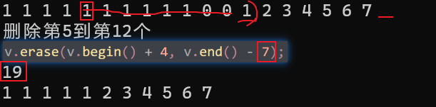 


#### 3.2.6 vector数据存取


**功能描述：**

* 对vector中的数据的存取操作


**函数原型：**

* `at(int idx); `     //返回索引idx所指的数据
* `operator[]; `       //返回索引idx所指的数据
* `front(); `            //返回容器中第一个数据元素
* `back();`              //返回容器中最后一个数据元素


**示例：**

```C++
#include<iostream>
#include<algorithm>
#include <vector>
using namespace std;
void Print(vector<int> p)
{
	for (vector<int>::iterator i = p.begin(); i < p.end(); i++) {
		cout << *i << " ";
	}

}


int main()
{
	vector<int> v;
	for (int i = 0; i < 10; i++)
	{
		v.push_back(i);
	}
	for (int i = 0; i < v.size(); i++)
	{
		cout << v[i] << " ";
	}
	cout << endl;

	for (int i = 0; i < v.size(); i++)
	{
		cout << v.at(i) << "-";
	}
	cout << endl;
	for (vector<int>::iterator i = v.begin(); i < v.end(); i++)
	{
		cout << *i << "*";
	}

	cout << endl;
	cout << "第一个元素是" << v.front() << "等于*v.begin()=v[1]=v.at(1):::" << *v.begin() << v[0] << v.at(0) << endl;
	cout << "最后元素是" << v.front() << "等于*(v.end()-1)=v[1]=v.at(1):::" << *(v.end() - 1) << v[v.size()-1] << v.at(v.size() - 1) << endl;

	return 0;
}
```

总结：

* 除了用迭代器获取vector容器中元素，[ ]和at也可以
* front返回容器第一个元素
* back返回容器最后一个元素


#### 3.2.7 vector互换容器

**功能描述：**

* 实现两个容器内元素进行互换


**函数原型：**

* `swap(vec);`  // 将vec与本身的元素互换

==**指针指向的交换**==


**示例：**

```C++
#include<iostream>
#include<algorithm>
#include <vector>
using namespace std;
void Print(vector<int> p)
{
	for (vector<int>::iterator i = p.begin(); i < p.end(); i++) {
		cout << *i << " ";
	}

}


int main()
{
	vector<int> v;
	for (int i = 0; i < 1000; i++)
	{
		v.push_back(i);
	}
	cout << "v的容量capacity是" << v.capacity() << endl;
	cout << "v的大小size是" << v.size() << endl;
	cout << "会帮我自动扩一点" << endl;
	v.resize(10);
	cout << "v的容量capacity是" << v.capacity() << endl;
	cout << "v的大小size是" << v.size() << endl;
	cout << "resize操纵的是实际大小，变小原本的删掉，变大用默认或者指定的n来代替" << endl;
	cout << "----------------用swap来巧妙的减少浪费内存-------------------" << endl;
	vector<int>  v1(v);
	cout << "v1的容量capacity是" << v1.capacity() << endl;
	cout << "v1的大小size是" << v1.size() << endl;
	cout << "再交换之后" << endl;
	v1.swap(v);
	cout << "v的容量capacity是" << v.capacity() << endl;
	cout << "v的大小size是" << v.size() << endl;
	cout << "----------------------------------------------" << endl;

	vector<int> v2(v);
	vector<int> v3;
	for (int i = 0; i < 5; i++)
	{
		v3.push_back(i);
	}
	Print(v2);
	cout << endl << "容量" << v2.capacity() << "大小" <<v2.size()<<endl;
	Print(v3);
	cout << endl << "容量" << v3.capacity() << "大小" << v3.size() << endl;
	v2.swap(v3);
	Print(v2);
	cout << endl << "容量" << v2.capacity() << "大小" << v2.size() << endl;
	Print(v3);
	cout << endl << "容量" << v3.capacity() << "大小" << v3.size() << endl;
	return 0;
}
```

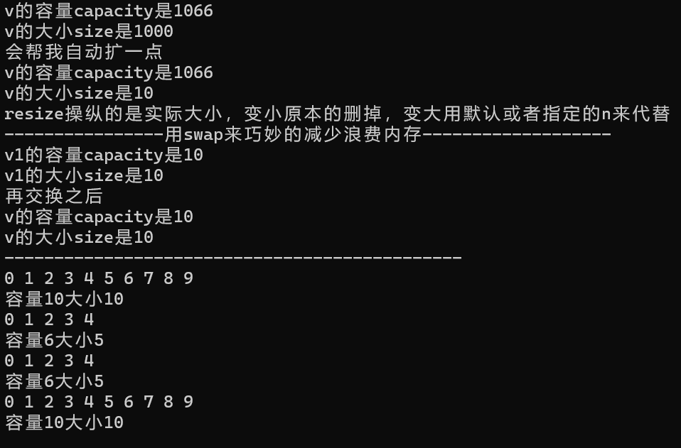 


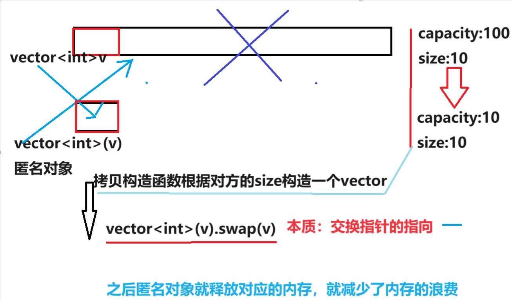 

总结：swap可以使两个容器互换，可以达到实用的收缩内存效果


#### 3.2.8 vector预留空间

**功能描述：**

* 减少vector在动态扩展容量时的扩展次数


**函数原型：**

* `reserve(int len);`//容器预留len个元素长度，预留位置不初始化，元素不可访问。

  

**示例：**

```C++
#include<iostream>
#include<algorithm>
#include <vector>
using namespace std;
void Print(vector<int> p)
{
	for (vector<int>::iterator i = p.begin(); i < p.end(); i++) {
		cout << *i << " ";
	}
}


int main()
{
	vector<int> v;
	int num = 0;
	int* p = NULL;
	for (int i = 0; i < 100000; i++)
	{
		v.push_back(i);
		if (p != &v[0])
		{
			p = &v[0];
			num++;
			cout << "这次扩展到" << v.capacity()<<endl;
		}
	}
	//动态扩展，这个过程扩展了多少次？
	cout << "动态扩展了" << num << endl;


	vector <int> newv;
	newv.reserve(1000000);
	//cout << newv[999];//会直接爆炸
	int newnum = 0;
	int* newp = NULL;
	for (int i = 0; i < 100000; i++)
	{
		newv.push_back(i);
		if (newp != &newv[0])
		{
			newp = &newv[0];
			newnum++;
			cout << "这次扩展到" << newv.capacity() << endl;
		}
	}
	//动态扩展，这个过程扩展了多少次？
	cout << "动态扩展了" << newnum << endl;
		//这次扩展到1000000
		//动态扩展了1
	cout << newv[999];
	return 0;
}
```

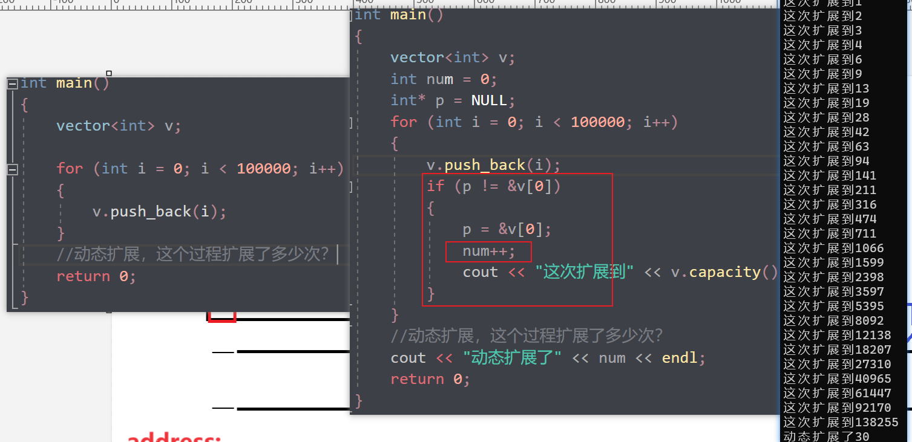 

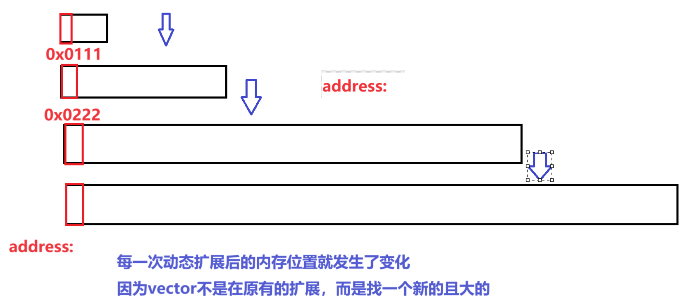 


总结：如果数据量较大，可以一开始利用reserve==预留空间==


#### vector排序

+ `algorithm里面的sort函数排序`
+ [参见deque的排序](#sort)


### 3.3 deque容器(双向)

#### 3.3.1 deque容器基本概念


**功能：**

* 双端数组，可以对头端进行插入删除操作


**deque与vector区别：**

* vector对于头部的插入删除效率低，数据量越大，效率越低
* deque相对而言，对头部的插入删除速度回比vector快
* vector访问元素时的速度会比deque快,这和两者内部实现有关


deque内部工作原理:

deque内部有个==**中控器**==，维护每段缓冲区中的内容，==缓冲区中存放真实数据==

中控器维护的是==每个缓冲区的地址==，使得使用deque时像一片连续的内存空间


* **deque容器的迭代器也是支持随机访问的**


#### 3.3.2 deque构造函数

**功能描述：**

* deque容器构造


**函数原型：**

* `deque<T>` deqT;                      //默认构造形式
* `deque(v.begin(), v.end());`                  //构造函数将[beg, end)区间中的元素拷贝给本身。
* `deque(n, elem);`                    //构造函数将n个elem拷贝给本身。
* `deque(const deque &deq);`   //拷贝构造函数


**示例：**

```C++
#include <iostream>
#include <deque>
#include <algorithm>
using namespace std;

void Print(deque<int> p)
{
	for (int i : p)
	{
		cout << i << "-";
	}
}

int main()
{
	deque<int> d;
	deque<int> d1(d);
	deque<int> d2(10,1);
	deque<int> d3(d2.begin()+3,d2.end());

	for (int i = 0; i < 10; i++)
	{
		d.push_front(i);
	}

	for (int i = 0; i < 10; i++)
	{
		d3.push_back(i);
	}
	Print(d);
	Print(d1);
	cout << endl;
	Print(d2);
	cout << endl;

	Print(d3);

	cout << endl;

	return 0;
}
```

**总结：**==deque容器和vector容器的构造方式几乎一致，==灵活使用即可


#### 3.3.3 deque赋值操作


**功能描述：**

* 给deque容器进行赋值


**函数原型：**

* `deque& operator=(const deque &deq); `         //重载等号操作符


* `assign(beg, end);`                                           //将[beg, end)区间中的数据拷贝赋值给本身。
* `assign(n, elem);`                                             //将n个elem拷贝赋值给本身。


**示例：**

```C++
#include <deque>

void printDeque(const deque<int>& d) 
{
	for (deque<int>::const_iterator it = d.begin(); it != d.end(); it++) {
		cout << *it << " ";

	}
	cout << endl;
}
//赋值操作
void test01()
{
	deque<int> d1;
	for (int i = 0; i < 10; i++)
	{
		d1.push_back(i);
	}
	printDeque(d1);

	deque<int>d2;
	d2 = d1;
	printDeque(d2);

	deque<int>d3;
	d3.assign(d1.begin(), d1.end());
	printDeque(d3);

	deque<int>d4;
	d4.assign(10, 100);
	printDeque(d4);

}

int main() {

	test01();

	system("pause");

	return 0;
}
```


总结：deque赋值操作也与vector相同，需熟练掌握


#### 3.3.4 deque大小操作

**功能描述：**

* 对deque容器的大小进行操作


**函数原型：**

* `deque.empty();`                       //判断容器是否为空

* `deque.size();`                         //返回容器中元素的个数

* `deque.resize(num);`                //重新指定容器的长度为num,若容器变长，则以默认值填充新位置。

  ​			                             //如果容器变短，则末尾超出容器长度的元素被删除。

* `deque.resize(num, elem);`     //重新指定容器的长度为num,若容器变长，则以elem值填充新位置。

  ​                                                     //如果容器变短，则末尾超出容器长度的元素被删除。

  


**示例：**

```C++
#include <iostream>
#include <deque>
#include <algorithm>
using namespace std;

void Print(deque<int> p)
{
	for (int i : p)
	{
		cout << i << "-";
	}
	cout << endl;
}

int main()
{
	deque<int> d;
	for (int i = 0; i < 10; i++)
	{
		d.push_back(i);
	}
	Print(d);
	cout << d.size() << endl;
	d.assign(d.begin(), d.end() - 3);
	cout << d.size() << endl;
	if (d.empty())
	{
		cout << "deque是空的" << endl;
	}
	else
	{
		cout << "deque不是空 的" << endl;
	}
	d.resize(5);
	Print(d);
	d.resize(25);
	Print(d);
//0-1-2-3-4-5-6-7-8-9-
//10
//7
//deque不是空 的
//0-1-2-3-4-
//0-1-2-3-4-0-0-0-0-0-0-0-0-0-0-0-0-0-0-0-0-0-0-0-0
	return 0;
}
```

总结：

* deque没有容量的概念
* 判断是否为空   --- empty
* 返回元素个数   --- size
* 重新指定个数   --- resize


#### 3.3.5==deque 插入和删除==

**功能描述：**

* 向deque容器中插入和删除数据


**函数原型：**

==两端==插入操作：

- `push_back(elem);`          //在容器尾部添加一个数据
- `push_front(elem);`        //在容器头部插入一个数据
- `pop_back();`                   //删除容器最后一个数据
- `pop_front();`                 //删除容器第一个数据

指定位置操作：

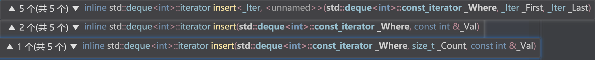 

* `insert(pos,elem);`         //在pos位置插入一个elem元素的拷贝，返回新数据的位置。

* `insert(pos,n,elem);`     //在pos位置插入n个elem数据，无返回值。

* `insert(pos,beg,end);`    //在pos位置插入[beg,end)区间的数据，无返回值。

* `clear();`                           //清空容器的所有数据

* ==都是迭代器==

* 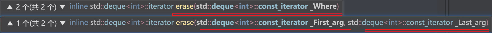 

* `erase(beg,end);`             //删除[beg,end)区间的数据，==返回下一个数据的位置。==

* `erase(pos);`                    //删除pos位置的数据，==返回下一个数据的位置。==

  

  


**示例：**

```C++
#include <iostream>
#include <deque>
#include <algorithm>
using namespace std;

void Print(deque<int> p)
{
	for (int i : p)
	{
		cout << i << " ";
	}
	cout << endl;
}

int main()
{
	deque<int> d;
	for (int i = 0; i < 10; i++)
	{
		d.push_back(i);
	}
	Print(d);
	d.pop_back();
	Print(d);
	d.pop_front();
	Print(d);
	d.erase(d.begin());
	Print(d);
	//d.erase(0);//错误
	//插入
	d.insert(d.begin(), 100);
	Print(d);
	d.insert(d.begin(), 2, 1000);
	Print(d);
	d.clear();
	Print(d);
	cout << "ds--ad-a" << endl;
	return 0;
}
```

总结：

* 插入和删除提供的位置是迭代器！
* 尾插   ---  push_back
* 尾删   ---  pop_back
* 头插   ---  push_front
* 头删   ---  pop_front


#### 3.3.6 deque 数据存取


**功能描述：**

* 对deque 中的数据的存取操作


**函数原型：**

- `at(int idx); `     //返回索引idx所指的数据
- `operator[]; `      //返回索引idx所指的数据
- `front(); `            //返回容器中第一个数据元素
- `back();`              //返回容器中最后一个数据元素


**示例：**

```C++
#include <iostream>
#include <deque>
#include <algorithm>
using namespace std;

void Print(deque<int> p)
{
	for (int i : p)
	{
		cout << i << " ";
	}
	cout << endl;
}

int main()
{
	deque<int> d;
	for (int i = 0; i < 10; i++)
	{
		d.push_back(i);
	}
	Print(d);
	cout << "第一个元素是" << d.at(0)<<"-" << d[0] <<"-" << d.front() << endl;
	cout << "d.at(0) == d[0]==d.front()";
	cout << "最后一个元素是" << d.back() << "-" << d.at(d.size() - 1) << "-" << d[d.size() - 1] << endl;
	cout << "d.back()==d.at(d.size() - 1)==d[d.size() - 1]";
	cout << "和vector一样" << endl;
//0 1 2 3 4 5 6 7 8 9
//第一个元素是0-0-0
//d.at(0) == d[0]==d.front()最后一个元素是9-9-9
//d.back()==d.at(d.size() - 1)==d[d.size() - 1]和vector一样
	return 0;
}
```

总结：

- 除了用迭代器获取deque容器中元素，[ ]和at也可以
- front返回容器第一个元素
- back返回容器最后一个元素


#### 3.3.7 <a name="sort"> deque 排序</a>

**功能描述：**

* 利用算法实现对deque容器进行排序

**算法：**

* `sort(iterator beg, iterator end)`  //对beg和end区间内元素进行排序

**示例：**

```C++
#include <iostream>
#include <deque>
#include <algorithm>
using namespace std;
class Person {
public:
	Person(string n, int a) :age(a), name(n) {};

	int age;
	string name;
};
void newPrint(deque<Person> p)
{
	for (Person i : p)
	{
		cout << "姓名:" << i.name << "年龄："<<i.age << " ";
	}
	cout << endl;
}

void Print(deque<int> p)
{
	for (int i : p)
	{
		cout << i << " ";
	}
	cout << endl;
}
bool shengxu(int a, int b)
{
	return a < b;
}
bool jiangxu(int a, int b)
{
	return a > b;
}
bool Psheng(Person& p1, Person& p2)
{
	return p1.age < p2.age;
}
bool Pjiang(Person& p1, Person& p2)
{
	return p1.age > p2.age;
}
int main()
{
	deque<int> d;
	d.push_back(2);
	d.push_back(9);
	d.push_back(1);
	d.push_back(0);
	d.push_back(10);

	Print(d);
	sort(d.begin(), d.end(),shengxu);
	Print(d);
	sort(d.begin(), d.end(), jiangxu);
	Print(d);

	cout << "sort函数不指定第三个参数的时候是默认的升序排序" << endl;

	deque<Person> p;
	Person p1("uma1", 6);
	Person p2("ni23ma2", 91);
	Person p3("ndsama3", 21);
	Person p4("nsada4", 1);

	p.push_back(p1);
	p.push_back(p2);
	p.push_back(p3);
	p.push_back(p4);
	newPrint(p);
	cout << "按照自定义升序排序后" << endl;
	sort(p.begin(), p.end(), Psheng);
	newPrint(p);
	cout << "按照自定义降序排序后" << endl;
	sort(p.begin(), p.end(), Pjiang);
	newPrint(p);


	return 0;
}
```

总结：sort算法非常实用，使用时包含头文件 algorithm即可


### 3.4 案例-评委打分


#### 3.4.1 案例描述

有5名选手：选手ABCDE，10个评委分别对每一名选手打分，去除最高分，去除评委中最低分，取平均分。


#### 3.4.2 实现步骤

1. 创建五名选手，放到vector中
2. 遍历vector容器，取出来每一个选手，执行for循环，可以把10个评分打分存到deque容器中
3. sort算法对deque容器中分数排序，去除最高和最低分
4. deque容器遍历一遍，累加总分
5. 获取平均分


**示例代码：**

```C++
#include <vector>
#include <deque>
#include <algorithm>
#include <iostream>
#include <string>
using namespace std;
class Person {
public:
	Person(std::string name, int score) :m_name(name), m_score(score) {};
	std::string m_name;//姓名
	int m_score;//平均分
};
void Print(const vector<Person> v)
{
	for (Person p : v)
	{
		cout << "姓名:" << p.m_name << "平均分" << p.m_score << endl;
	}
}
void creatPerson(vector<Person> &v)
{
	string name;
	string indexname = "ABCDEF";

	for (int j = 0; j < 5; j++)
	{
		name = "姓名";
		name += indexname[j];
		int score = 0;
		v.push_back(Person(name, score));
	}

};
void setScore(vector<Person> &p)
{
	for (vector<Person>::iterator i = p.begin(); i < p.end(); i++)
	{
		deque<int> d;
		for (int j = 0; j < 10; j++)
		{
			int randscore = rand() % 41 + 60;//60---100
			d.push_back(randscore);
		}

		//for (int q : d)
		//{
		//	cout << q << " ";
		//}
		//cout << "\n";


		sort(d.begin(), d.end());
		d.pop_back();
		d.pop_front();
		int sum = 0;
		for (int l = 0; l < d.size(); l++)
		{
			sum += d.at(l);
		}

		int avg = sum / d.size();
		
		(*i).m_score = avg;

	}
}
bool sheng(Person p1, Person p2)
{
	return p1.m_score > p2.m_score;
}
int main()
{
	srand(static_cast<unsigned int>(time(0)));

	//1创建一个vector存储五个人
	vector<Person> v;
	creatPerson(v);
	Print(v);

	//开始打分
	setScore(v);
	cout << "打分后\n";

	Print(v);
	cout << "升序排序后\n";
	sort(v.begin(), v.end(), sheng);
	Print(v);

	return 0;
}
```

**总结：** 选取不同的容器操作数据，可以提升代码的效率


### 3.5 ==stack==容器

#### 3.5.1 stack 基本概念

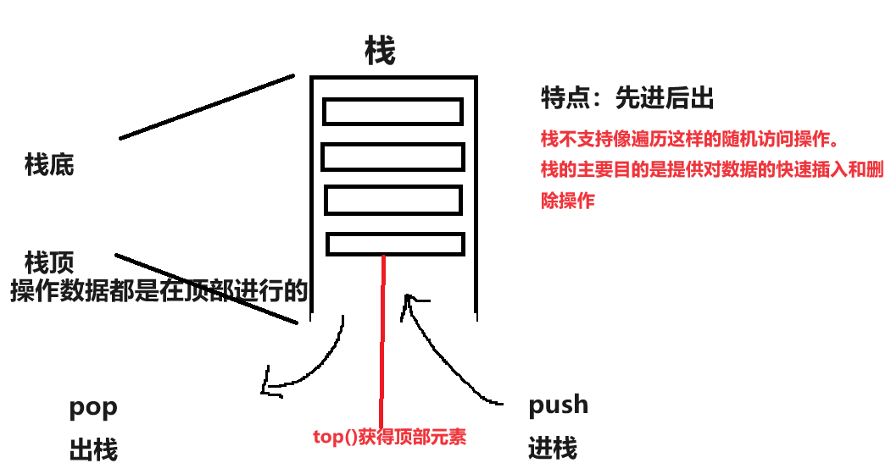

**概念：**stack是一种**先进后出**(First In Last Out,FILO)的数据结构，它只有一个出口


==**栈中只有顶端的元素才可以被外界使用，因此栈不允许有遍历行为**==

栈中进入数据称为  --- **入栈**  `push`

栈中弹出数据称为  --- **出栈**  `pop`

==**栈是自顶向下的，堆是向上的**==

生活中的栈：


#### 3.5.2 stack 常用接口

功能描述：栈容器常用的对外接口

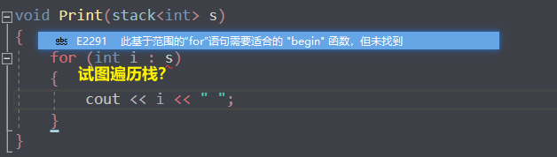 

构造函数：

* `stack<T> stk;`                                 //stack采用模板类实现， stack对象的默认构造形式
* `stack(const stack &stk);`            //拷贝构造函数

赋值操作：

* `stack& operator=(const stack &stk);`           //重载等号操作符

数据存取：

* `push(elem);`      //向栈顶添加元素
* `pop();`                //从栈顶移除第一个元素
* `top(); `                //返回栈顶元素

大小操作：

* `empty();`            //判断堆栈是否为空
* `size(); `              //返回栈的大小


**示例：**

```C++
#include <iostream>
using namespace std;

#include <stack>
#include <algorithm>

int getfirst(stack<int> &s)
{
	return s.top();
}

void delfirst(stack<int>& s)
{
	s.pop();
}

void isempty(stack<int>& s)
{
	if (s.empty())
	{
		cout << "栈现在是空的" << endl;
	}
	else
	{
		cout << "栈不是空的" << endl;
	}
}

int main()
{
	stack<int> s;
	isempty(s);
	for (int i = 0; i < 10; i++)
	{
		s.push(i);
	}

	isempty(s);
	cout << "栈现在的大小" << s.size() << endl;
	cout << "栈顶的第一个数据是..."<<getfirst(s) << endl;
	cout << "栈现在的大小" << s.size() << endl;
	delfirst(s);
	cout << "栈顶的第一个数据是..." << getfirst(s) << endl;
	cout << "栈现在的大小" << s.size() << endl;
	delfirst(s);
	cout << "栈顶的第一个数据是..." << getfirst(s) << endl;
	cout << "栈现在的大小" << s.size() << endl;
//栈现在是空的
//栈不是空的
//栈现在的大小10
//栈顶的第一个数据是...9
//栈现在的大小10
//栈顶的第一个数据是...8
//栈现在的大小9
//栈顶的第一个数据是...7
//栈现在的大小8


	return 0;
}
```

总结：

* 入栈   --- push
* 出栈   --- pop
* 返回栈顶   --- top
* 判断栈是否为空   --- empty
* 返回栈大小   --- size


### 3.6 ==queue== 容器

#### 3.6.1 queue 基本概念


**概念：**Queue是一种**先进先出**(First In First Out,FIFO)的数据结构，它有一个出口一个入口


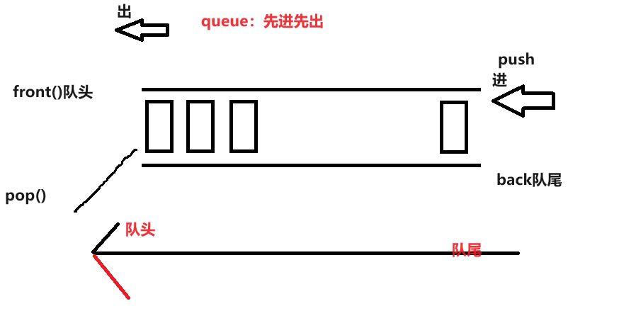


队列容器允许从一端新增元素，从另一端移除元素

队列中只==有队头和队尾才可以被外界使用==，因此队列==不允许有遍历行为==

队列中进数据称为 --- **入队**    `push`

队列中出数据称为 --- **出队**    `pop`


生活中的队列：


#### 3.6.2 queue 常用接口


功能描述：栈容器常用的对外接口


构造函数：

- `queue<T> que;`                                 //queue采用模板类实现，queue对象的默认构造形式
- `queue(const queue &que);`            //拷贝构造函数

赋值操作：

- `queue& operator=(const queue &que);`           //重载等号操作符

数据存取：

- `push(elem);`                             //往队尾添加元素
- `pop();`                                      //从队头移除第一个元素
- `back();`                                    //返回最后一个元素
- `front(); `                                  //返回第一个元素

大小操作：

- `empty();`            //判断堆栈是否为空
- `size(); `              //返回栈的大小


**示例：**

```C++
#include <iostream>
#include <queue>
#include <algorithm>


using namespace std;
class Person
{
public:
	Person(string name, int age)
	{
		this->m_Name = name;
		this->m_Age = age;
	}

	string m_Name;
	int m_Age;
};

int main() {

	//创建队列
	queue<Person> q;

	//准备数据
	Person p1("唐僧", 30);
	Person p2("孙悟空", 1000);
	Person p3("猪八戒", 900);
	Person p4("沙僧", 800);

	//向队列中添加元素  入队操作
	q.push(p1);
	q.push(p2);
	q.push(p3);
	q.push(p4);

	//队列不提供迭代器，更不支持随机访问	
	while (!q.empty()) {
		//输出队头元素
		cout << "队头元素-- 姓名： " << q.front().m_Name
			<< " 年龄： " << q.front().m_Age << endl;

		cout << "队尾元素-- 姓名： " << q.back().m_Name
			<< " 年龄： " << q.back().m_Age << endl;

		cout << endl;
		//弹出队头元素
		q.pop();
	}

	cout << "队列大小为：" << q.size() << endl;

	return 0;
}
```

总结：

- 入队   --- push
- 出队   --- pop
- 返回队头元素   --- front
- 返回队尾元素   --- back
- 判断队是否为空   --- empty
- 返回队列大小   --- size


### 3.7 list容器(双向)

#### 3.7.1 list基本概念

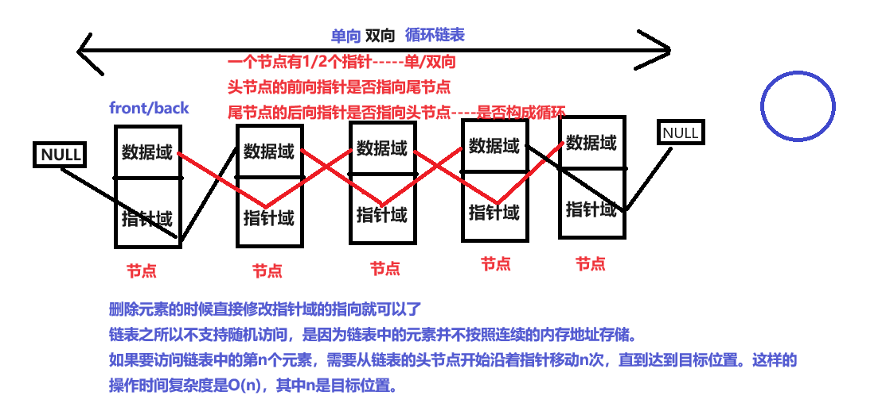

**功能：**将数据进行==链式存储==

==**链表**（list）是一种物理存储单元上非连续==的存储结构，数据元素的逻辑顺序是通过==链表中的指针链接实现==的

链表的组成：==链表由一系列**结点**组成==


结点的组成：==一个是存储数据元素的**数据域**，另一个是存储下一个结点地址的**指针域**==

> 单向链表和双向链表的主要区别在于节点之间的链接方式和支持的遍历方向。
>
> 1. 链接方式：
>    - 单向链表：每个节点只包含指向下一个节点的指针。节点可以从头到尾依次遍历，但无法直接访问前一个节点。
>    - 双向链表：每个节点既包含指向下一个节点的指针，也包含指向前一个节点的指针。节点可以从头到尾或从尾到头双向遍历，可以直接访问前一个节点和后一个节点。
> 2. 遍历方向：
>    - 单向链表：只能从头节点开始按照指针顺序向后遍历，无法反向遍历。
>    - 双向链表：可以从头节点或尾节点开始，根据指针的方向正向或反向遍历。
> 3. 内存占用：
>    - 单向链表：每个节点只包含指向下一个节点的指针，占用的内存相对较少。
>    - 双向链表：每个节点既包含指向下一个节点的指针，也包含指向前一个节点的指针，占用的内存相对较多。
> 4. 操作复杂性：
>    - 单向链表：插入和删除操作只需改变指针的指向，相对较简单。
>    - 双向链表：插入和删除操作需要同时改变前后节点的指针，稍微复杂一些。

STL中的链表是一个==双向循环链表==

> 1. 每个节点有两个指针域，分别指向前一个节点和后一个节点。
> 2. 尾节点的后向指针指向头节点，头节点的前向指针指向尾节点，形成了一个闭合的环。
> 3. 由于是循环的结构，可以从任何一个节点开始，沿着指针方向向前或向后遍历整个链表，直到回到出发节点。


由于==链表的存储方式并不是连续的内存空间==，因此链表list中的迭代器==只支持前移和后移==，属于**双向迭代器**

> 如果要访问链表中的第n个元素，需要从链表的头节点开始沿着指针移动n次，直到达到目标位置。这样的操作时间复杂度是O(n)，其中n是目标位置。
>
> 如果循环链表为空（没有任何元素），那么`begin`和`end`应该指向同一个位置，即都指向一个空的节点（比如nullptr）。
>
> 链表之所以不支持随机访问，是因为链表中的元素并不按照连续的内存地址存储。

list的优点：

* 采用**动态存储分配，不会造成内存浪费和溢出**
* 链表执行插入和删除操作十分方便，**修改指针即可，不需要移动大量元素**

list的缺点：

* 链表灵活，但是==空间(指针域) 和 时间（遍历）额外耗费较大==
* 占据空间大（指针）


List有一个重要的性质，==**插入操作和删除操作都不会造成原有list迭代器的失效**==，这在vector是不成立的。

> 虽然不会失效，但是不及时更新迭代器的话，迭代器一直指向旧list的那个位置
>
> ```c++
> 	list<int>::iterator begin = l1.begin();
> 	advance(begin, 3);
> 	l1.insert(begin, 111);
> 	Print(l1);
> 	//begin = l1.begin();
> 	//advance(begin, 3);
> 	l1.insert(begin, 1111);
> 	Print(l1);
> 	l1.erase(begin);
> 	Print(l1);
> ```
>
> 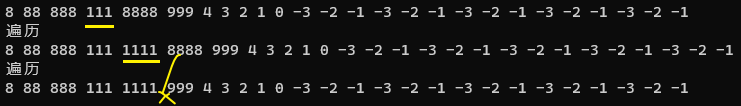
>
> 及时更新迭代器
>
> ```c++
> list<int>::iterator begin = l1.begin();
> advance(begin, 3);
> l1.insert(begin, 111);
> Print(l1);
> begin = l1.begin();
> advance(begin, 3);
> l1.insert(begin, 1111);
> Print(l1);
> begin = l1.begin();
> advance(begin, 3);
> l1.erase(begin);
> Print(l1);
> ```
>
> 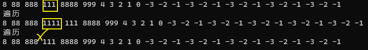 


总结：STL中**List和vector是两个最常被使用的容器**，各有优缺点


#### 3.7.2  list构造函数

**功能描述：**

* 创建list容器


**函数原型：**

* `list<T> lst;`                               //list采用采用模板类实现,对象的默认构造形式：
* `list(beg,end);`                           //构造函数将[beg, end)区间中的元素拷贝给本身。
* `list(n,elem);`                             //构造函数将n个elem拷贝给本身。
* `list(const list &lst);`            //拷贝构造函数。


**示例：**

```C++
#include <list>

void printList(const list<int>& L) {

	for (list<int>::const_iterator it = L.begin(); it != L.end(); it++) {
		cout << *it << " ";
	}
	cout << endl;
}

void test01()
{
	list<int>L1;
	L1.push_back(10);
	L1.push_back(20);
	L1.push_back(30);
	L1.push_back(40);

	printList(L1);

	list<int>L2(L1.begin(),L1.end());
	printList(L2);

	list<int>L3(L2);
	printList(L3);

	list<int>L4(10, 1000);
	printList(L4);
}

int main() {

	test01();

	system("pause");

	return 0;
}
```

总结：list构造方式同其他几个STL常用容器，熟练掌握即可


可以用{}来列表初始化


#### 3.7.3 list 赋值和交换

**功能描述：**

* 给list容器进行赋值，以及交换list容器

**函数原型：**

* `assign(beg, end);`            //将[beg, end)区间中的数据拷贝赋值给本身。
* `assign(n, elem);`              //将n个elem拷贝赋值给本身。
* `list& operator=(const list &lst);`         //重载等号操作符
* `swap(lst);`                         //将lst与本身的元素互换。

1. **void assign (size_type n, const T& val)**
   这个重载用于将列表的内容替换为 n 个值为 val 的元素。例如：

   ```cpp
   std::list<int> mylist;
   mylist.assign(5, 10); // 将列表替换为包含 5 个值为 10 的元素
   ```

2. **template <class InputIterator> void assign (InputIterator first, InputIterator last)**
   这个重载接受两个迭代器参数，用于指定一个范围，将列表的内容替换为这个范围内的元素。例如：

   ```cpp
   std::list<int> mylist;
   int myints[] = {1776, 7, 4};
   mylist.assign(myints, myints+3); // 将列表替换为数组 myints 中的元素
   ```

3. **void assign (std::initializer_list<T> il)**
   这个重载使用初始化列表作为参数，用于将列表的内容替换为初始化列表中的元素。例如：

   ```cpp
   std::list<int> mylist;
   mylist.assign({1, 2, 3, 4, 5}); // 将列表替换为初始化列表中的元素
   ```

**示例：**

```C++
#include <iostream>
#include <list>
#include <algorithm>


using namespace std;
void Print(list<int> l1)
{
	cout << "遍历" << endl;
	for (list<int>::iterator i = l1.begin(); i!=l1.end(); i++)
	{
		cout << *i << " ";
	}
	cout << endl;
}
int main() {

	//构造函数
	list<int> l1;
	for (int i = 0; i < 5; i++)
	{
		for (int j = -3; j < 0; j++)
		{
			l1.push_back(j);
		}
		l1.push_front(i);
	}
	Print(l1);
	//拷贝构造函数
	list<int> l2(l1);
	Print(l2);

	//赋值
	list<int>l3;
	l3.assign(l1.begin(), l1.end());
	Print(l3);
	l3.assign(10, 11);
	Print(l3);
	l3 = l1;
	cout << "l3" ;

	Print(l3);
	list<int> l4({ 1,2,3,4,5 });
	cout << "l4" ;

	Print(l4);
	cout << "交换swap()" << endl;


	l3.swap(l4);
	cout << "l3";
	Print(l3);
	cout << "l4";
	Print(l4);


	return 0;
}
```

总结：list赋值和交换操作能够灵活运用即可


#### 3.7.4 list 大小操作

**功能描述：**

* 对list容器的大小进行操作


**函数原型：**

* `size(); `                             //返回容器中元素的个数

* `empty(); `                           //判断容器是否为空

* `resize(num);`                   //重新指定容器的长度为num，若容器变长，则以默认值填充新位置。

  ​					    //如果容器变短，则末尾超出容器长度的元素被删除。

* `resize(num, elem); `       //重新指定容器的长度为num，若容器变长，则以elem值填充新位置。

   //如果容器变短，则末尾超出容器长度的元素被删除。


**示例：**

```C++
#include <iostream>
#include <list>
#include <algorithm>


using namespace std;
void Print(list<int> l1)
{
	cout << "遍历" << endl;
	for (list<int>::iterator i = l1.begin(); i!=l1.end(); i++)
	{
		cout << *i << " ";
	}
	cout << endl;
}
int main() {

	list<int> l1;
	for (int i = 0; i < 5; i++)
	{
		for (int j = -3; j < 0; j++)
		{
			l1.push_back(j);
		}
		l1.push_front(i);
	}
	list<int> l2(l1);
	Print(l1);

	while (!l1.empty())
	{
		cout << "现在size是" << l1.size() << endl;
		cout << "尾部是" << l1.back() << endl;
		cout << "头部是" << l1.front() << endl;
		l1.pop_front();
		l1.pop_back();
	}
	l2.resize(5);
	cout << "---------------缩小size后------------------"<<endl;
	Print(l2);

	return 0;
}
```

总结：

- 判断是否为空   --- empty
- 返回元素个数   --- size
- 重新指定个数   --- resize


#### 3.7.5 ==list 插入和删除==<a name="双向迭代器"></a>

**功能描述：**

* 对list容器进行数据的插入和删除

> ​	l1.insert(l1.begin() + 3, 1);//wrong
>
> 对于 `std::list` 容器，插入操作并不支持像 `std::vector` 那样使用 `begin() + n` 来直接指定位置。因为 `std::list` 是一个双向链表，插入操作涉及到链表节点的重新连接，所以需要通过迭代器来指定插入位置。
>
> ```c++
> 	it = L.begin();
> 	L.erase(++it);
> 	自增和自减还是ok的，但是+-n就不行了
> ```
>
> 
>
> ---
>
> `std::advance` 的函数签名如下：
>
> ```c++
> template <class InputIt, class Distance>
> void advance(InputIt& it, Distance n);
> ```
>
> `std::advance` 函数的作用是将迭代器 `it` 向前或向后移动 `n` 个位置。如果 `n` 是正数，迭代器将向前移动；如果 `n` 是负数，迭代器将向后移动。
>
> ```c++
> 	l1.insert(l1.begin() + 3, 1);//wrong
> 	list<int>::iterator begin = l1.begin();
> 	advance(begin, 3);
> 	advance(l1.begin(), 3);//wrong
> ```
>
> `l1.begin()`返回的是一个指向容器中第一个元素的迭代器，而不是一个迭代器对象，因此不能直接调用`advance`函数来移动它的位置。相反，应该先将`l1.begin()`返回的迭代器存储在一个变量中，然后再使用`advance`函数来移动它的位置
>
> 

**函数原型：**

* push_back(elem);//在容器尾部加入一个元素

* pop_back();//删除容器中最后一个元素

* push_front(elem);//在容器开头插入一个元素

* pop_front();//从容器开头移除第一个元素

  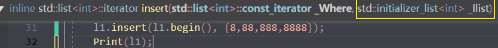

* insert(pos,elem);//在pos位置插elem元素的拷贝，返回新数据的位置。

   

* insert(pos,n,elem);//在pos位置插入n个elem数据，无返回值。

   

* insert(pos,beg,end);//在pos位置插入[beg,end)区间的数据，无返回值。

   

* clear();//移除容器的所有数据

* erase(beg,end);//删除[beg,end)区间的数据，返回下一个数据的位置。

   

* erase(pos);//删除pos位置的数据，返回下一个数据的位置。

   

* ==**remove(elem);//删除容器中所有与elem值匹配的元素。**==


**示例：**

```C++
#include <list>

void printList(const list<int>& L) {

	for (list<int>::const_iterator it = L.begin(); it != L.end(); it++) {
		cout << *it << " ";
	}
	cout << endl;
}

//插入和删除
void test01()
{
	list<int> L;
	//尾插
	L.push_back(10);
	L.push_back(20);
	L.push_back(30);
	//头插
	L.push_front(100);
	L.push_front(200);
	L.push_front(300);

	printList(L);

	//尾删
	L.pop_back();
	printList(L);

	//头删
	L.pop_front();
	printList(L);

	//插入
	list<int>::iterator it = L.begin();
	L.insert(++it, 1000);
	printList(L);

	//删除
	it = L.begin();
	L.erase(++it);
	printList(L);

	//移除
	L.push_back(10000);
	L.push_back(10000);
	L.push_back(10000);
	printList(L);
	L.remove(10000);
	printList(L);
    
    //清空
	L.clear();
	printList(L);
}

int main() {

	test01();

	system("pause");

	return 0;
}
```

总结：

* 尾插   --- push_back
* 尾删   --- pop_back
* 头插   --- push_front
* 头删   --- pop_front
* 插入   --- insert
* 删除   --- erase
* 移除   --- remove
* 清空   --- clear


list的迭代器不能+n

只能用advance或者自增自减++--


双向迭代器，不能跳跃移动


#### 3.7.6 list 数据存取

**功能描述：**

* 对list容器中数据进行存取


**函数原型：**

* `front();`        //返回第一个元素。
* `back();`         //返回最后一个元素。


**示例：**

```C++
#include <list>

//数据存取
void test01()
{
	list<int>L1;
	L1.push_back(10);
	L1.push_back(20);
	L1.push_back(30);
	L1.push_back(40);

	
	//cout << L1.at(0) << endl;//错误 不支持at访问数据
	//cout << L1[0] << endl; //错误  不支持[]方式访问数据
	cout << "第一个元素为： " << L1.front() << endl;
	cout << "最后一个元素为： " << L1.back() << endl;

	//list容器的迭代器是双向迭代器，不支持随机访问
	list<int>::iterator it = L1.begin();
	//it = it + 1;//错误，不可以跳跃访问，即使是+1
}

int main() {

	test01();

	system("pause");

	return 0;
}

```

总结：

* list容器中不可以通过[]或者at方式访问数据
* 返回第一个元素   --- front
* 返回最后一个元素   --- back


#### ==3.7.7 list 反转和排序==

**功能描述：**

* 将容器中的元素反转，以及将容器中的数据进行排序


**函数原型：**

* `reverse();`   //反转链表
* `sort();`        //链表排序

> //不支持==随机访问迭代器==的==不能用标准排序算法==
>
> ```c++
> sort()wrong
> l1.sort()//right
> ```
>
> //会有对应的sort成员函数


**示例：**

```C++
#include <iostream>
#include <list>
#include <algorithm>

bool jiang(int a, int b)
{
	return a > b;
}
bool sheng(int a, int b)
{
	return a < b;
}
using namespace std;
void Print(list<int> &l1)
{
	cout << "遍历" << endl;
	for (list<int>::const_iterator i = l1.begin(); i!=l1.end(); i++)
	{
		cout << *i << " ";
	}
	cout << endl;
}
int main() {

	list<int> l1;
	l1.push_back(1);
	l1.push_back(3);
	l1.push_back(9);
	l1.push_back(2);
	l1.push_back(6);


	cout << "反转后" << endl;
	l1.reverse();
	Print(l1);

	cout << "升序" << endl;

	//sort(l1.begin(), l1.end(),sheng);
	l1.sort();
	Print(l1);
	cout << "降序" << endl;
	l1.sort(jiang);
	//sort(l1.begin(), l1.end(), jiang);
	Print(l1);
	//不支持随机访问迭代器的不能用标准排序算法
	//会有对应的sort成员函数
	return 0;
}
```

总结：

* 反转   --- reverse
* 排序   --- sort （成员函数）


#### 3.7.8 排序案例

案例描述：将Person自定义数据类型进行排序，Person中属性有姓名、年龄、身高

排序规则：按照年龄进行升序，如果年龄相同按照身高进行降序


**示例：**

```C++
#include <iostream>
#include <vector>
#include <algorithm>
//排序规则：按照年龄进行升序，如果年龄相同按照身高进行降序


using namespace std;
class Person {
public:
	Person(string n, int a, int s) :name(n), age(a), shengao(s) {};
	string name;
	int age;
	int shengao;


};

void creatPerson(vector<Person> &v)
{
	string name = "学生";
	string abc = "ABCDEF";
	string newname = " ";
	int age;
	int height;
	for (int i = 0; i < 5; i++)
	{
		newname = name + abc[i];
		age = rand()%11+10;
		height= rand() % 21 + 160;
		v.push_back(Person(newname, age, height));
	}

}

void Print(vector<Person> p)
{
	for (Person i : p)
	{
		cout << "姓名:" << i.name << "年龄:" << i.age << "身高:" << i.shengao << endl;
	}
}

bool compare(Person p1, Person p2)
{
	if (p1.age != p2.age)
	{
		return p1.age < p2.age;
	}
	else
	{
		return p1.shengao > p2.shengao;
	}

}
int main()
{
	srand(static_cast<unsigned int>(time(0)));
	vector<Person> v;
	creatPerson(v);
	Print(v);
	cout << "排序后" << endl;
	sort(v.begin(), v.end(), compare);
	Print(v);
//姓名:学生A年龄:12身高 : 27
//姓名 : 学生B年龄 : 20身高 : 87
//姓名 : 学生C年龄 : 14身高 : 113
//姓名 : 学生D年龄 : 12身高 : 145
//姓名 : 学生E年龄 : 13身高 : 45
//排序后
//姓名 : 学生D年龄:12身高 : 145
//姓名 : 学生A年龄 : 12身高 : 27
//姓名 : 学生E年龄 : 13身高 : 45
//姓名 : 学生C年龄 : 14身高 : 113
//姓名 : 学生B年龄 : 20身高 : 87


	return 0;
}
```


总结：

* 对于自定义数据类型，必须要指定排序规则，否则编译器不知道如何进行排序


* 高级排序只是在排序规则上再进行一次逻辑规则制定，并不复杂


### 3.8 set/ multiset 容器（双向）

#### 3.8.1 set基本概念

**简介：**

* 所有元素都==会在插入时**自动被排序**==


**本质：**

* set/multiset属于==**关联式容器**==，底层结构是用==**二叉树**==实现。


**set和multiset区别**：

* set==不允许容器中有重复的元素==

* multiset==**允许容器中有重复的元素**==

  > **包含了set的头文件也可以用multiset！**


#### 二叉树

> 二叉树是一种==树形数据结构==，它由==节点==组成，==每个节点最多有两个子节点==，分别称为左子节点和右子节点。二叉树通常被用来模拟自然界中的层级关系，比如家族关系、文件系统等。
>
> 为了更容易理解二叉树的核心概念，可以通过以下方式学习：
>
> 1. **节点（Node）：** 二叉树的基本单元就是节点。每个节点包含一个值，并且可能具有指向左子节点和右子节点的引用。
>
> 2. **根节点（Root Node）：** 二叉树的顶部节点称为根节点。它是整棵树的起点。
>
> 3. **子节点（Child Node）：** 每个节点最多有两个子节点，分别称为左子节点和右子节点。
>
> 4. **叶子节点（Leaf Node）：** 没有子节点的节点称为叶子节点，它们位于树的末端。
>
> 5. **深度（Depth）：** 从根节点到某个节点的唯一路径的长度称为该节点的深度。根节点的深度为0。
>
> 6. **高度（Height）：** 从一个节点到它的叶子节点的最长路径经过的边的数量称为该节点的高度。树的高度等于根节点的高度。
>
> 7. **遍历（Traversal）：** 遍历是指按照一定顺序访问树中的所有节点。常见的遍历方式有前序遍历、中序遍历和后序遍历。
>
> 8. **平衡二叉树（Balanced Binary Tree）：** 如果一棵二叉树的每个节点的左子树和右子树的高度差不超过1，则称这棵二叉树是平衡二叉树。
>
> 9. **二叉搜索树（Binary Search Tree）：** 一种特殊的二叉树，左子树上所有节点的值均小于根节点的值，右子树上所有节点的值均大于根节点的值。
>
> 10. **操作：** 二叉树支持插入、删除、查找等操作，这些操作可以帮助我们在树中存储和检索数据。
>
> 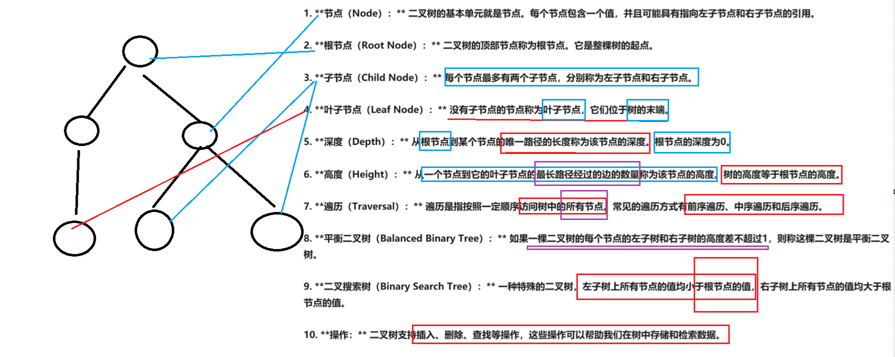


#### 3.8.2 set构造和赋值

功能描述：创建set容器以及赋值


构造：

* `set<T> st;`                        //默认构造函数：
* `set(const set &st);`       //拷贝构造函数

赋值：

* `set& operator=(const set &st);`    //重载等号操作符


**示例：**

```C++
#include <iostream>
#include <set>
#include <algorithm>
using namespace std;
void PrintSet(set<int> s)
{
	for (int i : s)
	{
		cout << i << " ";
	}
	cout << endl;
}
int main()
{

	set<int> s;
	s.insert(1);
	s.insert(2);
	s.insert(8);
	s.insert(3);
	s.insert(9);
	/////////////set的特点：1：只有插入的方式存储数据，而且对插入的数据自动升序排序
	////////////2.不允许有重复的数据！
	s.insert(9);
	s.insert(9);
	s.insert(9);


	PrintSet(s);


	cout << "拷贝构造函数" << endl;

	set<int> s1(s);
	PrintSet(s1);

	cout << "等号赋值操作" << endl;
	set<int> s3;
	s3 = s1;
	PrintSet(s3);
	return 0;
}
```

总结：


* set容器插入数据时用insert
* set容器插入数据的数据会自动(升序)排序

> Set是一种容器，==用于存储独特（唯一）的元素，它不允许重复值==。在C++中，Set通常使用红黑树（Red-Black Tree）实现，这是一种==自平衡的二叉搜索树==。
>
> `resize`方法通常用于动态调整容器的大小。对于具有固定大小的容器（如数组），可以通过`resize`方法增加或减少容器的大小。
>
> 然而，对于Set容器来说，它的大小是由其中的元素数量决定的，并且==Set容器不允许重复值，所以它的大小是动态变化的。==`就算扩大了用0来补充但是不能有重复的元素，那resize了个什么？`
>
> 由于Set容器使用红黑树来实现，红黑树的结构与容器的大小相关。每次插入、删除元素时，红黑树会自动进行平衡操作，以保持树的平衡性.
>
> ==**Set容器的大小是由树的结构和元素的数量共同决定的，而不是由用户手动指定的**==


#### <a name="自定义数据时候的比较">set放自定义数据的时候如何自动排序呢</a>

> `std::set` 默认使用 `operator<` 来进行对象的比较，而不是 `operator>`。因此，在使用 `std::set` 存储自定义对象时，你需要重载 `<` 运算符来定义对象的比较规则。

```c++
#include <iostream>
#include <set>
#include <algorithm>
#include <string>
using namespace std;
class Person {
public:

	Person(int age, string name) :age(age), name(name) {};
	int age;
	string name;
	//需要自定义比较规则,而且set默认是用<来比较的，重载>就报错了！
	bool operator<(const Person &p) const {
		if (this->name == p.name)
		{
			return this->age > p.age;
		}
		else
		{
			return this->name > p.name;
		}
	}
};
void PrintSet(const set<Person> &s)
{
	for (const Person i : s)
	{
		cout << "姓名" << i.name << "年龄" << i.age << endl;
	}
} 

int main()
{
	set<Person> s;
	Person p1(11, "小明2");
	Person p2(12, "小明1");
	Person p3(13, "小明3");
	Person p4(14, "小明5");
	Person p5(15, "小明0");
	s.insert(p1);
	s.insert(p2);
	s.insert(p4);
	s.insert(p5);
	s.insert(p5);

	PrintSet(s);
 
	return 0;
}
```


#### 3.8.3 set大小和交换

**功能描述：**

* 统计set容器大小以及交换set容器


**函数原型：**

* `size();`          //返回容器中元素的数目
* `empty();`        //判断容器是否为空
* `swap(st);`      //交换两个集合容器


**示例：**

```C++
#include <iostream>
#include <set>
#include <algorithm>
using namespace std;
void PrintSet(set<int> s)
{
	for (int i : s)
	{
		cout << i << " ";
	}
	cout << endl;
}
void SetIsempty(set<int> s)
{
	if (s.empty())
	{
		cout << "set是空的" << endl;
	}
	else
	{
		cout << "set不是空的" << endl;
	}

}
int main()
{

	set<int> s;
	SetIsempty(s);
	s.insert(1);
	s.insert(2);
	s.insert(8);
	s.insert(3);
	s.insert(9);
	s.insert(9);
	s.insert(9);
	s.insert(9);


	PrintSet(s);
	cout << "set的大小" << endl;
	cout << s.size() << endl;
	//Set容器的大小是由树的结构和元素的数量共同决定的，而不是由用户手动指定的
	SetIsempty(s);
	set<int> s2;
	s2.insert(1);
	s2.insert(5);
	s2.insert(2);

	PrintSet(s2);

	s.swap(s2);

	cout << "交换后" << endl;

	cout << "s:";
	PrintSet(s);
	cout << "s2:";
	PrintSet(s2);


	return 0;
}
```

总结：

* 统计大小   --- size
* 判断是否为空   --- empty
* 交换容器   --- swap


#### 3.8.4 set插入和删除

**功能描述：**

* set容器进行插入数据和删除数据


**函数原型：**

* `insert(elem);`           //在容器中插入元素。
* `clear();`                    //清除所有元素
* `erase(pos);`              //删除pos迭代器所指的元素，返回下一个元素的迭代器。
* `erase(beg, end);`    //删除区间[beg,end)的所有元素 ，返回下一个元素的迭代器。
* `erase(elem);`            //删除容器中值为elem的元素。


**示例：**

```C++
#include <iostream>
#include <set>
#include <algorithm>
using namespace std;
void PrintSet(set<int> s)
{
	for (int i : s)
	{
		cout << i << " ";
	}
	cout << endl;
}
void SetIsempty(set<int> s)
{
	if (s.empty())
	{
		cout << "set是空的" << endl;
	}
	else
	{
		cout << "set不是空的" << endl;
	}

}
int main()
{

	set<int> s;
	SetIsempty(s);
	s.insert(1);
	s.insert(2);
	s.insert(8);
	s.insert(3);
	s.insert(9);
	s.insert(9);
	s.insert(9);
	s.insert(9);


	PrintSet(s);
	cout << "双向迭代器" << endl;
	//s.erase(s.begin()+2);
	s.erase(s.begin()++);
	PrintSet(s);
	s.erase(9);
	PrintSet(s);
	set<int>::iterator end = s.end();
	advance(end, -1);
	//s.erase(s.begin(),s.end()--);//不支持--后退操作，可以用advance来指定后退！！！！
	s.erase(s.begin(), end);
	PrintSet(s);
	//1 2 3 &
	cout << "-----------" << endl;
	s.clear();
	PrintSet(s);
	cout << "s.erase(s.begin(),s.end());" << "等价于" << "s.clear()" << endl;

	return 0;
}
```

总结：

* 插入   --- insert
* 删除   --- erase
* 清空   --- clear

> 双向迭代器不支持--
>
> 支持++
>
> 或者用advance指定移动位置，但是要及时更新迭代器！


#### 3.8.5 set查找和统计

**功能描述：**

* 对set容器进行查找数据以及统计数据


**函数原型：**

* `find(key);`                  //查找key是否存在,若存在，返回该键的元素的迭代器；若不存在，返回set.end();
* `count(key);`                //统计key的元素个数
* find返回的是迭代器可以*操作，找不到就返回end迭代器
* count返回0/1


**示例：**

```C++
#include <iostream>
#include <set>
#include <algorithm>
using namespace std;
void PrintSet(set<int> s)
{
	for (int i : s)
	{
		cout << i << " ";
	}
	cout << endl;
}
void SetIsempty(set<int> s)
{
	if (s.empty())
	{
		cout << "set是空的" << endl;
	}
	else
	{
		cout << "set不是空的" << endl;
	}

}
int main()
{

	set<int> s;
	SetIsempty(s);
	s.insert(1);
	s.insert(2);
	s.insert(8);
	s.insert(3);
	s.insert(9);
	s.insert(9);
	s.insert(9);
	s.insert(9);


	PrintSet(s);
	if (s.find(9)!=s.end())
	{
		cout << "找到拉！" << endl;
	}
	else
	{
		cout << "找不到T_T" << endl;
	}

	cout << "9的个数为" << s.count(9) << endl;
	cout << "10的个数为" << s.count(10) << endl;

	return 0;
}
```

总结：

* 查找   ---  find    （返回的是迭代器）
* 统计   ---  count  （对于set，结果为0或者1）


#### 3.8.6 set和multiset区别

**学习目标：**

* 掌握set和multiset的区别

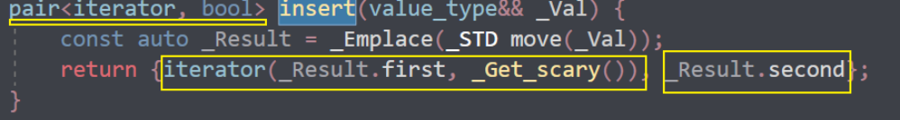 


multiset:

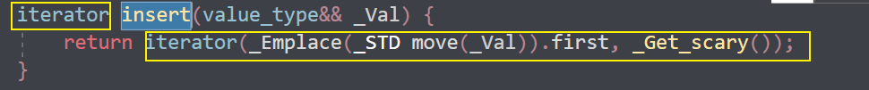 

**区别：**

* set不可以插入重复数据，而multiset可以
* set插入数据的同时会返回插入结果，表示插入是否成功
* multiset==不会检测数据，==因此可以插入重复数据


**示例：**

```C++
#include <iostream>
#include <set>
#include <algorithm>
using namespace std;
void PrintSet(set<int> s)
{
	for (int i : s)
	{
		cout << i << " ";
	}
	cout << endl;
}
void SetIsempty(set<int> s)
{
	if (s.empty())
	{
		cout << "set是空的" << endl;
	}
	else
	{
		cout << "set不是空的" << endl;
	}

}
int main()
{

	set<int> s;
	SetIsempty(s);

	pair<set<int>::iterator,bool> ret=s.insert(1);
	if (ret.second)
	{
		cout << "插入成功" << endl;
	}
	else
	{
		cout << "插入失败" << endl;
	}
	ret = s.insert(1);
	if (ret.second)
	{
		cout << "插入成功" << endl;
	}
	else
	{
		cout << "插入失败" << endl;
	}

	multiset<int> ms;
	multiset<int>::iterator mret=ms.insert(10);
	cout <<"multiset的insert返回的是迭代器这个值解引用操作得到插入的数"<< * mret << endl;

	return 0;
}
```

总结：

> * 如果不允许插入重复数据可以利用set
> * 如果需要插入重复数据利用multiset
>
> 


#### 3.8.7 pair对组创建

**功能描述：**

* 成对出现的数据，利用对组可以返回两个数据


**两种创建方式：**

* `pair<type, type> p ( value1, value2 );`
* `pair<type, type> p = make_pair( value1, value2 );`


**示例：**

```C++
#include <iostream>
using namespace std;
//队组的使用pair
int main()
{
	pair<string,int> p("tom", 11);
	cout << "队组的第一个数是" << p.first << endl;
	cout << "队组的第二个参数是" << p.second << endl;

	pair <string, int> p1 = make_pair("牛马", 23);
	cout << "队组的第一个数是" << p1.first << endl;
	cout << "队组的第二个参数是" << p1.second << endl;
	//队组的第一个数是tom
	//	队组的第二个参数是11
	//	队组的第一个数是牛马
	//	队组的第二个参数是23
	return 0;
}
```

总结：

两种方式都可以创建对组，记住一种即可

> 不需要包含头文件
>
> 直接使用
>
> 


#### 3.8.8 ==set容器排序==

学习目标：

* set容器默认排序规则为从小到大，掌握如何改变排序规则
* 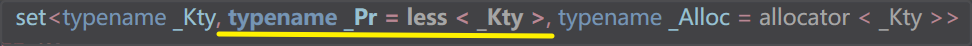 


主要技术点：

* 利用**仿函数**，可以改变排序规则


**示例一**   set存放内置数据类型

```C++
#include <iostream>
#include <set>
using namespace std;
class compare {
public:

	bool operator()(int a, int b) const
	{
		return a > b;
	}
};


void Print(const set<int,compare> &s)
{
	for (set<int, compare>::const_iterator i = s.begin(); i!=s.end(); i++)
	{
		cout << *i << " ";
	}
	cout << "\n";
}
int main()
{
	//要在创建对象之前就指定排序规则！
	set<int, compare> s;
	s.insert(1);
	s.insert(7);
	s.insert(2);
	s.insert(5);
	s.insert(9);
	 Print(s);

	return 0;
}
```

总结：利用仿函数可以指定set容器的排序规则


**示例二** [set存放自定义数据类型](#自定义数据时候的比较)

```C++
#include <set>
#include <string>

class Person
{
public:
	Person(string name, int age)
	{
		this->m_Name = name;
		this->m_Age = age;
	}

	string m_Name;
	int m_Age;

};
class comparePerson
{
public:
	bool operator()(const Person& p1, const Person &p2)
	{
		//按照年龄进行排序  降序
		return p1.m_Age > p2.m_Age;
	}
};

void test01()
{
	set<Person, comparePerson> s;

	Person p1("刘备", 23);
	Person p2("关羽", 27);
	Person p3("张飞", 25);
	Person p4("赵云", 21);

	s.insert(p1);
	s.insert(p2);
	s.insert(p3);
	s.insert(p4);

	for (set<Person, comparePerson>::iterator it = s.begin(); it != s.end(); it++)
	{
		cout << "姓名： " << it->m_Name << " 年龄： " << it->m_Age << endl;
	}
}
int main() {

	test01();

	system("pause");

	return 0;
}
```

总结：

对于自定义数据类型，set必须指定排序规则才可以插入数据

> 提前指定排序规则
>
> 或者重载<！
>
> 但是推荐提前用仿函数指定排序规则
>
> ```c++
> class comparePerson
> {
> public:
> 	bool operator()(const Person& p1, const Person &p2)
> 	{
> 		//按照年龄进行排序  降序
> 		return p1.m_Age > p2.m_Age;
> 	}
> };
> ```
>
> ---
>
> ---
>
> ```c++
> class Person {
> public:
> 
> 	Person(int age, string name) :age(age), name(name) {};
> 	int age;
> 	string name;
> 	//需要自定义比较规则,而且set默认是用<来比较的，重载>就报错了！
> 	bool operator<(const Person &p) const {
> 		if (this->name == p.name)
> 		{
> 			return this->age > p.age;
> 		}
> 		else
> 		{
> 			return this->name > p.name;
> 		}
> 	}
> };
> ```
>
> 


### 3.9 map/ multimap容器

#### 3.9.1 map基本概念

**简介：**

* map中所有元素都是==pair==
* pair中**第一个元素为key（键值）**，起到索引作用，**第二个元素为value（实值）**
* ==所有元素都会根据**元素的键自动升序排序**==


**本质：**

* map/multimap属于**关联式容器**，底层结构是用二叉树实现。


**优点：**

* **可以根据key值快速找到value值**


map和multimap**区别**：

- map不允许容器中有**重复key值元素**
- multimap允许容器中有**重复key值元素**


#### 3.9.2  map构造和赋值

**功能描述：**

* 对map容器进行构造和赋值操作

**函数原型：**

**构造：**

* `map<T1, T2> mp;`                     //map默认构造函数: 
* `map(const map &mp);`             //拷贝构造函数


**赋值：**

* `map& operator=(const map &mp);`    //重载等号操作符


**示例：**

```C++
#include <iostream>
#include <map>
#include <algorithm>
using namespace std;
void PrintMap(map<string, int>& m)
{
	for (pair<string, int> i : m)
	{
		cout << "姓名" << i.first << "序号" << i.second << endl;
	}
}

int main()
{

	pair<string,int> p("xasd", 2332);
	pair<string, int> pp = make_pair("niuma", 23);

	map<string, int> m;
	m.insert(pair<string, int>("牛马5", 4));
	m.insert(pair<string, int>("牛马1", 9));
	m.insert(pair<string, int>("牛马2", 1));
	m.insert(pair<string, int>("牛马3", 3));
	m.insert(pair<string, int>("牛马4", 5));

	PrintMap(m);

	map<string, int> m1(m);
	PrintMap(m1);


	map<string, int> m2;
	m2 = m;
	PrintMap(m2);


	return 0;
}
```

总结：map中所有元素都是成对出现，插入数据时候要使用对组


#### 3.9.3 map大小和交换

**功能描述：**

* 统计map容器大小以及交换map容器


函数原型：

- `size();`          //返回容器中元素的数目
- `empty();`        //判断容器是否为空
- `swap(st);`      //交换两个集合容器


**示例：**

```C++
#include <iostream>
#include <map>
#include <algorithm>
using namespace std;
void PrintMap(map<string, int>& m)
{
	for (pair<string, int> i : m)
	{
		cout << "姓名" << i.first << "序号" << i.second << endl;
	}
}

int main()
{
	
	pair<string,int> p("xasd", 2332);
	pair<string, int> pp = make_pair("niuma", 23);

	map<string, int> m;
	m.insert(pair<string, int>("牛马5", 4));
	m.insert(pair<string, int>("牛马1", 9));
	m.insert(pair<string, int>("牛马2", 1));
	m.insert(pair<string, int>("牛马3", 3));
	m.insert(pair<string, int>("牛马4", 5));
	cout << "size=" << m.size() << endl;
	PrintMap(m);
	if (m.empty())
	{
		cout << "容器是空的！" << endl;

	}
	else
	{
		cout << "容器不是空的" << endl;
	}

	map<string, int> m1;
	m1.insert(pair<string, int>("马5", 94));
	m1.insert(pair<string, int>("马1", 97));
	cout << "size=" << m1.size() << endl;

	cout << "交换swap" << endl;
	m.swap(m1);
	PrintMap(m);
	PrintMap(m1);

	return 0;
}
```

总结：

- 统计大小   --- size
- 判断是否为空   --- empty
- 交换容器   --- swap


#### 3.9.4 map插入和删除

**功能描述：**

- map容器进行插入数据和删除数据


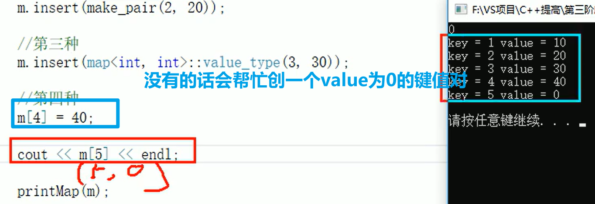 

**函数原型：**

- `insert(elem);`           //在容器中插入元素。
- `clear();`                    //清除所有元素
- `erase(pos);`              //删除pos迭代器所指的元素，返回下一个元素的迭代器。
- `erase(beg, end);`    //删除区间[beg,end)的所有元素 ，返回下一个元素的迭代器。
- `erase(key);`            //==删除容器中值为**key**的元素。==
- ==可以用[]来访问value的值==但是不建议用[]来插入！


**示例：**

```C++
#include <map>

void printMap(map<int,int>&m)
{
	for (map<int, int>::iterator it = m.begin(); it != m.end(); it++)
	{
		cout << "key = " << it->first << " value = " << it->second << endl;
	}
	cout << endl;
}

void test01()
{
	//插入
	map<int, int> m;
	//第一种插入方式
	m.insert(pair<int, int>(1, 10));
	//第二种插入方式
	m.insert(make_pair(2, 20));
	//第三种插入方式
	m.insert(map<int, int>::value_type(3, 30));
	//第四种插入方式
	m[4] = 40; 
	printMap(m);

	//删除
	m.erase(m.begin());
	printMap(m);

	m.erase(3);
	printMap(m);

	//清空
	m.erase(m.begin(),m.end());
	m.clear();
	printMap(m);
}

int main() {

	test01();

	system("pause");

	return 0;
}
```

总结：

* map插入方式很多，记住其一即可

- 插入   --- insert 
- 删除   --- erase
- 清空   --- clear


#### 3.9.5 map查找和统计

**功能描述：**

- 对map容器进行查找数据以及统计数据


**函数原型：**

- `find(key);`                  //==查找key==是否存在,若存在，返回该键的元素的迭代器；==**若不存在，返回set.end();**==
- 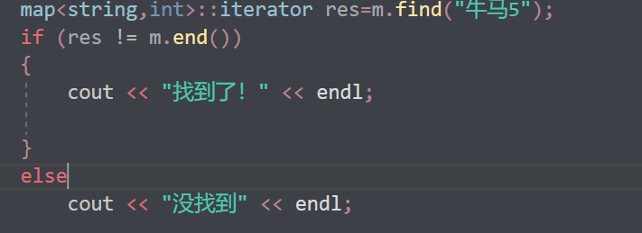 
- `count(key);`                //统计==key的元素个数==
- map的只能为1，multimap可能大于1
- 是查找的key


**示例：**

```C++
#include <iostream>
#include <map>
#include <algorithm>
using namespace std;
void PrintMap(map<string, int>& m)
{
	for (pair<string, int> i : m)
	{
		cout << "姓名" << i.first << "序号" << i.second << endl;
	}
}

int main()
{
	
	pair<string,int> p("xasd", 2332);
	pair<string, int> pp = make_pair("niuma", 23);

	map<string, int> m;
	m.insert(pair<string, int>("牛马5", 4));
	m.insert(pair<string, int>("牛马1", 9));
	m.insert(pair<string, int>("牛马3", 1));
	m.insert(pair<string, int>("牛马3", 3));
	m.insert(pair<string, int>("牛马4", 5));
	cout << "size=" << m.size() << endl;
	PrintMap(m);

	cout << "key为3的有多少个？" << m.count("牛马3") << endl;
	map<string,int>::iterator res=m.find("牛马5");
	if (res != m.end())
	{
		cout << "找到了！" << endl;

	}
	else
		cout << "没找到" << endl;


	return 0;
}
```

总结：

- 查找   ---  find    （返回的是迭代器）
- 统计   ---  count  （对于map，结果为0或者1）


#### 3.9.6 map容器排序

**学习目标：**

- map容器默认排序规则为 按照key值进行 从小到大排序，掌握如何改变排序规则


**主要技术点:**

- 利用仿函数，可以改变排序规则


**示例：**

```C++
#include <iostream>
#include <map>
#include <algorithm>
using namespace std;


//比较的是key
class compare {
public:
	bool operator()(const string& s1, const string& s2) const
	{
		return s1 > s2;
	}
};


void PrintMap(const map<string, int, compare> &m)
{
	for ( const pair<string, int> i : m)
	{
		cout << "姓名" << i.first << "序号" << i.second << endl;
	}
}

//这意味着map的键是string类型，值是int类型，但比较函数对象的参数类型并不匹配。
//根据key啊啊啊啊啊啊啊啊啊啊啊
int main()
{


	map<string, int,compare> m;
	m.insert(pair<string, int>("牛马5", 4));
	m.insert(pair<string, int>("牛马1", 9));
	m.insert(pair<string, int>("牛马3", 1));
	m.insert(pair<string, int>("牛马3", 3));
	m.insert(pair<string, int>("牛马4", 10));
	cout << "size=" << m.size() << endl;
	PrintMap(m);


	return 0;
}
```

总结：

* 利用仿函数可以指定map容器的排序规则
* 对于自定义数据类型，map必须要指定排序规则,同set容器


### 3.10 案例-员工分组

#### 3.10.1 案例描述

* 公司今天招聘了10个员工（ABCDEFGHIJ），10名员工进入公司之后，需要指派员工在那个部门工作
* 员工信息有: 姓名  工资组成；部门分为：策划、美术、研发
* 随机给10名员工分配部门和工资
* 通过multimap进行信息的插入  key(部门编号) value(员工)
* 分部门显示员工信息


#### 3.10.2 实现步骤

1. 创建10名员工，放到vector中
2. 遍历vector容器，取出每个员工，进行随机分组
3. 分组后，将员工部门编号作为key，具体员工作为value，放入到multimap容器中
4. 分部门显示员工信息


**案例代码：**

```C++
#include <iostream>
#include <vector>
#include <map>
#include <algorithm>
#define CEHUA 0
#define MEISHU 1
#define YANFA 2
using namespace std;
class Worker
{
public:
	Worker() {};
	Worker(string name, int salary) : name(name), salary(salary) {};
	string name;
	int salary;
};
void Print(vector<Worker> v)
{
	for (Worker w : v)
	{
		cout << "姓名:" << w.name << "薪资" << w.salary << endl;
	}
}
void CreateWorke(vector<Worker>& v)
{
	string words = "ABCDEFGHIJ";
	for (int i = 0; i < 10; i++)
	{
		//Worker worker;
		//worker.name = "员工";
		//worker.name +=words[i];
		//worker.salary = rand() % 10000 + 10000; // 10000 ~ 19999
		////将员工放入到容器中
		//v.push_back(worker);
		string temp = "员工";
		temp += words[i];
		int salary = rand() % 10000 + 6000;
		v.push_back(Worker(temp, salary));

	}
}
void assigndp(multimap<int, Worker>& m, vector<Worker>& v)
{
	for (Worker w : v)
	{
		int a = rand() % 3;
		m.insert(make_pair(a, w));
	}
}

void PrintMap(multimap<int, Worker>& m)
{
	//for (pair<int, Worker> p : m)
	//{
	//	if (p.first == CEHUA)
	//	{
	//		cout << "这个人是策划部门的" << "姓名:" << p.second.name << "薪资:" << p.second.salary << endl;
	//	}
	//	else if (p.first == MEISHU)
	//	{
	//		cout << "这个人是美术部门的" << "姓名:" << p.second.name << "薪资:" << p.second.salary << endl;
	//	}
	//	else
	//	{
	//		cout << "这个人是科研部门的" << "姓名:" << p.second.name << "薪资:" << p.second.salary << endl;
	//	}
	//}

	for (map<int, Worker>::iterator it = m.begin(); it != m.end(); it++)
	{
		if ((*it).first == CEHUA)
		{
			cout << "这个人是策划部门的" << "姓名:" << (*it).second.name << "薪资:" << (*it).second.salary << endl;
		}
		else if ((*it).first == MEISHU)
		{
			cout << "这个人是美术部门的" << "姓名:" << (*it).second.name << "薪资:" << (*it).second.salary << endl;
		}
		else
		{
			cout << "这个人是科研部门的" << "姓名:" << (*it).second.name << "薪资:" << (*it).second.salary << endl;
		}
	}

}

int main()
{	
	srand(static_cast<unsigned int>(time(0)));
	vector<Worker> v;
	CreateWorke(v);
	Print(v);
	multimap<int, Worker> m;
	assigndp(m,v);
	PrintMap(m);

	return 0;
}
```

总结：

* 当数据以键值对形式存在，可以考虑用map 或 multimap


## 4 STL- 函数对象(仿函数)

### 4.1 函数对象

#### 4.1.1 函数对象概念

**概念：**

* 重载**函数调用操作符**的类，其对象常称为**函数对象**
* **函数对象**使用重载的()时，行为类似函数调用，也叫**仿函数**


**本质：**

函数对象(仿函数)是一个**类**，不是一个函数


#### 4.1.2  函数对象使用

**特点：**

* 函数对象在使用时，可以像普通函数那样调用, 可以有参数，可以有返回值
* 函数对象超出普通函数的概念，函数对象可以有==自己的状态==
* 函数对象可以作为参数传递

==和普通函数不一样，这是仿函数的优点，普通函数不定义全局变量或者静态变量会被释放的输出不了，而仿函数可以==


**示例:**

```C++
#include<iostream>
#include <vector>
#include <algorithm>//标准算法头文件
using namespace std;
//*函数对象在使用时，可以像普通函数那样调用, 可以有参数，可以有返回值
//* 函数对象超出普通函数的概念，函数对象可以有自己的状态
//* 函数对象可以作为参数传递

class func {
public:
	func()
	{
		this->count = 0;
	}
	int operator()(int a, int b)
	{
		return a + b;
	};
	void operator()()
	{
		cout << "hello world!" << endl;
		this->count++;
	}
	int count;
};


void test01()
{
	func f;
	cout<<f(10, 20)<<endl;
}
void test02()
{
	func f;
	f();
	f();
	f();
	f();
	cout << "调用了" << f.count << "次" << endl;

}

void test03(func &f)
{
	f();
}
int main()
{
	test01();
	test02();
	func f;
	test03(f);

	return 0;
}
```

总结：

* 仿函数写法非常灵活，可以作为参数进行传递。


### 4.2  谓词

#### 4.2.1 谓词概念


**概念：**

==**谓词（Predicate）通常是指一种能够返回布尔值的可调用对象，例如函数、函数指针、函数对象（仿函数）等**==

* ==返回bool类型的仿函数==称为**谓词**
* 如果operator()==接受一个参数，那么叫做一元谓词==
* 如果operator()==接受两个参数，那么叫做二元谓词==

 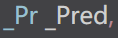 让写==函数名==，或者==匿名函数对象==也就是谓词！

```c++
bool rule(int a)
{
	return a == 5;
}//函数充当谓词
class compre()
{
public:
	bool operator()(int a)
	{
		return a==5;
	}
}//仿函数充当谓词
//仿函数不是函数而是一个类
```


#### 4.2.2 一元谓词

**示例：**

```C++
#include<iostream>
#include <vector>
#include <algorithm>//标准算法头文件
using namespace std;
//仿函数，返回值为bool类型，就是谓词！
//一元谓词

class Big {
public:
	bool operator()(int a) const
	{
		return a > 5;
	}
};
void PrintV(vector<int> v)
{
	for (int i : v)
	{
		cout << i << " ";
	}
	cout << "\n";
}
bool compare(int a, int b)
{
	return a > b;
}
int main()
{
	vector<int> v;
	v.push_back(1);
	v.push_back(9);
	v.push_back(2);
	v.push_back(3);
	v.push_back(8);
	PrintV(v);
	//大于五的数字
	//sort(v.begin(), v.end(),compare);
	sort(v.begin(), v.end());
	PrintV(v);

	vector<int>::iterator it=find_if(v.begin(), v.end(),Big());
	for (vector<int>::iterator i = it; i < v.end(); i++)
	{
		cout << *i << " ";
	}


	return 0;
}
```

总结：参数只有一个的谓词，称为一元谓词


#### find_if()

在容器中查找满足特定条件的元素。

```c++
template< class InputIt, class UnaryPredicate >
InputIt find_if( InputIt first, InputIt last, UnaryPredicate p );

```

> 1. `first`和`last`是表示要搜索的范围的迭代器。`first`指向要搜索的范围的第一个元素，`last`指向要搜索的范围之后的位置。
> 2. `p`是一个一元谓词（unary predicate），它是一个可调用==对象==，用于指定要查找的条件。
>
> > `find_if()`函数会在指定范围内查找第一个满足条件`p`的元素
> >
> > 并返回==指向该元素的迭代器==。如果没有找到满足条件的元素，则返回`last`。
>
> sort
>
>  

#### 4.2.3 二元谓词

**示例：**

```C++
#include<iostream>
#include <vector>
#include <algorithm>//标准算法头文件
using namespace std;

class Func {
public:
	bool operator()(int a, int b) {
		return a > b;
	}
};
void Print(vector<int> v)
{
	for (int i : v)
	{
		cout << i << " ";
	}
	cout << endl;
}
bool jiang(int a, int b)
{
	return a > b;
}
int main()
{
	vector<int> v;
	v.push_back(1);
	v.push_back(9);
	v.push_back(2);
	v.push_back(4);
	v.push_back(5);
	Print(v);
	sort(v.begin(), v.end());
	Print(v);
	//sort(v.begin(), v.end(), jiang);
	sort(v.begin(), v.end(), Func());

	Print(v);

	return 0;
}
```

总结：参数只有两个的谓词，称为二元谓词


==可以传入**谓词函数名**或者创建一个**匿名函数对象**==

```c++
class XXX{
public:
bool XXX(元数)
{
asdasdasd
}
}
谓词函数名
bool XXX(元数)
{
  sdad 
}
```


### 4.3 内建函数对象\<functional>

#### 4.3.1 内建函数对象意义

**概念：**

* STL内建了一些函数对象

C++的内建函数对象是指一些在标准库中预定义的函数对象，它们可以直接在代码中使用，无需额外定义。

通过使用内建函数对象，可以避免手动编写一些重复的代码，同时也可以利用标准库中已经优化过的函数对象，提高程序的性能。

**分类:**

* **算术**仿函数

  > 加减乘除的运算

* **关系**仿函数

  > 比较，相等，大于小于。。。

* **逻辑**仿函数

  > 与或非

**用法：**

* 这些仿函数所产生的对象，用法和一般函数完全相同
* 使用内建函数对象，需要引入头文件 `#include<functional>`


#### 4.3.2 算术仿函数

**功能描述：**

* 实现四则运算
* 其中negate是一元运算，其他都是二元运算


**仿函数原型：**

* `template<class T> T plus<T>`                //加法仿函数
* `template<class T> T minus<T>`              //减法仿函数
* `template<class T> T multiplies<T>`    //乘法仿函数
* `template<class T> T divides<T>`         //除法仿函数
* `template<class T> T modulus<T>`         //取模仿函数
* `template<class T> T negate<T>`           //取反仿函数


**示例：**

```C++
#include<iostream>
#include <functional>
#include <algorithm>//标准算法头文件
using namespace std;

void testjia()
{
	plus<int> a;
	cout << a(10, 30)<< endl;
}
void testqufan()
{
	negate<int> b;
	cout << b(10) << endl;
}
void testjian()
{
	minus<int> c;
	cout << c(30, 10) << endl;
}
void testcheng()
{
	multiplies<int> d;
	cout << d(90, 80) << endl;
}
void testchu()
{
	divides<int> e;
	cout << e(5, 3) << endl;
}
void testquyu()
{
	modulus<int> f;
	cout << f(30, 4) << endl;
}
int main()
{
	testjia();
	cout << "--=---------------------" << endl;
	testqufan();
	cout << "--=---------------------" << endl;
	testjian();
	cout << "--=---------------------" << endl;

	testcheng();

	cout << "--=---------------------" << endl;
	testchu();
	cout << "--=---------------------" << endl;

	testquyu();

	return 0;
}
```

总结：使用内建函数对象时，需要引入头文件 `#include <functional>`


#### 4.3.3 关系仿函数_____[sort](#sort)

**功能描述：**

- 实现关系对比


**仿函数原型：**

* `template<class T> bool equal_to<T>`                    //等于
* `template<class T> bool not_equal_to<T>`            //不等于
* `template<class T> bool greater<T>`                      //大于
* `template<class T> bool greater_equal<T>`          //大于等于
* `template<class T> bool less<T>`                           //小于
* `template<class T> bool less_equal<T>`               //小于等于


**示例：**

```C++
#include<iostream>
#include <vector>
#include <functional>
#include <algorithm>//标准算法头文件
using namespace std;

class Compare {
public:
	bool operator()(int a, int b) {
		return a > b;
	}
};
void Print(vector<int> v)
{
	for (int i : v)
	{
		cout << i << " ";
	}
	cout << endl;
}
bool sheng(int a, int b)
{
	return a < b;
}
int main()
{
	vector<int> v;
	v.push_back(1);
	v.push_back(9);
	v.push_back(2);
	v.push_back(4);
	v.push_back(5);
	Print(v);
	sort(v.begin(), v.end());
	Print(v);
	cout << "-------------------" << endl;
	sort(v.begin(), v.end(), Compare());
	Print(v);
	sort(v.begin(), v.end(), greater<int>());
	Print(v);
	cout << "-------------------" << endl;

	cout << "===================" << endl;

	sort(v.begin(), v.end(), sheng);
	Print(v);
	sort(v.begin(), v.end(), less<int>());


	Print(v);

	cout << "===================" << endl;


	return 0;
}
```

总结：关系仿函数中最常用的就是greater<>大于

> `sort(v.begin(), v.end(), less<int>());`
>
> `sort(v.begin(), v.end(), greater<int>());`


#### 4.3.4 逻辑仿函数

**功能描述：**

- 实现逻辑运算


**函数原型：**

* `template<class T> bool logical_and<T>`              //逻辑与
* `template<class T> bool logical_or<T>`                //逻辑或
* `template<class T> bool logical_not<T>`              //逻辑非


**示例：**

```C++
#include<iostream>
#include <vector>
#include <functional>
#include <algorithm>//标准算法头文件
using namespace std;


void Print(vector<bool> v)
{
	for (bool i : v)
	{
		cout << i << " ";
	}
	cout << endl;
}

int main()
{
	vector<bool> v;
	v.push_back(true);
	v.push_back(true);
	v.push_back(false);
	v.push_back(false);
	v.push_back(true);
	v.push_back(false);
	Print(v);

	vector <bool> v1;
	v1.resize(v.size());

	transform(v.begin(), v.end(), v1.begin(), logical_not<bool>());
	//标准算法里的，
	Print(v);
	Print(v1);


	return 0;
}
```

总结：逻辑仿函数实际应用较少，了解即可


> transform搬运算法
>
> 搬运之前，空容器是要有足够的空间的！
>
> 而且要指定放置位置的v1.begin()。


## 5 STL- 常用算法\<algorithm> \<numeric>


**概述**:

* 算法主要是由头文件`<algorithm>` `` <numeric>`组成。


* `<algorithm>`是所有STL头文件中最大的一个，范围涉及到比较、 交换、查找、遍历操作、复制、修改等等
* `<numeric>`体积很小，只包括几个在序列上面进行简单数学运算的模板函数
* `<functional>`定义了一些模板类,用以声明函数对象。


### 5.1 常用遍历算法

**学习目标：**

* 掌握常用的遍历算法


**算法简介：**

* `for_each`     //遍历容器
* `transform`   //搬运容器到另一个容器中


#### 5.1.1 for_each

**功能描述：**

* 实现遍历容器

**函数原型：**

* `for_each(iterator beg, iterator end, _func);  `

  // 遍历算法 遍历容器元素

  // beg 开始迭代器

  // end 结束迭代器

  // _func ==**函数或者函数对象**==`指定你的遍历方式！`

  ```c++
  void func(类型 a)
  {
  	cout<<a<<" ";
  }
  ```

  


**示例：**

```C++
#include<iostream>
#include <vector>
#include <functional>
#include <algorithm>//标准算法头文件
using namespace std;


void Print(bool a)
{
	cout << a << "=";

}
int main()
{
	vector<bool> v;
	v.push_back(true);
	v.push_back(true);
	v.push_back(false);
	v.push_back(false);
	v.push_back(true);
	v.push_back(false);

	for_each(v.begin(), v.end(), Print);
	return 0;
}
```


**总结：**for_each在实际开发中是最常用遍历算法，需要熟练掌握


#### 5.1.2 transform

**功能描述：**

* ==**搬运**==容器到另一个容器中

**函数原型：**

* `transform(iterator beg1, iterator end1, iterator beg2, _func);`

//beg1 **源容器**开始迭代器

//end1 源容器结束迭代器

//beg2 ==目标容器==开始迭代器vnew.begin();

//_func ==函数或者函数对象==

**示例：**

```C++
#include<iostream>
#include <vector>
#include <functional>
#include <algorithm>//标准算法头文件
using namespace std;
class ts {
public:
	int operator()(int a)
	{
		return a;
	}
};
void Print(int a)
{
	cout << a << " ";

}
int main()
{
	vector<int> v;
	for (int i = 0; i < 5; i++)
	{
		v.push_back(i);
	}
	vector<int> nv;

	nv.resize(v.size());

	transform(v.begin(), v.end(), nv.begin(), ts());

	for_each(v.begin(), v.end(), Print);
	cout << endl;
	for_each(nv.begin(), nv.end(), Print);


	return 0;
}
```

**总结：** 搬运的==**目标容器必须要提前开辟空间，否则无法正常搬运**==


### 5.2 常用查找算法

学习目标：

- 掌握常用的查找算法


**算法简介：**

- `find`                     //查找元素
- `find_if`               //按条件查找元素
- `adjacent_find`    //查找相邻重复元素
- `binary_search`    //二分查找法
- `count`                   //统计元素个数
- `count_if`             //按条件统计元素个数


#### 5.2.1 find

**功能描述：**

* 查找指定元素，找到返回指定元素的迭代器，找不到返回结束迭代器end()


**函数原型：**

- `find(iterator beg, iterator end, value);  `

  // 按值查找元素，找到返回指定位置迭代器，找不到返回结束迭代器位置

  // beg 开始迭代器

  // end 结束迭代器

  // value 查找的元素


**示例：**

```C++
#include <algorithm>
#include <vector>
#include <string>
void test01() {

	vector<int> v;
	for (int i = 0; i < 10; i++) {
		v.push_back(i + 1);
	}
	//查找容器中是否有 5 这个元素
	vector<int>::iterator it = find(v.begin(), v.end(), 5);
	if (it == v.end()) 
	{
		cout << "没有找到!" << endl;
	}
	else 
	{
		cout << "找到:" << *it << endl;
	}
}

class Person {
public:
	Person(string name, int age) 
	{
		this->m_Name = name;
		this->m_Age = age;
	}
	//重载==
	bool operator==(const Person& p) 
	{
		if (this->m_Name == p.m_Name && this->m_Age == p.m_Age) 
		{
			return true;
		}
		return false;
	}

public:
	string m_Name;
	int m_Age;
};

void test02() {

	vector<Person> v;

	//创建数据
	Person p1("aaa", 10);
	Person p2("bbb", 20);
	Person p3("ccc", 30);
	Person p4("ddd", 40);

	v.push_back(p1);
	v.push_back(p2);
	v.push_back(p3);
	v.push_back(p4);

	vector<Person>::iterator it = find(v.begin(), v.end(), p2);
	if (it == v.end()) 
	{
		cout << "没有找到!" << endl;
	}
	else 
	{
		cout << "找到姓名:" << it->m_Name << " 年龄: " << it->m_Age << endl;
	}
}
```

总结： 利用find可以在容器中找指定的元素，返回值是**迭代器**


#### 5.2.2 find_if

**功能描述：**

* 按条件查找元素

**函数原型：**

- `find_if(iterator beg, iterator end, _Pred);  `

  // 按值查找元素，找到返回指定位置迭代器，找不到返回结束迭代器位置

  // beg 开始迭代器

  // end 结束迭代器

  // _Pred 函数或者谓词（返回bool类型的仿函数）


**示例：**

```C++
#include <algorithm>
#include <vector>
#include <string>

//内置数据类型
class GreaterFive
{
public:
	bool operator()(int val)
	{
		return val > 5;
	}
};

void test01() {

	vector<int> v;
	for (int i = 0; i < 10; i++) {
		v.push_back(i + 1);
	}

	vector<int>::iterator it = find_if(v.begin(), v.end(), GreaterFive());
	if (it == v.end()) {
		cout << "没有找到!" << endl;
	}
	else {
		cout << "找到大于5的数字:" << *it << endl;
	}
}

//自定义数据类型
class Person {
public:
	Person(string name, int age)
	{
		this->m_Name = name;
		this->m_Age = age;
	}
public:
	string m_Name;
	int m_Age;
};

class Greater20
{
public:
	bool operator()(Person &p)
	{
		return p.m_Age > 20;
	}

};

void test02() {

	vector<Person> v;

	//创建数据
	Person p1("aaa", 10);
	Person p2("bbb", 20);
	Person p3("ccc", 30);
	Person p4("ddd", 40);

	v.push_back(p1);
	v.push_back(p2);
	v.push_back(p3);
	v.push_back(p4);

	vector<Person>::iterator it = find_if(v.begin(), v.end(), Greater20());
	if (it == v.end())
	{
		cout << "没有找到!" << endl;
	}
	else
	{
		cout << "找到姓名:" << it->m_Name << " 年龄: " << it->m_Age << endl;
	}
}

int main() {

	//test01();

	test02();

	system("pause");

	return 0;
}
```

总结：find_if按条件查找使查找更加灵活，提供的仿函数可以改变不同的策略


#### 5.2.3 adjacent_find

**功能描述：**

* 查找相邻重复元素


**函数原型：**

- `adjacent_find(iterator beg, iterator end);  `

  // 查找相邻重复元素,返回相邻元素的第一个位置的迭代器

  // beg 开始迭代器

  // end 结束迭代器

  


**示例：**

```C++
#include <algorithm>
#include <vector>

void test01()
{
	vector<int> v;
	v.push_back(1);
	v.push_back(2);
	v.push_back(5);
	v.push_back(2);
	v.push_back(4);
	v.push_back(4);
	v.push_back(3);

	//查找相邻重复元素
	vector<int>::iterator it = adjacent_find(v.begin(), v.end());
	if (it == v.end()) {
		cout << "找不到!" << endl;
	}
	else {
		cout << "找到相邻重复元素为:" << *it << endl;
	}
}
```

总结：面试题中如果出现查找相邻重复元素，记得用STL中的adjacent_find算法


#### ==5.2.4 binary_search(要求先排序)==

**功能描述：**

* 查找指定元素是否存在

**函数原型：**

- `bool binary_search(iterator beg, iterator end, value);  `

  // 查找指定的元素，==查到 返回true  否则false==	

  // 注意: 在==**要先排好序且和sort成对使用**==

  > 如果用到函数对象或者仿函数
  >
  > 就都要用

  // beg 开始迭代器

  // end 结束迭代器

  // value 查找的元素

> [二分查找的原理](#二分查找)
>
> 1. 先排序好的
> 2. 然后要找的数比中间的数比较，排除一半，反复。。。直到找到

**示例：**

```C++
#include<iostream>
#include <vector>
#include <functional>
#include <algorithm>//标准算法头文件
using namespace std;
void Print(int a)
{
	cout << a << " ";
}
int main()
{
	vector<int> v;
	v.push_back(1);
	v.push_back(9);
	v.push_back(7);
	v.push_back(7);
	v.push_back(8);
	cout << "排序前" << endl;
	for_each(v.begin(), v.end(), Print);
	cout << endl;
	cout << "排序后" << endl;
	sort(v.begin(), v.end(),greater<int>());
	for_each(v.begin(), v.end(), Print);
	cout << endl;

	cout << "二分查找的数字" << endl;
	int key;
	scanf_s("%d", &key);

	if (binary_search(v.begin(), v.end(), key,greater<int>()))
	{
		cout << "找到拉！" << endl;
	}
	else
	{
		cout << "没找到！" << endl;
	}
	cout << "一一对应" << endl;
	vector<int> vv(v);
	sort(vv.begin(),vv.end());
	if (binary_search(vv.begin(), vv.end(), key))
	{
		cout << "找到拉！" << endl;
	}
	else
	{
		cout << "没找到！" << endl;
	}
	cout << "要用仿函数大家一起用，要不用都不用" << "二分查找默认是升序的" << endl;

	return 0;
}
```

**总结：**二分查找法查找效率很高，值得注意的是查找的容器中元素必须的有序序列


> ==升序排序对应一种二分::::::::降序排序对应一种二分==
>
> 当使用 `sort` 函数进行排序时，如果你选择了自定义的比较函数（例如 `greater<int>()`），那么在后续使用需要有序序列的算法时，也需要使用相同的比较函数。
>
> 如果选择使用 `sort(v.begin(), v.end(), greater<int>())` 进行降序排序，那么在后续使用二分查找时，确实需要使用相同的比较函数，即 `binary_search(v.begin(), v.end(), key, greater<int>())`。
>
>   
>
> ---
>
> 如果不打算使用相同的比较函数，一种简单的解决方案是使用默认的升序排序，即 `sort(v.begin(), v.end())`。这样，在后续的二分查找等算法中，你就可以使用默认的比较函数而无需额外指定。


#### 5.2.5 count

**功能描述：**

* 统计元素个数


**函数原型：**

- `count(iterator beg, iterator end, value);  `

  // 统计元素出现次数

  // beg 开始迭代器

  // end 结束迭代器

  // value 统计的元素


**示例：**

```C++
#include <algorithm>
#include <vector>

//内置数据类型
void test01()
{
	vector<int> v;
	v.push_back(1);
	v.push_back(2);
	v.push_back(4);
	v.push_back(5);
	v.push_back(3);
	v.push_back(4);
	v.push_back(4);

	int num = count(v.begin(), v.end(), 4);

	cout << "4的个数为： " << num << endl;
}

//自定义数据类型
class Person
{
public:
	Person(string name, int age)
	{
		this->m_Name = name;
		this->m_Age = age;
	}
	bool operator==(const Person & p)
	{
		if (this->m_Age == p.m_Age)
		{
			return true;
		}
		else
		{
			return false;
		}
	}
	string m_Name;
	int m_Age;
};

void test02()
{
	vector<Person> v;

	Person p1("刘备", 35);
	Person p2("关羽", 35);
	Person p3("张飞", 35);
	Person p4("赵云", 30);
	Person p5("曹操", 25);

	v.push_back(p1);
	v.push_back(p2);
	v.push_back(p3);
	v.push_back(p4);
	v.push_back(p5);
    
    Person p("诸葛亮",35);

	int num = count(v.begin(), v.end(), p);
	cout << "num = " << num << endl;
}
int main() {

	//test01();

	test02();

	system("pause");

	return 0;
}
```

**总结：** 统计自定义数据类型时候，需要配合重载 `operator==`


#### 5.2.6 count_if

**功能描述：**

* 按条件统计元素个数

**函数原型：**

- `count_if(iterator beg, iterator end, _Pred);  `

  // 按条件统计元素出现次数

  // beg 开始迭代器

  // end 结束迭代器

  // _Pred 谓词

  

**示例：**

```C++
#include<iostream>
#include <vector>
#include <functional>
#include <algorithm>//标准算法头文件
using namespace std;
class ts {
public:
	int operator()(int a)
	{
		return a;
	}
};
void Print(int a)
{
	cout << a << " ";

}
class Find {
public:
	bool operator()(int a)
	{
		return a == 7;
	}
};
bool FFind(int a)
{
	return a == 7;
}
int main()
{
	vector<int> v;
	v.push_back(1);
	v.push_back(9);
	v.push_back(7);
	v.push_back(7);
	v.push_back(8);
	for_each(v.begin(), v.end(), Print);
	vector<int>::iterator it = adjacent_find(v.begin(), v.end());
	cout << "---------------" << endl;
	cout << *it << endl;
	cout << "---------------" << endl;

	cout << "查找元素的个数" << endl;
	cout << "7的个数为" << count(v.begin(), v.end(), 7)<<endl;
	//cout << "7的个数为" << count_if(v.begin(), v.end(), Find);
	cout << "7的个数为" << count_if(v.begin(), v.end(), Find()) << endl;
	cout << "7的个数为" << count_if(v.begin(), v.end(), FFind);
	return 0;
}
```

**总结：**按值统计用count，按条件统计用count_if


### 5.3 常用排序算法

**学习目标：**

- 掌握常用的排序算法

**算法简介：**

- `sort`             //对容器内元素进行排序
- `random_shuffle`   //洗牌   指定范围内的元素随机调整次序
- `merge `           // 容器元素合并，并存储到另一容器中
- `reverse`       // 反转指定范围的元素


#### <a name="sort">5.3.1 sort</a>

**功能描述：**

* 对容器内元素进行排序


**函数原型：**

- `sort(iterator beg, iterator end, _Pred);  `

  // 按值查找元素，找到返回指定位置迭代器，找不到返回结束迭代器位置

  //  beg    开始迭代器

  //  end    结束迭代器

  // _Pred  谓词


**示例：**

```c++
#include<iostream>
#include <vector>
#include <functional>
#include <algorithm>//标准算法头文件
#include <algorithm>
#include <vector>
using namespace std;
class compare {
public:
	bool operator()(int a, int b)
	{
		return a > b;
	}
};//等价于greater<int>
void myPrint(int val)
{
	cout << val << " ";
}

void test01() {
	vector<int> v;
	v.push_back(10);
	v.push_back(30);
	v.push_back(50);
	v.push_back(20);
	v.push_back(40);

	//sort默认从小到大排序
	sort(v.begin(), v.end());
	for_each(v.begin(), v.end(), myPrint);
	cout << endl;

	//从大到小排序
	sort(v.begin(), v.end(), greater<int>());
	for_each(v.begin(), v.end(), myPrint);
	cout << endl;
}

int main() {

	test01();

	system("pause");

	return 0;
}
```

**总结：**sort属于开发中最常用的算法之一，需熟练掌握


#### 5.3.2 random_shuffle

**功能描述：**

* 洗牌   指定范围内的元素随机调整次序


**函数原型：**

- `random_shuffle(iterator beg, iterator end);  `

  // 指定范围内的元素==**随机调整次序**==

  // beg 开始迭代器

  // end 结束迭代器

  

**示例：**

```c++
#include<iostream>
#include <vector>
#include <functional>
#include <algorithm>//标准算法头文件
#include <algorithm>
#include <vector>
using namespace std;
void PrintV(vector<int> v)
{
	for (int i : v)
	{
		cout << i << " ";
	}
	cout << "\n";
}

int main() {

	cout << "为了使每一次洗牌都不一样" << endl;
	srand(static_cast<unsigned int>(time(0)));

	vector<int> v;
	v.push_back(10);
	v.push_back(30);
	v.push_back(50);
	v.push_back(20);
	v.push_back(40);

	PrintV(v);
	cout << "洗牌！" << endl;
	random_shuffle(v.begin(), v.end());
	PrintV(v);


	return 0;
}
```


**总结：**random_shuffle洗牌算法比较实用，使用时记得加随机数种子


#### ==5.3.3 merge(要求先排序)==

**功能描述：**

* 两个容器元素合并，并存储到另一容器中


**函数原型：**

- `merge(iterator beg1, iterator end1, iterator beg2, iterator end2, iterator dest);  `

  // 容器元素合并，并存储到另一容器中

  // 注意: 两个==容器必须是**有序的**==

  // beg1   容器1开始迭代器
  // end1   容器1结束迭代器
  // beg2   容器2开始迭代器
  // end2   容器2结束迭代器
  // dest    目标容器开始迭代器

  > 配对使用，binary_find一样
  >
  > 
  >
  >  
  >
  > ---
  >
  > 
  >
  >  

  

**示例：**

```c++
#include<iostream>
#include <vector>
#include <functional>
#include <algorithm>//标准算法头文件
#include <algorithm>
#include <vector>
using namespace std;
void PrintV(vector<int> v)
{
	for (int i : v)
	{
		cout << i << " ";
	}
	cout << "\n";
}

int main() {

	cout << "为了使每一次洗牌都不一样" << endl;
	srand(static_cast<unsigned int>(time(0)));
	vector<int> v;
	v.push_back(10);
	v.push_back(30);
	v.push_back(50);
	v.push_back(20);
	v.push_back(40);
	vector<int> v1(v);
	PrintV(v);
	cout << "v洗牌！" << endl;
	random_shuffle(v.begin(), v.end());
	PrintV(v);
	cout << "都要先排好序!" << endl;
	sort(v.begin(), v.end());
	sort(v1.begin(), v1.end());

	vector<int> v2;
	v2.resize(v1.size() + v.size());
	merge(v.begin(), v.end(), v1.begin(), v1.end(), v2.begin());
	cout << "也类似binary_find一样，排序的时候用到了指定的仿函数或者函数对象那么就要用对应的重载版本的merge!" << endl;
	PrintV(v2);
	return 0;
}
```

**总结：**merge合并的两个容器必须的==有序序列==


#### 5.3.4 reverse

**功能描述：**

* 将容器内元素进行反转


**函数原型：**

- `reverse(iterator beg, iterator end);  `

  // 反转指定范围的元素

  // beg 开始迭代器

  // end 结束迭代器

  > 可以逆转局部或者全部!

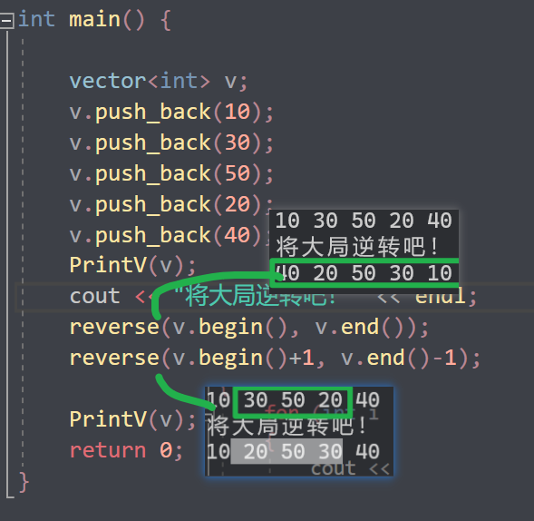 

**示例：**

```c++
#include<iostream>
#include <vector>
#include <functional>
#include <algorithm>//标准算法头文件
#include <algorithm>
#include <vector>
using namespace std;
void PrintV(vector<int> v)
{
	for (int i : v)
	{
		cout << i << " ";
	}
	cout << "\n";
}

int main() {

	vector<int> v;
	v.push_back(10);
	v.push_back(30);
	v.push_back(50);
	v.push_back(20);
	v.push_back(40);
	PrintV(v);
	cout << "将大局逆转吧！" << endl;
	reverse(v.begin(), v.end());
	reverse(v.begin()+1, v.end()-1);

	PrintV(v);
	return 0;
}
```

**总结：**reverse反转区间内元素，面试题可能涉及到

》》》》

> 挑战自己？
>
> 手写一个这样的逆置算法？汗流浃背了吧hh
>
> ---
>
> ---


### 5.4 常用拷贝和替换算法

**学习目标：**

- 掌握常用的拷贝和替换算法

**算法简介：**

- `copy`                      // 容器内指定范围的元素拷贝到另一容器中
- `replace`                // 将容器内指定范围的旧元素修改为新元素
- `replace_if `          // 容器内指定范围满足条件的元素替换为新元素
- `swap`                     // 互换两个容器的元素


#### 5.4.1 copy

**功能描述：**

* 容器内指定范围的元素拷贝到另一容器中


**函数原型：**

- `copy(iterator beg, iterator end, iterator dest);  `

  // 按值查找元素，找到返回指定位置迭代器，找不到返回结束迭代器位置

  // beg  开始迭代器

  // end  结束迭代器

  // dest 目标起始迭代器

> 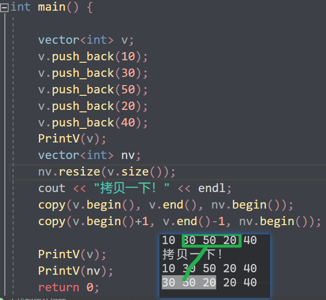 
>
> 可以拷贝指定区间或者全部

**示例：**

```c++
#include<iostream>
#include <vector>
#include <functional>
#include <algorithm>//标准算法头文件
#include <algorithm>
#include <vector>
using namespace std;
void PrintV(vector<int> v)
{
	for (int i : v)
	{
		cout << i << " ";
	}
	cout << "\n";
}

int main() {

	vector<int> v;
	v.push_back(10);
	v.push_back(30);
	v.push_back(50);
	v.push_back(20);
	v.push_back(40);
	PrintV(v);
	vector<int> nv;
	nv.resize(v.size());
	cout << "拷贝一下！" << endl;
	copy(v.begin(), v.end(), nv.begin());
	//copy(v.begin()+1, v.end()-1, nv.begin());

	PrintV(v);
	PrintV(nv);
	return 0;
}
```

**总结：**利用copy算法在拷贝时，==目标容器记得提前开辟空间==

> ```c++
> a...................
> vector<int> b;
> a.resize(a.size());
> ```
>
> ==**要提前开辟好空间**==


#### 5.4.2 replace

**功能描述：**

* 将容器内指定范围的旧元素修改为新元素


**函数原型：**

- `replace(iterator beg, iterator end, oldvalue, newvalue);  `

  // 将区间内旧元素 替换成 新元素

  // beg 开始迭代器

  // end 结束迭代器

  ==指定区间==

  ==替换规则==

  // oldvalue 旧元素

  // newvalue 新元素

> 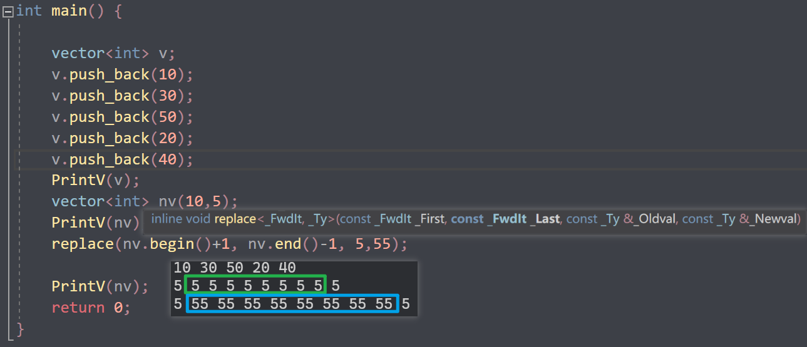 

**示例：**

```c++
#include<iostream>
#include <vector>
#include <functional>
#include <algorithm>//标准算法头文件
#include <algorithm>
#include <vector>
using namespace std;
void PrintV(vector<int> v)
{
	for (int i : v)
	{
		cout << i << " ";
	}
	cout << "\n";
}

int main() {

	vector<int> v;
	v.push_back(10);
	v.push_back(30);
	v.push_back(50);
	v.push_back(20);
	v.push_back(40);
	PrintV(v);
	vector<int> nv(10,5);
	PrintV(nv);
	replace(nv.begin()+1, nv.end()-1, 5,55);

	PrintV(nv);
	return 0;
}
```

**总结：**replace会替换区间内满足条件的元素


#### 5.4.3 replace_if

**功能描述:**  

* 将区间内满足条件的元素，替换成指定元素


**函数原型：**

- `replace_if(iterator beg, iterator end, _pred, newvalue);  `

  // 按条件替换元素，满足条件的替换成指定元素

  // beg 开始迭代器

  // end 结束迭代器

  // _pred==谓词或者仿函数！)==

  // newvalue 替换的新元素

> 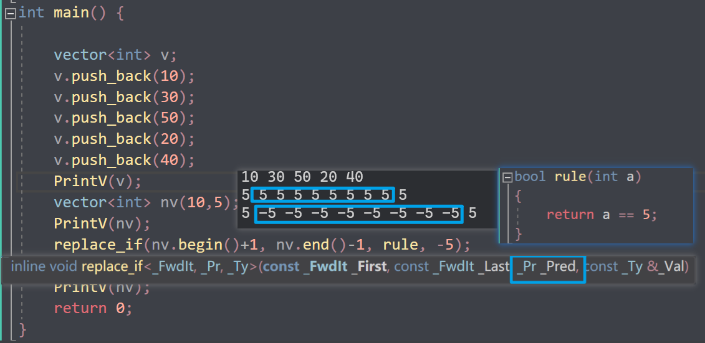

**示例：**

```c++
#include <algorithm>
#include <vector>

class myPrint
{
public:
	void operator()(int val)
	{
		cout << val << " ";
	}
};

class ReplaceGreater30
{
public:
	bool operator()(int val)
	{
		return val >= 30;
	}

};

void test01()
{
	vector<int> v;
	v.push_back(20);
	v.push_back(30);
	v.push_back(20);
	v.push_back(40);
	v.push_back(50);
	v.push_back(10);
	v.push_back(20);

	cout << "替换前：" << endl;
	for_each(v.begin(), v.end(), myPrint());
	cout << endl;

	//将容器中大于等于的30 替换成 3000
	cout << "替换后：" << endl;
	replace_if(v.begin(), v.end(), ReplaceGreater30(), 3000);
	for_each(v.begin(), v.end(), myPrint());
	cout << endl;
}

int main() {

	test01();

	system("pause");

	return 0;
}
```

**总结：**replace_if按条件查找，可以利用仿函数灵活筛选满足的条件


#### 5.4.4 swap

**功能描述：**

* 互换两个容器的元素


**函数原型：**

- `swap(container c1, container c2);  `

  // 互换两个容器的元素

  // c1容器1

  // c2容器2

  

**示例：**

```c++
#include<iostream>
#include <vector>
#include <functional>
#include <algorithm>//标准算法头文件
#include <algorithm>
#include <vector>
using namespace std;
void PrintV(vector<int> v)
{
	for (int i : v)
	{
		cout << i << " ";
	}
	cout << "\n";
}
bool rule(int a)
{
	return a == 5;
}
int main() {

	vector<int> v;
	v.push_back(10);
	v.push_back(30);
	v.push_back(50);
	v.push_back(20);
	v.push_back(40);
	PrintV(v);
	vector<int> nv(10,5);
	PrintV(nv);
	cout << "交换之后" << endl;
	swap(v, nv);
	PrintV(v);
	PrintV(nv);

	return 0;
}
```

**总结：**swap交换容器时，注意交换的容器要同种类型


### 5.5 常用算术生成算法<numeric\>

**学习目标：**

- 掌握常用的算术生成算法


**注意：**

* 算术生成算法属于小型算法，使用时包含的头文件为 `#include <numeric>`


**算法简介：**

- `accumulate`      // 计算容器元素累计总和

- `fill`                 // 向容器中添加元素

  

#### 5.5.1 accumulate(累计)

**功能描述：**

*  计算区间内 容器元素累计总和


**函数原型：**

- `accumulate(iterator beg, iterator end, value);  `

  // 计算容器元素累计总和

  // beg 开始迭代器

  // end 结束迭代器

  // value 起始值


**示例：**

```c++
#include<iostream>
#include <vector>
#include <functional>
#include <algorithm>//标准算法头文件
#include <vector>
#include <numeric>
using namespace std;
void PrintV(vector<int> v)
{
	for (int i : v)
	{
		cout << i << " ";
	}
	cout << "\n";
}
bool rule(int a)
{
	return a == 5;
}
int main() {

	vector<int> v;
	v.push_back(1);
	v.push_back(2);
	v.push_back(3);
	PrintV(v);
	cout << "算数和！" << endl;
	//指定sum的初始值！返回算数和后的sum
	cout << accumulate(v.begin(), v.end(), 0) << endl;
	return 0;
}
```


**总结：**accumulate使用时头文件注意是 numeric，这个算法很实用


#### 5.5.2 fill

**功能描述：**

* 向容器中填充指定的元素


**函数原型：**

- `fill(iterator beg, iterator end, value);  `

  // 向容器中填充元素

  // beg 开始迭代器

  // end 结束迭代器

  // value 填充的值


**示例：**

```c++
#include<iostream>
#include <vector>
#include <functional>
#include <algorithm>//标准算法头文件
#include <vector>
#include <numeric>
using namespace std;
void PrintV(vector<int> v)
{
	for (int i : v)
	{
		cout << i << " ";
	}
	cout << "\n";
}
bool rule(int a)
{
	return a == 5;
}
int main() {

	vector<int> v;
	v.resize(100);
	fill(v.begin(), v.end(), 11);
	PrintV(v);
	return 0;
}
```

**总结：**利用fill可以将容器区间内元素填充为 指定的值


### 5.6 常用集合算法

**学习目标：**

- 掌握常用的集合算法

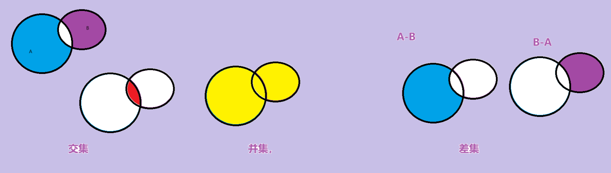 

**算法简介：**

- `set_intersection`          // 求两个容器的交集
- ​                     // 求两个容器的并集
- `set_difference `              // 求两个容器的差集

> `std::set_intersection` 和 `std::set_difference` 和`set_union`  这类算法并不要求输入序列必须是有序的，它们只要求输入序列是有序的范围（即是由迭代器指定的范围）。这就意味着，可以在无序序列上使用这些算法。
>
> ---
>
> 但要注意，如果你的序列是无序的，这些算法的行为可能会变得更加随机，并且结果可能不如在有序序列上的行为那样可预测。
>
> 虽然可以在无序序列上使用 
>
> 但最好的实践是在有序序列上使用，以确保算法的性能和可靠性。

#### 5.6.1 set_intersection(交集)

**功能描述：**

* 求两个容器的交集


**函数原型：**

- `set_intersection(iterator beg1, iterator end1, iterator beg2, iterator end2, iterator dest);  `

  // 求两个集合的交集

  // **注意:两个集合必须是有序序列**

  // beg1 容器1开始迭代器
  // end1 容器1结束迭代器
  // beg2 容器2开始迭代器
  // end2 容器2结束迭代器
  // dest 目标容器开始迭代器


**示例：**

```C++
#include <vector>
#include <algorithm>

class myPrint
{
public:
	void operator()(int val)
	{
		cout << val << " ";
	}
};

void test01()
{
	vector<int> v1;
	vector<int> v2;
	for (int i = 0; i < 10; i++)
    {
		v1.push_back(i);
		v2.push_back(i+5);
	}

	vector<int> vTarget;
	//取两个里面较小的值给目标容器开辟空间
	vTarget.resize(min(v1.size(), v2.size()));

	//返回目标容器的最后一个元素的迭代器地址
	vector<int>::iterator itEnd = 
        set_intersection(v1.begin(), v1.end(), v2.begin(), v2.end(), vTarget.begin());

	for_each(vTarget.begin(), itEnd, myPrint());
	cout << endl;
}

int main() {

	test01();

	system("pause");

	return 0;
}
```

**总结：** 

* 求交集的两个集合必须的有序序列
* 目标容器开辟空间需要从**两个容器中取小值**
* set_intersection返回值既是交集中最后一个元素的位置


#### 5.6.2 set_union(并集)

**功能描述：**

* 求两个集合的并集


**函数原型：**

- `set_union(iterator beg1, iterator end1, iterator beg2, iterator end2, iterator dest);  `

  // 求两个集合的并集

  // **注意:两个集合必须是有序序列**

  // beg1 容器1开始迭代器
  // end1 容器1结束迭代器
  // beg2 容器2开始迭代器
  // end2 容器2结束迭代器
  // dest 目标容器开始迭代器

  

**示例：**

```C++
#include <vector>
#include <algorithm>

class myPrint
{
public:
	void operator()(int val)
	{
		cout << val << " ";
	}
};

void test01()
{
	vector<int> v1;
	vector<int> v2;
	for (int i = 0; i < 10; i++) {
		v1.push_back(i);
		v2.push_back(i+5);
	}

	vector<int> vTarget;
	//取两个容器的和给目标容器开辟空间
	vTarget.resize(v1.size() + v2.size());

	//返回目标容器的最后一个元素的迭代器地址
	vector<int>::iterator itEnd = 
        set_union(v1.begin(), v1.end(), v2.begin(), v2.end(), vTarget.begin());

	for_each(vTarget.begin(), itEnd, myPrint());
	cout << endl;
}

int main() {

	test01();

	system("pause");

	return 0;
}
```

**总结：** 

- 求并集的两个集合必须的有序序列
- 目标容器开辟空间需要**两个容器相加**
- set_union返回值既是并集中最后一个元素的位置


#### 5.6.3  set_difference(差集)

**功能描述：**

* 求两个集合的差集


**函数原型：**

- `set_difference(iterator beg1, iterator end1, iterator beg2, iterator end2, iterator dest);  `

  // 求两个集合的差集

  // **注意:两个集合必须是有序序列**

  // beg1 容器1开始迭代器
  // end1 容器1结束迭代器
  // beg2 容器2开始迭代器
  // end2 容器2结束迭代器
  // dest 目标容器开始迭代器

  

**示例：**

```C++
#include <vector>
#include <algorithm>

class myPrint
{
public:
	void operator()(int val)
	{
		cout << val << " ";
	}
};

void test01()
{
	vector<int> v1;
	vector<int> v2;
	for (int i = 0; i < 10; i++) {
		v1.push_back(i);
		v2.push_back(i+5);
	}

	vector<int> vTarget;
	//取两个里面较大的值给目标容器开辟空间
	vTarget.resize( max(v1.size() , v2.size()));

	//返回目标容器的最后一个元素的迭代器地址
	cout << "v1与v2的差集为： " << endl;
	vector<int>::iterator itEnd = 
        set_difference(v1.begin(), v1.end(), v2.begin(), v2.end(), vTarget.begin());
	for_each(vTarget.begin(), itEnd, myPrint());
	cout << endl;


	cout << "v2与v1的差集为： " << endl;
	itEnd = set_difference(v2.begin(), v2.end(), v1.begin(), v1.end(), vTarget.begin());
	for_each(vTarget.begin(), itEnd, myPrint());
	cout << endl;
}

int main() {

	test01();

	system("pause");

	return 0;
}
```

**总结：** 

- 求差集的两个集合必须的有序序列
- 目标容器开辟空间需要从**两个容器取较大值**
- set_difference返回值既是差集中最后一个元素的位置


#### 综合版本

```c++
#include<iostream>
#include <vector>
#include <functional>
#include <algorithm>//标准算法头文件
#include <vector>
#include <numeric>
using namespace std;
void PrintV(vector<int> v)
{
	for (int i : v)
	{
		cout << i << " ";
	}
	cout << "\n";
}
bool rule(int a)
{
	return a == 5;
}
int main() {

	vector<int> v1 = { 1,2,3,4,5 };
	vector<int> v2= { 3,4,5,6,7 };
	sort(v1.begin(), v1.end());
	sort(v2.begin(), v2.end());

	//v1-v2=1 2
	//v2 -v1=6 ,7
	vector<int> v3;
	v3.resize(10);
	vector<int> v4(v3);
	vector<int> v5(v3);//A-B
	vector<int> v6(v3);//B-A


	v3.resize(v1.size() + v2.size());
	set_union(v1.begin(), v1.end(), v2.begin(), v2.end(), v3.begin());
	PrintV(v1);
	PrintV(v2);
	cout << "v1和v2的并集！" << endl;
	PrintV(v3);


	set_intersection(v1.begin(), v1.end(), v2.begin(), v2.end(), v4.begin());
	cout << "v1和v2的交集！" << endl;
	PrintV(v4);

	set_difference(v1.begin(), v1.end(), v2.begin(), v2.end(), v5.begin());
	set_difference( v2.begin(), v2.end(), v1.begin(), v1.end(),v6.begin());

	cout << "v1-v2！" << endl;
	PrintV(v5);
	cout << "v2-v1！" << endl;
	PrintV(v6);

	return 0;
}
```


## Tips

### 数组作为函数参数传递的时候

```c++
void Print(int a[])
{

	int line = sizeof(a) / sizeof(a[0]);
    //得不到数组元素的个数！
	cout << "line是多少呢？" << line << endl;
	for (int i = 0; i < line; i++)
	{
		cout << a[i] << " ";
	}

}
```

> 因为==在函数中，数组名会退化为指针，==	sizeof(a)实际上是指针的大小，而不是数组的大小。所以无法正确地计算数组的长度。如果想要在函数内部获取数组的长度，可以==通过传递数组的长度作为函数参数来实现。==

### `sizeof(str) / sizeof(str[0])  endl;//10`

```c++
int main()
{
	
	char str[10] = "hello";
	cout << sizeof(str) / sizeof(str[0]) << endl;//10

	return 0;
}
```


### 选择算法

```c++
#include <iostream>
#include <string>
using namespace std;

//void test(char str[])
int main()
{
	
	int array[5] = { 1,7,4,9,2 };
	int line = sizeof(array) / sizeof(array[0]);
	int temp;
	for (int i = 0; i < line-1; i++)
	{
		int minindex = i;
		for (int j = i + 1; j < line; j++)
		{
			if (array[j] < array[minindex])
			{
				minindex = j;
			}
		}
		temp = array[minindex];
		array[minindex] = array[i];
		array[i] = temp;
	}
    //升序

	for (int i = 0; i < line; i++)
	{
		cout << array[i] << " ";
	}


	return 0;
}
```


### 拷贝构造函数

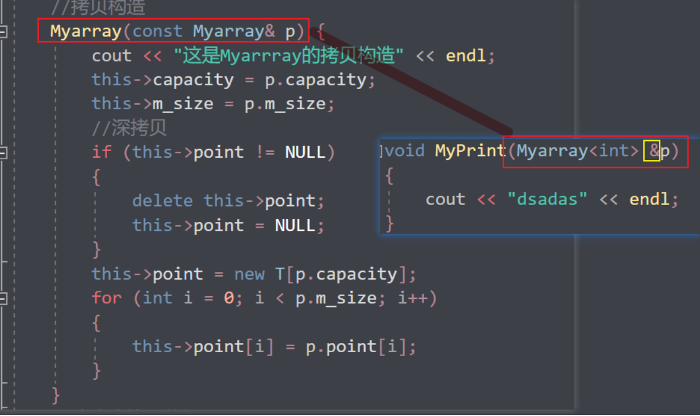

> 总结多使用引用，如果下面没有修改引用的数据的话最好再加上const
>
> 最后，当对象要作为参数的时候，就要注意形参的写法，要和拷贝构造函数保持一致！
>
> 少加一个&就。。。


### <a name="第vector迭代器的失效">vector迭代器的失效</a>

> 迭代器失效是因为在插入元素后，容器内部的元素可能会被重新分配内存，导致原来的迭代器指向的位置不再有效。
>
> 在C++的标准库中，vector是一个动态数组，它的内部实现是通过动态分配内存来存储元素的。
>
> 当vector的容量不足以容纳新的元素时，它会重新分配一块更大的内存空间，并将原来的元素复制到新的内存空间中。
>
> 这个过程可能会导致原来的迭代器失效，==**因为迭代器指向的位置在内存重新分配后可能已经不再是有效的位置**。==
>
> 经典场景 
>
> > ```c++
> > #include<iostream>
> > #include<algorithm>
> > #include <vector>
> > using namespace std;
> > void myprint(int a)
> > {
> > 	cout << a << " ";
> > }
> > //1
> > void Print(vector<int> p)
> > {
> > 	for (vector<int>::iterator i = p.begin(); i < p.end(); i++) {
> > 		cout << *i << " ";
> > 	}
> > 
> > }
> > //3
> > template<class T>
> > void Print(T p)
> > {
> > 	for (vector<int>::iterator i = p.begin(); i < p.end(); i++) {
> > 		cout << *i << "-";
> > 	}
> > }
> > //2
> > template<class T>
> > void Print(vector<T> p)
> > {
> > 	for (vector<int>::iterator i = p.begin(); i < p.end(); i++) {
> > 		cout << *i << "=";
> > 	}
> > }
> > 
> >                                                     //删除容器中所有元素
> > int main()
> > {
> > 	vector<int> v;
> > 	for (int i = 0; i < 10; i++)
> > 	{
> > 		v.push_back(i);
> > 	}
> > 
> > 	Print(v);
> > 	cout << endl;
> > 	v.pop_back();
> > 	Print(v);
> > 	cout << endl;
> > 
> > 	vector<int>::iterator start = v.begin();
> > 	vector<int>::iterator end = v.end();
> > 
> > 
> > 	v.insert(start, 0);
> > 
> > 	//迭代器失效是因为在插入元素后，容器内部的元素可能会被重新分配内存，导致原来的迭代器指向的位置不再有效。
> > 	///////////////------------------------
> > 	v.insert(start, 2, 1);
> > 	v.insert(v.begin(), 2, 1);
> > 	///////////////------------------------
> > 
> > 	cout << endl;
> > 	Print(v);
> > 	return 0;
> > }
> > ```
> >
> > 插入后，还想用原来的迭代器进行插入，就会爆炸！

### vector的拷贝构造函数

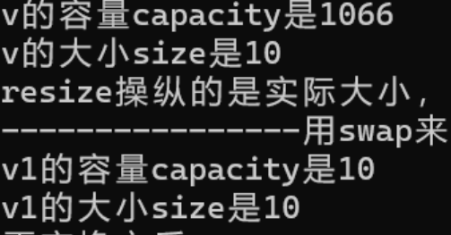 

```c++
vector<int> v1(v);
是根据v的size来构造一个数据一样的;
```


### const&迭代器

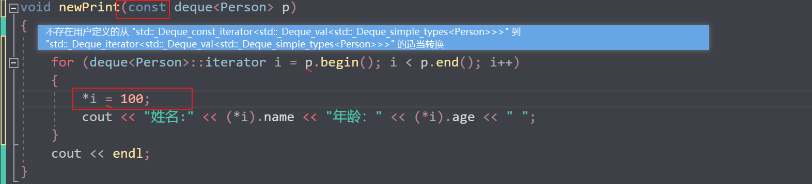 

想实现，不让修改我们的 内部数据

但是报错了

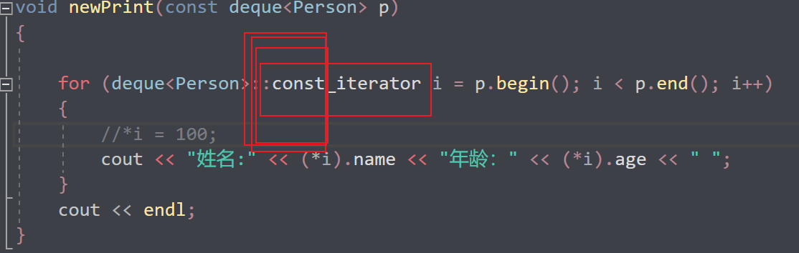 

就好了！


### 随机数的简单使用

```c++
srand(static_cast<unsigned int>(time(0)));
int randscore = rand() % 41 + 60;//60---100
```

time(0)

当前系统时间的种子。

rand（）x得到[0,x-1]的随机数；


### extern关键字


> extern"关键字声明的变量是==**对其他文件中定义的全局变量的引用**。==
>
> 它只是一个声明，告诉编译器该变量在其他文件中已经定义，并且我们可以在当前文件中使用它。

file1

```
int a=10;
```

file 2

```c++
#include <iostream>
using namespace std;
extern int a;
int main()
{
	cout << a << endl;

	return 0;
}
```

这样就能在file2中使用a变量了==，而且还是引用的形式传过来的，修改之后实体也被修改了==

跨文件的全局变量使用应当谨慎。全局变量的修改可能会导致代码的可读性和维护性下降，因为很难追踪全局变量的使用和修改情况。在一般情况下，建议尽可能地避免使用全局变量，并使用其他适当的编程技术，如函数参数、类成员或局部变量来传递和存储数据。


### static_cast的使用

static_cast 是 C++ 中进行==**显式类型转换**==的一个重要操作符，经常用于以下场景：

1. 在==不同数值类型之间进行转换==，比如将整数转换为浮点数，或者将浮点数转换为整数。

```cpp
int num = 42;
double convertedNum = static_cast<double>(num);
```

2. 在进行继承结构中，进行基类指针向派生类指针的转换。

```cpp
class Base {
    // ...
};
class Derived : public Base {
    // ...
};

Base* basePtr = new Derived();
Derived* derivedPtr = static_cast<Derived*>(basePtr);
```

3. 将==空指针转换为目标类型的指针==。

```cpp
void* voidPtr = nullptr;
int* intPtr = static_cast<int*>(voidPtr);
```

4. 将枚举类型转换为整数类型。

```cpp
enum class Color { RED, GREEN, BLUE };
int colorValue = static_cast<int>(Color::RED);
```

> static_cast 在编译时进行类型检查，可以避免一些潜在的类型错误，并且提供了一种清晰明了的方式来进行类型转换。
>
> 但是在使用 static_cast 时，开发者需要保证转换是合理和安全的，因为==**static_cast 并不会执行运行时的边界检查**==


### 虚函数 

==**将基类的成员函数声明为虚函数的主要原因是实现多态性（polymorphism）。**==通过将基类的函数声明为虚函数，可以在派生类中重写（override）这些函数，并且通过==**基类指针或引用**==调用这些函数时，==可以根据实际对象的类型来决定调用哪个版本的函数。==

下面是一些使用虚函数的好处：

1. 实现==运行时多态性==：当基类指针或引用指向派生类对象时，可以==根据实际的对象类型来调用相应的函数。==这使得程序能够更加灵活和动态，而不需要在编译时确定具体的函数调用。

2. 便于统一处理不同派生类对象：如果基类的函数是虚函数，那么可以通过基类指针或引用来统一处理不同派生类对象，而不需要关心对象的具体类型。

3. 支持动态绑定：使用虚函数可以实现动态绑定（dynamic binding），即在运行时确定调用的函数版本，而不是在编译时确定。这对于实现一些基于对象类型的特定行为非常有用。

举例来说，假设有一个基类 Animal 和它的派生类 Dog 和 Cat，如果 Animal 类中的某个函数声明为虚函数（比如 speak()），那么在使用 Animal 类指针或引用调用 speak() 函数时，程序会根据实际指向的对象类型来确定调用 Dog::speak() 还是 Cat::speak()。


### 纯虚函数

纯虚函数在C++中起着非常重要的作用，==**它是一种特殊的虚函数，没有具体的实现，只有函数声明**。==纯虚函数通过==**在基类中定义接口，要求派生类必须实现这些函数，从而达到强制派生类实现特定功能的目的。**==

纯虚函数通常用于以下情况：

1. 定义接口：当我们希望创建一个接口（即定义一组函数的抽象接口），但不希望在基类中提供这些函数的具体实现时，==**可以使用纯虚函数。这样的基类通常被称为抽象基类，因为它不能被实例化，只能作为接口被其他类继承。**==

```cpp
class AbstractShape {
public:
    virtual double area() const = 0;  // 纯虚函数
    virtual void draw() const = 0;    // 纯虚函数
};
```

2. 强制派生类实现特定行为：通过将函数声明为纯虚函数，基类要求==**任何派生类都必须提供对应的实现**==。这样可以确保派生类正确地实现了基类定义的接口。

```cpp
class Interface {
public:
    virtual void doSomething() = 0;  // 纯虚函数
};

class ConcreteClass : public Interface {
public:
    void doSomething() override {
        // 实现具体的功能
    }
};
```

总之，纯虚函数提供了一种将接口与实现分离的方式，同时强制要求派生类提供特定行为的机制。通过使用纯虚函数，可以更好地实现抽象和多态，是面向对象设计中非常有用的特性。


### sort标准排序函数

> //不支持随机访问迭代器的不能用标准排序算法
> //会有对应的sort成员函数

	//不支持随机访问迭代器的不能用标准排序算法
	//会有对应的sort成员函数

list链表只有双向迭代器，无法用sort(l1.begin(),l1.end())

会报错！！！

用对用的sort成员函数，一个重载版本指定降序，默认是升序


### 双向迭代器

正向迭代器和反向迭代器都支持前进操作(`++`)，==但不支持后退操作(`--`)。==

--操作虽然不报错但是没有实际的用处！

此外，它们还支持解引用操作(`*`)，以获取迭代器当前指向的元素值。

[list](#双向迭代器)

end()可以理解成尾后指针，方便记忆

> 双向迭代器，它并不支持 `<` 操作符进行比较

### ()重载

#### 4.5.6 函数调用运算符重载()


* 函数调用运算符 ()  也可以重载
* 由于重载后使用的方式非常像函数的调用，因此称为仿函数
* 仿函数没有固定写法，非常灵活

> #### operator（）（）只能在类里面定义，报错说不允许他为全局函数。


**示例：**

```C++
#include <iostream>
using namespace std;
//重载的（）操作符 也称为仿函数
//重载的（）操作符 也称为仿函数
//重载的（）操作符 也称为仿函数
//重载的（）操作符 也称为仿函数
class person
{
public:
	void operator()(string text) {
		cout << text << endl;
	}


private:
	string name;
	int age;
};


class Myadd
{
public:
	int operator()(int a, int b)
	{
		return a+1 + b+1;
	}

private:

};

void test()
{
	//匿名对象调用  
//有参构造Person(10)单独写就是匿名对象  当前行结束之后，马上析构，直接构造析构然后立马销毁
//Person()单独写就是匿名对象  当前行结束之后，马上析构，直接构造析构然后立马销毁
	person p;
	p("你好啊）OP");
	cout << "-----匿名函数----------" << endl;
	person()("你好啊匿名函数");

	cout << "-------------------" << endl;
	Myadd add;
	cout<<add(1, 30)<<endl;
	cout << "-----匿名函数----------" << endl;
	cout << Myadd()(90, 100) << endl;
}


int main()
{
	test();

	return 0;
}
```


### 常函数

> 常函数（const member function）是指在类的成员函数声明或定义中使用 const 关键字修饰的成员函数。
>
> 1. 常对象只能调用常函数。常对象是指被声明为 const 的对象`const Person p("牛马")`
>
> 2. 常函数内部不能修改对象的==非静态成员变量==。在常函数中，对于非静态成员变量的修改操作是不允许的，除非该成员变量被声明为` mutable。`
>
> 3. ==常函数可以被同名的非常函数重载。==如果一个类中同时存在常函数和非常函数，它们可以拥有相同的函数名，**常对象调用只能调用常函数**根据对象是否为常对象来决定调用哪个版本的函数。
>
> 4. 常函数可以提高代码的可读性和安全性。通过将适当的成员函数声明为常函数，可以明确表明==函数不会修改对象的状态==，从而使代码更加清晰和可维护。
>
> 5. ```c++
>    class compare {
>    public:
>    
>    	bool operator()(int a, int b) const
>    	{
>    		return a > b;
>    	}
>    };
>    ```
>
> 


### ==函数指针==

定义: 函数指针是一个==指向函数的指针变量==。函数指针可以用来传递函数作为参数，也可以用来在程序运行时动态调用函数。

```c++
// 声明一个函数指针类型
typedef void (*funcptr)(int)
//从此定义了一个funcptr类型，是指向（返回值为void，参数为int）函数的指针！也就是函数指针
void myFunction(int x) {
    // 函数体
}

// 声明一个函数指针变量并赋值
FunctionPtr ptr = &myFunction;

```

#### 回调函数

> ==函数可以作为参数==传递给另一个函数，这通常用于回调函数的实现。
>
> 回调函数是一个作为参数传递给其他函数的函数
>
> 用于在特定事件发生时被调用。
>
> ```c++
> #include <iostream>
> 
> //包含头文件
> #include <vector>
> #include <string>
> #include <algorithm>
> using namespace std;
> 
> 
> typedef void (*funcptr)(int);
> //从此定义了一个funcptr类型，是指向（返回值为void，参数为int）函数的指针！也就是函数指针
> //定义一个函数
> void func(int t) {
> 	cout <<t<<"----" << "hhh我要作为函数参数传入函数并且调用" << endl;
> }
> 
> //测试回调函数的函数
> void test(funcptr p)
> {
> 	p(2);
> }
> void newtest(void (*ptr)(int))
> {
> 	ptr(2);
> }
> 
> void ptr(int t)
> {
> 	cout << "tttt" << t << endl;
> }
> 
> int main()
> {
> 
> 
> 	funcptr point = &func;
> 	test(point);
> 	newtest(&ptr);
> 	return 0;
> }
> ```
>
> 

#### ==Typedef==

作用

> 给数据类型取别名的关键字。
>
> 将一个数据类型定义为一个新的类型名称，使得代码更加清晰易读
>
> ```c++
> typedef void (*FunctionPtr)(int);
> //声明了一个新的类型FunctionPtr，它是一个指向参数为int类型、返回类型为void的函数的指针类型。
> ```

---

typedef的最详细最核心的用法和知识：

1. **给类型起别名**

```cpp
typedef type new_name;
```

例如以后int可以用myint代替

```cpp
typedef int my_int;
```

2. 定义类型

   > 1. 
   >
   > ```c++
   > typedef int* int_ptr;
   > ```
   >
   > int_ptr就可以作为int*类型的别名来使用。
   >
   > 2. ==**函数指针**==
   >
   > ```c++
   > typedef int (*func_ptr)(int, int);
   > ```
   >
   > func_ptr就可以作为指向返回类型为int，参数类型为int和int的函数指针类型的别名来使用。
   >
   > 3. typedef关键字还可以用来定义结构体类型的别名，例如：
   >
   > ```cpp
   > typedef struct {
   >     int x;
   >     int y;
   > } Point;
   > ```
   >
   > 这样，Point就可以作为该结构体类型的别名来使用。

3. 嵌套使用

typedef关键字还可以嵌套使用，例如：

```cpp
typedef int* int_ptr;
typedef int_ptr* int_ptr_ptr;
```

这样，int_ptr_ptr就可以作为int**类型的别名来使用。

6. 与模板一起使用

typedef关键字还可以与模板一起使用，例如：

```cpp
template<typename T>
typedef std::vector<T> Vector;
```

这样，Vector就可以作为std::vector<T>类型的别名来使用。

typedef关键字可以用来定义类型别名，可以用来定义基本类型、指针类型、函数指针类型、结构体类型等等。在实际编程中，typedef关键字可以**大大简化代码，提高代码的可读性和可维护性。**


#### auto

```c++
int a=10;
auo a=10;
```

### scanf_s()

> `scanf_s()` 是安全版本的输入函数，它可以防止缓冲区溢出等安全问题。该函数的使用方法与 `scanf()` 函数类似，但是需要指定缓冲区的大小。
>
> 


### <a name="二分查找">冒泡排序和二分查找</a>

```c++
#include<iostream>
#include <vector>
#include <functional>
#include <algorithm>//标准算法头文件
using namespace std;

int main()
{
	int a[10] = { 1,4,5,6,2,7,9,0,5,8};
	for (int i : a)
	{
		cout << i << " ";
	}
	cout << "\n";
	int line = 10;
	for (int i = 0; i < line-1; i++)
	{
		for (int j = 0; j<line-1-i; j++)
		{
			if (a[j] > a[j+1])
			{
				int temp = a[j];
				a[j] = a[j+1];
				a[j+1] = temp;
			}
		}
	}
	int key;
	for (int i : a)
	{
		cout << i << " ";
	}
	cout << "输入你要查找的数字" << endl;
	scanf_s("%d", &key);

	int start = 0, end = line - 1;
	while (end >= start)
	{
		int middle = (start + end) / 2;
		if (key < a[middle])
		{
			end = middle - 1;
		}
		else if (key > a[middle])
		{
			start = middle + 1;
		}
		else
		{
			cout << "找到拉下标为" << middle << endl;
			break;
		}

	}

	return 0;
}
```

> 升序排序对应一种二分
>
> 降序排序对应一种二分